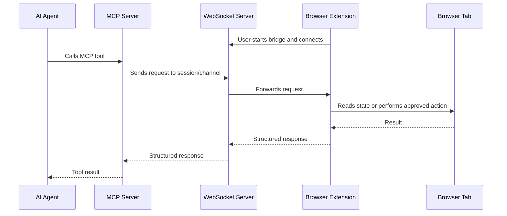

# BrowserBridge Agent Instructions

BrowserBridge is a user-controlled bridge between browser extensions and AI
agents. The browser extension connects to a WebSocket server only when the user
explicitly starts it. The MCP server can then request browser state and perform
approved browser actions through that WebSocket channel.

The project must support both local development and a future cloud deployment
model. Keep the first implementation intentionally small and readable.

## Core Principles

- The user controls when the bridge is active.
- Browser state is available only while the user has explicitly connected the
  extension.
- Do not implement silent background surveillance.
- Do not continuously stream browser data by default.
- Browser data requests must be initiated through explicit MCP tool calls.
- Design cloud behavior around private user/session/channel routing.
- Prefer simple TypeScript code, clear boundaries, and structured message
  schemas over heavy abstractions.

## Required Workflow

When asked to implement a feature or behavioral change:

1. Write an ADR first in `docs/architecture/decisions`.
2. Include technical diagrams using Mermaid where architecture or flow is
   relevant.
3. Wait for user approval before implementing.
4. Use TDD: write failing tests first, implement the smallest change, then
   verify the tests pass.
5. When a project area is complete, write full documentation in
   `docs/artifacts`.

When creating a PR:

- Use atomic commits.
- Write meaningful commit messages.
- Use a PR title and description that match the actual goal and scope.
- Keep unrelated refactors out of the PR.

## Repository Shape

Use a pnpm TypeScript monorepo.

```text
/package.json
/pnpm-workspace.yaml
/README.md
/.env.example
/docker-compose.yml
/packages
  /shared
    /src
      messages.ts
      types.ts
/servers
  /websocket
    /src
      index.ts
      sessions.ts
      messages.ts
    package.json
    README.md
  /mcp
    /src
      index.ts
      tools.ts
      websocket-client.ts
    package.json
    README.md
/clients
  /extensions
    /chrome
      /src
        background.ts
        content.ts
        popup.ts
      manifest.json
      package.json
      README.md
    /safari
      README.md
    /firefox
      README.md
  /apps
    README.md
```

Shared schemas and types should live in `packages/shared` when more than one
package needs them. Do not duplicate protocol definitions across servers and
clients.

## Architecture

The intended local flow is:



The extension is reactive. It should answer requests and return results, not
publish continuous page snapshots.

## WebSocket Server Requirements

The WebSocket server lives in `servers/websocket`.

It should:

- Manage live browser extension connections.
- Support user, session, and channel identification.
- Allow the MCP server to send requests to a connected extension.
- Allow extensions to respond with browser status, page context, or action
  results.
- Include basic authentication or token handling, even if minimal initially.
- Return clear errors for missing sessions, invalid messages, auth failures,
  timeouts, and unsupported actions.

Required protocol message names:

- `extension_connected`
- `get_status`
- `status_response`
- `get_page_context`
- `page_context_response`
- `perform_action`
- `action_result`
- `error`

## MCP Server Requirements

The MCP server lives in `servers/mcp`.

It should:

- Expose MCP tools for AI agents.
- Connect to the WebSocket server.
- Route tool calls to the appropriate browser extension session.
- Return clear structured results.

Initial tools:

- `get_browser_status`
- `get_current_page_context`
- `navigate_to_url`
- `click_element`
- `fill_input`
- `submit_form`

Tool responses should be structured and predictable. Prefer typed result objects
with explicit `ok`, `data`, and `error` fields over loosely shaped responses.

## Browser Extension Requirements

Start with Chrome in `clients/extensions/chrome`.

The Chrome extension should:

- Connect and disconnect manually through popup UI.
- Establish a WebSocket connection to the server only after user action.
- Respond to MCP-originated requests.
- Read the current tab URL and title.
- Extract basic page text and context.
- Support simple DOM actions where possible.
- Show enough UI state for the user to know whether the bridge is connected.

Safari and Firefox folders should exist as placeholders with README files until
their implementations are planned.

## Apps Placeholder

Create `clients/apps` as a placeholder for future desktop, mobile, or web apps.
Its README should explain future intent without implying current support.

## First Milestone

The first working milestone is intentionally narrow:

1. A local Chrome extension can manually connect to the WebSocket server.
2. The MCP server can request browser status.
3. The extension can respond with the current tab URL and title.

Do not expand beyond this milestone without an approved ADR.

## Documentation Requirements

The root `README.md` should explain:

- Project purpose.
- Architecture.
- Local setup.
- How the WebSocket server, MCP server, and extension communicate.
- Security model.
- Future roadmap.

Each package or app should have its own README with local commands, environment
variables, and package-specific behavior.

Use Mermaid diagrams for architecture, message flow, and deployment flow when
they help clarify behavior.

## Environment And Docker

Include `.env.example` files or documented variables for local development.
Never commit real secrets or user-specific tokens.

Include Docker support for local development. Docker should make it easy to run
the WebSocket server and MCP server together, while still allowing package-level
development through pnpm.

## Coding Standards

- Use TypeScript everywhere.
- Use pnpm workspaces.
- Keep code readable and explicit.
- Prefer structured parsers and schemas over ad hoc string handling.
- Keep shared protocol definitions in `packages/shared`.
- Avoid unnecessary frameworks until the problem calls for them.
- Add tests around protocol handling, routing, and tool behavior.
- Keep browser permissions minimal and document why each permission is needed.

## Security Model

BrowserBridge is not an ambient monitoring system. Agents may only access browser
state through explicit requests while the user-controlled extension connection is
active.

Design every request path around these constraints:

- Authenticated WebSocket and MCP-to-WebSocket communication.
- Private user/session/channel routing.
- Explicit request and response IDs.
- Timeouts for pending requests.
- Clear user-facing connection state.
- No storage of page content unless an approved feature explicitly requires it.

## Agent Notes

- Read this file before making project changes.
- Respect user changes in the working tree.
- Do not revert unrelated edits.
- Before modifying project behavior, create the ADR and wait for approval.
- Before claiming work is complete, run the relevant verification commands and
  report what passed or why verification could not run.
