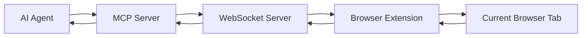
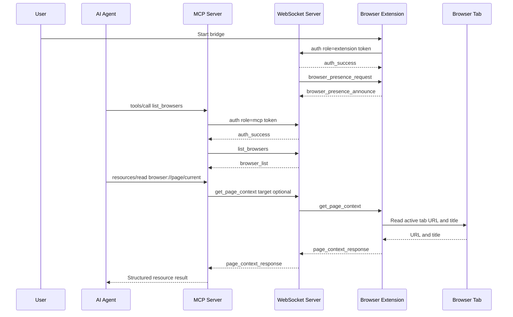

# BrowserBridge

BrowserBridge is a user-controlled bridge between browser extensions and AI
agents.

The browser extension connects to a WebSocket server only when the user
explicitly starts it. An MCP server can then request browser state or ask the
extension to perform approved browser actions through that WebSocket channel.

BrowserBridge is designed for local-first development with a path to private
cloud deployment.

BrowserBridge is source-available and free for non-commercial use. Commercial
use requires separate written permission from the relevant copyright holder or
holders.

## Status

This project has the local WebSocket transport, Chrome extension page context
and action handling, MCP resources and tools, and local pairing/presence routing
in place. Safari Web Extension support with full Chrome feature parity is also
implemented (ADR 0019), using shared logic from `@browserbridge/shared`. The
current working milestone is:

1. A local Chrome extension manually connects to the WebSocket server.
2. The extension authenticates with a local pairing token and announces browser
   presence.
3. The MCP server authenticates with the same token, lists online browser
   instances, and routes explicit page reads or actions to one browser.
4. The Safari extension has the same browser capabilities as Chrome, using
   shared logic and Safari-specific adapters.

Features beyond that milestone require an approved ADR before implementation.

## Goals

- Keep the user in control of when browser access is active.
- Avoid silent background surveillance.
- Avoid continuous page streaming by default.
- Make browser state available only through explicit MCP resource reads.
- Support local and future cloud deployment.
- Keep the protocol typed, structured, and shared across packages.
- Share browser-agnostic logic in `@browserbridge/shared` across Chrome and
  Safari extensions.

## Planned Repository Layout

```text
/package.json
/pnpm-workspace.yaml
/README.md
/.env.example
/docker-compose.yml
/packages
  /shared
    /src
      protocol.ts
      page-context.ts
      page-content.ts
      background-controller.ts
      content-handler.ts
      timers.ts
    package.json
    README.md
/servers
  /websocket
    /src
      index.ts
      sessions.ts
      messages.ts
    package.json
    README.md
  /mcp
    /src
      index.ts
      page-context.ts
      websocket-client.ts
    package.json
    README.md
/clients
  /extensions
    /chrome
      /src
        background.ts
        content-script-entry.ts
        setup.ts
        permissions.ts
      manifest.json
      package.json
      README.md
    /safari
      /src
        background.ts
        background-entry.ts
        content-script-entry.ts
        popup.ts
        popup-entry.ts
        popup.html
        permissions.ts
      manifest.json
      package.json
      README.md
    /firefox
      README.md
  /apps
    README.md
```

## Architecture

BrowserBridge has three active runtime parts:

- **Browser extension**: user-controlled client that connects only after the
  user starts the bridge.
- **WebSocket server**: session router between extensions and trusted server
  components.
- **MCP server**: exposes browser resources to AI agents and routes resource
  reads to the active browser session.

Shared protocol types and browser-agnostic logic live in `packages/shared` so
the Chrome and Safari extensions, the WebSocket server, and the MCP server all
use the same message definitions, background controller, and extraction code.
Each browser extension imports from `@browserbridge/shared` and provides only
browser-specific adapters and entry-point wiring.



## Communication Flow

The extension is reactive. It should answer specific requests and return
specific results. It should not stream page state continuously.



## Protocol Messages

The current message schema covers:

- `auth`
- `auth_success`
- `browser_presence_request`
- `browser_presence_announce`
- `browser_list`
- `extension_connected`
- `get_status`
- `status_response`
- `get_page_context`
- `page_context_response`
- `perform_action`
- `action_result`
- `error`

Every request/response pair should include a request ID so callers can match
responses to requests and handle timeouts clearly.

## MCP Resources And Tools

The current MCP server exposes page resources:

- `browser://page/current`, named `current-page-context`
- `browser://page/current/content/{index}`, named `current-page-content`

It also exposes tools for explicit page reads and discrete browser actions:

- `list_browsers`
- `read_current_page`
- `click_element`
- `fill_input`
- `fill_editable`
- `set_checked`
- `select_options`
- `submit_form`

Resource and tool results should use predictable structured responses, for
example:

```ts
type ToolResult<T> =
  | { ok: true; data: T }
  | { ok: false; error: { code: string; message: string } };
```

## Local Development

The project is expected to use:

- TypeScript
- pnpm workspaces
- Docker Compose for local server development
- shared protocol packages for browser/server communication

Once the skeleton exists, the local setup should follow this shape:

```sh
pnpm install
cp .env.example .env
pnpm dev
```

Docker-based local development should start the server components together:

```sh
docker compose --profile runtime up --build
```

The runtime profile also serves the local form test page over HTTP:

```text
http://127.0.0.1:${TEST_PAGE_PORT:-8080}/test.html
```

Generate a local pairing token before starting the runtime:

```sh
pnpm run token
```

Set the generated value as `BROWSERBRIDGE_PAIRING_TOKEN` for the WebSocket and
MCP servers. Configure the same token in the Chrome extension setup page along
with the local WebSocket URL.

Generate a separate MCP HTTP bearer token and set it as
`MCP_HTTP_AUTH_TOKEN`. MCP clients connect to:

```text
http://127.0.0.1:${MCP_HTTP_PORT:-8788}${MCP_HTTP_PATH:-/mcp}
```

The MCP HTTP token is for agent-to-MCP access. It is intentionally separate
from `BROWSERBRIDGE_PAIRING_TOKEN`, which scopes private routing between the
MCP server, WebSocket server, and browser extension.

### Testing The WebSocket Server With A CLI

Start the WebSocket server:

```sh
pnpm --filter @browserbridge/websocket dev
```

In another terminal, connect with `wscat`:

```sh
pnpm dlx wscat -c ws://127.0.0.1:8787
```

Send an auth message first:

```json
{
  "type": "message",
  "id": "auth-1",
  "payload": {
    "type": "auth",
    "role": "mcp",
    "token": "your-local-token"
  }
}
```

Then send a valid MCP-scoped request:

```json
{ "type": "message", "id": "cli-1", "payload": { "type": "list_browsers" } }
```

The response lists browser instances that authenticated with the same pairing
token and announced presence.

To test structured error handling, send invalid JSON:

```text
{not valid json
```

The server should respond with an `invalid_json` error envelope.

The Chrome extension should then be loaded from
`clients/extensions/chrome/dist` or the documented build output path.

## Environment Variables

The initial `.env.example` should include values like:

```sh
WEBSOCKET_HOST=127.0.0.1
WEBSOCKET_PORT=8787
BROWSERBRIDGE_WEBSOCKET_URL=ws://127.0.0.1:8787
BROWSERBRIDGE_REQUEST_TIMEOUT_MS=5000
BROWSERBRIDGE_PAIRING_TOKEN=replace-with-generated-token
BROWSERBRIDGE_BROWSER_INSTANCE_ID=
MCP_HTTP_HOST=127.0.0.1
MCP_HTTP_PORT=8788
MCP_HTTP_PATH=/mcp
MCP_HTTP_AUTH_TOKEN=replace-with-generated-mcp-token
MCP_HTTP_ALLOWED_HOSTS=127.0.0.1,localhost
MCP_HTTP_ALLOWED_ORIGINS=
MCP_HTTP_ALLOW_TAILSCALE_HOSTS=false
MCP_HTTP_ALLOW_LOCAL_HOSTS=false
```

`BROWSERBRIDGE_TOKEN` is accepted as a backward-compatible alias for
`BROWSERBRIDGE_PAIRING_TOKEN`. `BROWSERBRIDGE_BROWSER_INSTANCE_ID` is optional;
when set, MCP tools target that browser by default. Tool calls can still pass a
different `browserInstanceId`.

`MCP_HTTP_AUTH_TOKEN` is required for the HTTP MCP server. `MCP_HTTP_ALLOWED_HOSTS`
and `MCP_HTTP_ALLOWED_ORIGINS` constrain which HTTP Host and Origin headers can
reach MCP handling.

For Tailscale-only development, bind the MCP HTTP server to a reachable
interface and enable the Tailscale suffix allowance:

```sh
MCP_HTTP_HOST=0.0.0.0
MCP_HTTP_ALLOW_TAILSCALE_HOSTS=true
```

This accepts MCP HTTP requests whose `Host` or browser `Origin` hostname ends
in `.ts.net`. It does not replace `MCP_HTTP_AUTH_TOKEN`; every MCP HTTP request
still needs the bearer token.

For local network development using mDNS-style names such as
`browserbridge.local`, enable the local suffix allowance:

```sh
MCP_HTTP_HOST=0.0.0.0
MCP_HTTP_ALLOW_LOCAL_HOSTS=true
```

This accepts MCP HTTP requests whose `Host` or browser `Origin` hostname ends
in `.local`. It also keeps bearer-token authentication required.

## Security Model

BrowserBridge is not an ambient monitoring system.

The extension should expose browser state only while the user has explicitly
started the bridge. Browser state requests should be made through explicit MCP
resource reads, and browser actions should be made through explicit MCP tool
calls routed to a private user/session/channel.

Security expectations:

- Manual connect/disconnect in the browser extension UI.
- Clear user-facing connection state.
- Minimal browser permissions.
- Basic token handling for local development.
- Authenticated routing between MCP and WebSocket components.
- Bearer-token authentication for MCP HTTP clients.
- Host and Origin validation on the MCP HTTP endpoint.
- In-memory browser presence while the extension WebSocket is connected.
- Request IDs and timeouts for all pending browser requests.
- No continuous page streaming by default.
- No page-content persistence unless a future approved feature requires it.

## Browser Extension Scope

Chrome and Safari are the current supported extension targets.

Chrome behavior:

- User manually connects and disconnects from the extension action after setup.
- The background script owns the WebSocket connection.
- The extension authenticates with the configured pairing token.
- The extension announces browser instance presence after authentication and in
  response to server presence requests.
- The extension responds to MCP-originated requests.
- The extension can read current tab context/content and perform approved page
  actions from explicit MCP requests.
- Optional host permissions for regular pages are requested at runtime.

Safari behavior:

- User connects and disconnects through a popup overlay.
- A persistent background script owns the WebSocket connection.
- The extension has full feature parity with Chrome (page context, content
  extraction, DOM actions).
- Broad host permissions (`*://*/*`) are granted at install time — no runtime
  permission prompts.
- Badge state is text-only (no background color API).
- See ADR 0019 for Safari-specific design decisions.

Firefox is a planned placeholder until its extension packaging and permission
model are designed.

## Development Process

Project changes should follow `AGENTS.md`.

For feature or behavioral changes:

1. Write an ADR in `docs/architecture/decisions`.
2. Include Mermaid diagrams where they clarify architecture or flow.
3. Wait for user approval.
4. Use TDD.
5. Document completed project areas in `docs/artifacts`.

## Roadmap

- Create the pnpm workspace skeleton.
- Define shared protocol schemas and types.
- Implement the local WebSocket peer-forwarding transport.
- Build the manually controlled Chrome extension.
- Implement the MCP server and first page-context resource.
- Add tests around protocol validation, session routing, and MCP resource
  results.
- Add Docker Compose local development support.
- Document the first working milestone.
- Extract shared logic into `@browserbridge/shared` (ADR 0019).
- Build the Safari Web Extension with full Chrome feature parity (ADR 0019).
- Design cloud deployment around private user/session/channel routing.
- Add Firefox and app clients after separate ADR approval.

## License

BrowserBridge source code is licensed under the PolyForm Noncommercial License
1.0.0. See `LICENSE`.

Documentation, diagrams, examples, and other non-code written materials are
licensed under Creative Commons Attribution-NonCommercial 4.0 International
unless a file says otherwise. See `LICENSE-DOCS.md`.

Commercial use requires separate written permission from the relevant copyright
holder or holders. See `COMMERCIAL-LICENSING.md`.

Contributions are accepted under an inbound-equals-outbound model. Contributors
keep copyright in their contributions and do not grant automatic commercial
relicensing rights. See `CONTRIBUTING.md`.
