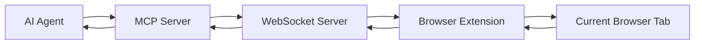
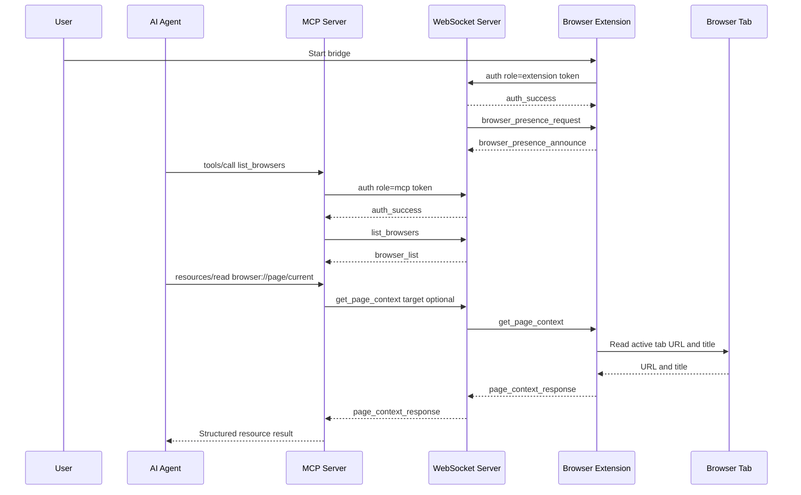

# BrowserBridge

> **Remote agents. Local browser. No shared credentials.**

BrowserBridge connects remote AI agents to the browser session you already control.

Instead of launching a separate browser, cloning sessions, exporting cookies, or streaming screenshots, BrowserBridge allows agents to collaborate with the browser you're already using.

The result is faster, safer, and more privacy-friendly access to the authenticated web.

BrowserBridge is open source under AGPLv3. See [LICENSE](LICENSE) and [COMMERCIAL-LICENSING.md](COMMERCIAL-LICENSING.md).

---

## Why BrowserBridge?

Most AI browser tools start with the assumption that the agent needs its own browser.

But in the real world, you're already:

- logged into Workday
- logged into Jira
- logged into GitHub
- logged into Gmail
- logged into your company's internal tools

The challenge isn't giving a browser to the agent.

The challenge is allowing the agent to collaborate with the browser session you already control.

That's what BrowserBridge solves.

---

## Key Principles

### Authenticated Browser First

Use the browser session you're already using.

- No cookie export
- No session replication
- No browser cloning

### Remote Agent Friendly

Run agents wherever you want:

- Claude Desktop
- Codex
- Gemini CLI
- Hermes
- OpenClaw
- Cloud-hosted agents

Your browser remains local.

### Privacy By Design

BrowserBridge is intentionally reactive.

The browser does not continuously stream:

- screenshots
- page updates
- DOM changes
- browser history

Agents must explicitly request information.

### Progressive Disclosure

Agents receive only the information they need.

Instead of sending:

- screenshots
- massive DOM trees
- full browser state

BrowserBridge provides structured context first, then content when requested.

### Human In Control

The browser remains under user control.

The agent only receives access through explicit requests.

---

## Architecture

```text
Agent
  ↓
MCP Server
  ↓
BrowserBridge Relay
  ↓
Browser Extension
 ↓
Browser Session
```

The browser remains the source of truth.



---

## Capability Matrix

- Read page context ✅
- Read page content ✅
- Read selected text ✅
- Fill forms ✅
- Trigger actions ✅
- Read page metadata ✅
- Structured page understanding ✅
- Remote agent access ✅
- File uploads 🚧
- End-to-end encryption 🚧
- Multi-tab workflows 🚧
- Fine-grained permissions 🚧
- Cookie export ❌
- Session cloning ❌
- Continuous browser streaming ❌
- Browser recording ❌

See [docs/project/CAPABILITY_MATRIX.md](docs/project/CAPABILITY_MATRIX.md) for the full capability contract.

---

## Communication Flow

The extension is reactive. It should answer specific requests and return
specific results. It should not stream page state continuously.



---

## Status

This project has the local WebSocket transport, Chrome extension page context
and action handling, MCP resources and tools, and local pairing/presence routing
in place. Safari Web Extension support with full Chrome feature parity is also
implemented (ADR 0019), using shared logic from `@browserbridge/shared`. The
current working milestone is:

1. A local Chrome extension manually connects to the WebSocket server.
2. The extension authenticates with a local pairing token and announces browser
   presence.
3. The MCP server authenticates with the same token, lists online browser
   instances, and routes explicit page reads or actions to one browser.
4. The Safari extension has the same browser capabilities as Chrome, using
   shared logic and Safari-specific adapters.

Features beyond that milestone require an approved ADR before implementation.

---

## MCP Resources And Tools

The current MCP server exposes page resources:

- `browser://page/current`, named `current-page-context`
- `browser://page/current/content/{index}`, named `current-page-content`

It also exposes tools for explicit page reads and discrete browser actions:

- `list_browsers`
- `read_current_page`
- `click_element`
- `fill_input`
- `fill_editable`
- `set_checked`
- `select_options`
- `submit_form`

Resource and tool results use predictable structured responses:

```ts
type ToolResult<T> =
  | { ok: true; data: T }
  | { ok: false; error: { code: string; message: string } };
```

---

## Local Development

```sh
pnpm install
cp .env.example .env
pnpm dev
```

Docker-based local development:

```sh
docker compose --profile runtime up --build
```

The runtime profile serves a local form test page over HTTP:

```text
http://127.0.0.1:${TEST_PAGE_PORT:-8080}/test.html
```

Generate a local pairing token before starting the runtime:

```sh
pnpm run token
```

Set the generated value as `BROWSERBRIDGE_PAIRING_TOKEN` for the WebSocket and
MCP servers. Configure the same token in the Chrome extension setup page along
with the local WebSocket URL.

Generate a separate MCP HTTP bearer token and set it as
`MCP_HTTP_AUTH_TOKEN`. MCP clients connect to:

```text
http://127.0.0.1:${MCP_HTTP_PORT:-8788}${MCP_HTTP_PATH:-/mcp}
```

### Testing The WebSocket Server With A CLI

Start the WebSocket server:

```sh
pnpm --filter @browserbridge/websocket dev
```

In another terminal, connect with `wscat`:

```sh
pnpm dlx wscat -c ws://127.0.0.1:8787
```

Send an auth message first:

```json
{
  "type": "message",
  "id": "auth-1",
  "payload": {
    "type": "auth",
    "role": "mcp",
    "token": "\*\*\*"
  }
}
```

Then send a valid MCP-scoped request:

```json
{ "type": "message", "id": "cli-1", "payload": { "type": "list_browsers" } }
```

### Environment Variables

```sh
WEBSOCKET_HOST=127.0.0.1
WEBSOCKET_PORT=8787
BROWSERBRIDGE_WEBSOCKET_URL=ws://127.0.0.1:8787
BROWSERBRIDGE_REQUEST_TIMEOUT_MS=5000
BROWSERBRIDGE_PAIRING_TOKEN=replac...oken
BROWSERBRIDGE_BROWSER_INSTANCE_ID=
MCP_HTTP_HOST=127.0.0.1
MCP_HTTP_PORT=8788
MCP_HTTP_PATH=/mcp
MCP_HTTP_AUTH_TOKEN=replac...oken
MCP_HTTP_ALLOWED_HOSTS=127.0.0.1,localhost
MCP_HTTP_ALLOWED_ORIGINS=
MCP_HTTP_ALLOW_TAILSCALE_HOSTS=false
MCP_HTTP_ALLOW_LOCAL_HOSTS=false
```

`BROWSERBRIDGE_TOKEN` is accepted as a backward-compatible alias for
`BROWSERBRIDGE_PAIRING_TOKEN`. `BROWSERBRIDGE_BROWSER_INSTANCE_ID` is optional;
when set, MCP tools target that browser by default.

For Tailscale-only development:

```sh
MCP_HTTP_HOST=0.0.0.0
MCP_HTTP_ALLOW_TAILSCALE_HOSTS=true
```

For local network development using mDNS-style names:

```sh
MCP_HTTP_HOST=0.0.0.0
MCP_HTTP_ALLOW_LOCAL_HOSTS=true
```

---

## Repository Layout

```text
/package.json
/pnpm-workspace.yaml
/packages
 /shared
 /src
 protocol.ts
 page-context.ts
 page-content.ts
 background-controller.ts
 content-handler.ts
 timers.ts
 package.json
/servers
 /websocket
 /src
 index.ts
 sessions.ts
 messages.ts
 package.json
 /mcp
 /src
 index.ts
 page-context.ts
 websocket-client.ts
 package.json
/clients
 /extensions
 /chrome
 /safari
 /firefox
 /apps
/docs
 /architecture
 ARCHITECTURE.md
 /decisions
 /security
 /project
```

---

## License

BrowserBridge source code is licensed under the GNU Affero General Public
License v3.0 (AGPLv3). See [LICENSE](LICENSE).

Commercial licensing is available for organizations that require alternative
terms. See [COMMERCIAL-LICENSING.md](COMMERCIAL-LICENSING.md).

Contributions are accepted under the project license. Contributors retain
copyright in their contributions. See [CONTRIBUTING.md](CONTRIBUTING.md).
