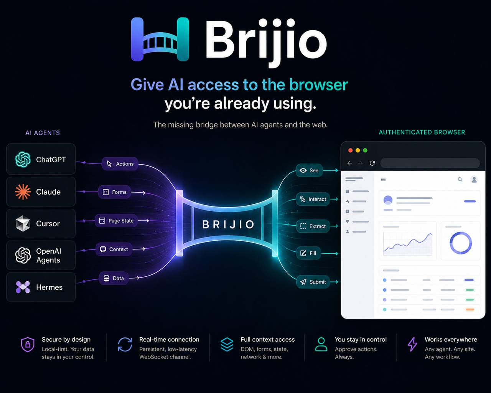
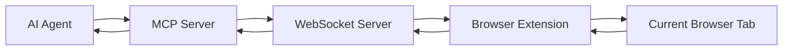
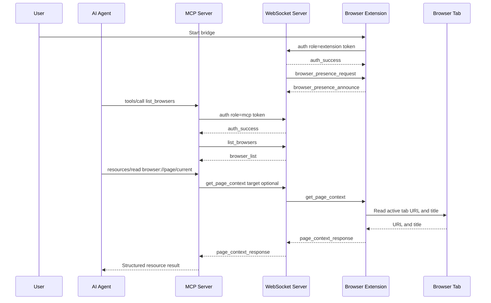

# Brijio

> **Remote agents. Local browser. No shared credentials.**

<p align="center">
  
</p>

Brijio connects remote AI agents to the browser session you already control.

Instead of launching a separate browser, cloning sessions, exporting cookies, or streaming screenshots, Brijio allows agents to collaborate with the browser you're already using.

The result is faster, safer, and more privacy-friendly access to the authenticated web.

Brijio is open source under AGPLv3. See [LICENSE](LICENSE) and [COMMERCIAL-LICENSING.md](COMMERCIAL-LICENSING.md).

---

## Why Brijio?

Most AI browser tools start with the assumption that the agent needs its own browser.

But in the real world, you're already:

- logged into Workday
- logged into Jira
- logged into GitHub
- logged into Gmail
- logged into your company's internal tools

The challenge isn't giving a browser to the agent.

The challenge is allowing the agent to collaborate with the browser session you already control.

That's what Brijio solves.

---

## Key Principles

### Authenticated Browser First

Use the browser session you're already using.

- No cookie export
- No session replication
- No browser cloning

### Remote Agent Friendly

Run agents wherever you want:

- Claude Desktop
- Codex
- Gemini CLI
- Hermes
- OpenClaw
- Cloud-hosted agents

Your browser remains local.

### Privacy By Design

Brijio is intentionally reactive.

The browser does not continuously stream:

- screenshots
- page updates
- DOM changes
- browser history

Agents must explicitly request information.

### Progressive Disclosure

Agents receive only the information they need.

Instead of sending:

- screenshots
- massive DOM trees
- full browser state

Brijio provides structured context first, then content when requested.

### Human In Control

The browser remains under user control.

The agent only receives access through explicit requests.

---

## Architecture

```text
Agent
  ↓
MCP Server
  ↓
Brijio Relay
  ↓
Browser Extension
 ↓
Browser Session
```

The browser remains the source of truth.



---

## Capability Matrix

- Read page context ✅
- Read page content ✅
- Read selected text ✅
- Fill forms ✅
- Trigger actions ✅
- Read page metadata ✅
- Structured page understanding ✅
- Remote agent access ✅
- File uploads 🚧
- End-to-end encryption 🚧
- Multi-tab workflows 🚧
- Fine-grained permissions 🚧
- Cookie export ❌
- Session cloning ❌
- Continuous browser streaming ❌
- Browser recording ❌

See [docs/project/CAPABILITY_MATRIX.md](docs/project/CAPABILITY_MATRIX.md) for the full capability contract.

---

## Communication Flow

The extension is reactive. It should answer specific requests and return
specific results. It should not stream page state continuously.



---

## Status

This project has the local WebSocket transport, Chrome extension page context
and action handling, MCP resources and tools, and local pairing/presence routing
in place. Safari Web Extension support with full Chrome feature parity is also
implemented (ADR 0019), using shared logic from `@brijio/shared`. The
current working milestone is:

1. A local Chrome extension manually connects to the WebSocket server.
2. The extension authenticates with a local pairing token and announces browser
   presence.
3. The MCP server authenticates with the same token, lists online browser
   instances, and routes explicit page reads or actions to one browser.
4. The Safari extension has the same browser capabilities as Chrome, using
   shared logic and Safari-specific adapters.

Features beyond that milestone require an approved ADR before implementation.

---

## MCP Resources And Tools

The current MCP server exposes page resources:

- `browser://page/current`, named `current-page-context`
- `browser://page/current/content/{index}`, named `current-page-content`

It also exposes tools for explicit page reads and discrete browser actions:

- `list_browsers`
- `read_current_page`
- `click_element`
- `fill_input`
- `fill_editable`
- `set_checked`
- `select_options`
- `submit_form`

Resource and tool results use predictable structured responses:

```ts
type ToolResult<T> =
  | { ok: true; data: T }
  | { ok: false; error: { code: string; message: string } };
```

---

## Running Brijio

### Option 1: npx (recommended for quick use)

```sh
npx @brijio/mcp
```

This starts both the WebSocket server and the MCP server with zero config. On startup, auto-generated tokens are printed to the console:

```text
🚀 Brijio ready!

  WebSocket:    ws://localhost:8787
  MCP:         http://localhost:8788/mcp

  Pairing Token:    dG9rZW4x  [auto-generated]
  MCP Auth Token:   dG9rZW4y  [auto-generated]
```

Copy these tokens — they change on every restart unless you persist them. To persist tokens, create a `.env` file in the working directory:

```sh
BRIJIO_PAIRING_TOKEN=your-secure-token-here
MCP_HTTP_AUTH_TOKEN=your-mcp-token-here
```

Or set environment variables directly:

```sh
BRIJIO_PAIRING_TOKEN=my-secret npx @brijio/mcp
```

The MCP endpoint is then available at `http://localhost:8788/mcp`.

### Option 2: Daemon (recommended for persistent use)

Install Brijio as a background service that starts on login:

```sh
npx @brijio/mcp install
```

This creates a LaunchAgent (macOS) or systemd user unit (Linux) that keeps Brijio running. Tokens are generated and stored in `~/.brijio/.env`.

```sh
npx @brijio/mcp start     # start the daemon
npx @brijio/mcp stop      # stop the daemon
npx @brijio/mcp restart   # restart the daemon
npx @brijio/mcp status    # check daemon and health status
npx @brijio/mcp logs      # view recent logs
npx @brijio/mcp logs --live  # stream logs in real-time
npx @brijio/mcp uninstall  # remove the daemon service
```

Daemon commands:

| Command                                | Description                                    |
| -------------------------------------- | ---------------------------------------------- |
| `install [--ws-port N] [--mcp-port N]` | Install daemon, generate tokens, start service |
| `uninstall`                            | Remove service (preserves config and logs)     |
| `start`                                | Start the daemon                               |
| `stop`                                 | Stop the daemon                                |
| `restart`                              | Restart the daemon                             |
| `status`                               | Show daemon state and health check results     |
| `logs [--lines N] [--live]`            | View or stream daemon logs                     |

Config is stored in `~/.brijio/.env`. To fully remove all Brijio daemon data: `rm -rf ~/.brijio`.

### Option 3: Docker

```sh
docker run -p 8787:8787 -p 8788:8788 \
  -e BRIJIO_PAIRING_TOKEN=my-pairing-token \
  -e MCP_HTTP_AUTH_TOKEN=my-mcp-token \
  brijio/mcp
```

Or with Docker Compose — copy `.env.example` to `.env`, fill in your tokens, then:

```sh
docker compose up
```

Both ports must be exposed: **8787** (WebSocket relay) and **8788** (MCP HTTP server). The Docker image bundles both services in a single container — no need to run separate images.

### Connecting Your Browser

1. Install the [Brijio Chrome extension](https://github.com/brijio/mcp)
2. Click the Brijio icon in your toolbar
3. Enter the WebSocket URL (default: `ws://localhost:8787`) and the pairing token
4. Click **Connect**

### Connecting Your AI Agent

Configure your MCP client (Claude Desktop, Hermes, etc.) to connect to the MCP server:

```json
{
  "mcpServers": {
    "brijio": {
      "type": "streamableHttp",
      "url": "http://localhost:8788/mcp",
      "headers": {
        "Authorization": "Bearer my-mcp-token"
      }
    }
  }
}
```

### Environment Variables

| Variable                    | Default               | Description                       |
| --------------------------- | --------------------- | --------------------------------- |
| `WEBSOCKET_HOST`            | `0.0.0.0`             | WebSocket server bind address     |
| `WEBSOCKET_PORT`            | `8787`                | WebSocket server port             |
| `BRIJIO_PAIRING_TOKEN`      | _auto-generated_      | Token for extension ↔ server auth |
| `MCP_HTTP_HOST`             | `0.0.0.0`             | MCP server bind address           |
| `MCP_HTTP_PORT`             | `8788`                | MCP server port                   |
| `MCP_HTTP_PATH`             | `/mcp`                | MCP server path                   |
| `MCP_HTTP_AUTH_TOKEN`       | _auto-generated_      | Bearer token for MCP clients      |
| `BRIJIO_WS_URL`             | `ws://127.0.0.1:8787` | WS URL for MCP → relay connection |
| `BRIJIO_REQUEST_TIMEOUT_MS` | `5000`                | Timeout for forwarded requests    |

Auto-generated tokens are ephemeral — they change on restart. For production or persistent setups, always set `BRIJIO_PAIRING_TOKEN` and `MCP_HTTP_AUTH_TOKEN` explicitly.

For Tailscale:

```sh
MCP_HTTP_HOST=0.0.0.0
```

No additional host allowlists are needed — auth tokens are the security boundary, not IP allowlists. See the security model below for details.

---

## Local Development

### Prerequisites

- **Node.js** ≥ 20
- **pnpm** ≥ 10 (`corepack enable` or `npm i -g pnpm`)

### Build

Build all workspace packages (shared package, WebSocket server, MCP server, and both browser extensions):

```sh
pnpm install
pnpm build
```

To build only the server packages:

```sh
pnpm --filter @brijio/websocket build
pnpm --filter @brijio/mcp build
```

### Install & Start

Copy the environment template and generate tokens:

```sh
cp .env.example .env
pnpm run token     # generates BRIJIO_PAIRING_TOKEN
```

Edit `.env` to set `BRIJIO_PAIRING_TOKEN` and `MCP_HTTP_AUTH_TOKEN` with your own values.

Start both servers with hot-reload:

```sh
pnpm dev
```

Or start individual servers:

```sh
pnpm --filter @brijio/websocket dev   # WebSocket relay on ws://0.0.0.0:8787
pnpm --filter @brijio/mcp dev         # MCP server on http://0.0.0.0:8788/mcp
```

For a production-style build + run:

```sh
pnpm build
node servers/mcp/dist/bin/brijio.js
```

Or use the daemon lifecycle commands from source:

```sh
pnpm brijio install   # install as a background service
pnpm brijio start      # start the daemon
pnpm brijio status     # check daemon health
```

Docker-based local development:

```sh
docker compose --profile runtime up --build
```

The runtime profile includes a demo page served over HTTP:

```text
http://127.0.0.1:${TEST_PAGE_PORT:-8080}/
```

Configure the same pairing token in the Chrome extension setup page along
with the local WebSocket URL.

Generate a separate MCP HTTP bearer token and set it as
`MCP_HTTP_AUTH_TOKEN`. MCP clients connect to:

```text
http://127.0.0.1:${MCP_HTTP_PORT:-8788}${MCP_HTTP_PATH:-/mcp}
```

### Testing The WebSocket Server With A CLI

Start the WebSocket server:

```sh
pnpm --filter @brijio/websocket dev
```

In another terminal, connect with `wscat`:

```sh
pnpm dlx wscat -c ws://127.0.0.1:8787
```

Send an auth message first:

```json
{
  "type": "message",
  "id": "auth-1",
  "payload": {
    "type": "auth",
    "role": "mcp",
    "token": "***"
  }
}
```

Then send a valid MCP-scoped request:

```json
{ "type": "message", "id": "cli-1", "payload": { "type": "list_browsers" } }
```

> **Compatibility:** `BRIJIO_PAIRING_TOKEN`, `BRIJIO_TOKEN`, `BRIJIO_WEBSOCKET_URL`, `BRIJIO_WS_URL`, `BRIJIO_REQUEST_TIMEOUT_MS`, and `BRIJIO_BROWSER_INSTANCE_ID` remain accepted as backward-compatible aliases during the transition window. `BRIJIO_BROWSER_INSTANCE_ID` is optional; when set, MCP tools target that browser by default.

---

## Repository Layout

```text
/package.json
/pnpm-workspace.yaml
/packages
 /shared
 /src
 protocol.ts
 page-context.ts
 page-content.ts
 background-controller.ts
 content-handler.ts
 timers.ts
 package.json
/servers
 /websocket
 /src
 index.ts
 sessions.ts
 messages.ts
 package.json
 /mcp
 /src
 index.ts
 page-context.ts
 websocket-client.ts
 package.json
/clients
 /extensions
 /chrome
 /safari
 /firefox
 /apps
/docs
 /architecture
 ARCHITECTURE.md
 /decisions
 /security
 /project
```

---

## Verify in 2 Minutes

Run `brijio demo` to start a self-contained demo server that exercises every Brijio MCP tool — no Docker, no browser extension, no external dependencies required.

```sh
npx brijio demo              # starts WS (8787) + MCP (8788) + demo page (8789)
```

Open the printed demo URL (default: `http://localhost:8789/`) in any browser. The page contains:

- **Story passages** — Sherlock Holmes text that exceeds 128 KiB, forcing `read_current_page` to paginate across multiple chunks
- **Structured data tables** — character profiles, timelines, deduction references, and cross-story indexes
- **Comprehensive form controls** — text, email, password, number, date, textarea, contenteditable, checkboxes, radios, single/multi-selects, disabled controls, and submit/reset buttons
- **Self-verifying submission** — form posts via GET parameters; `#results` shows ✅/❌ for each answer
- **Dynamic content** — live timestamp and auto-incrementing counter for polling tests

### Quick Checks

| MCP Tool | Test | Expected Result |
|---|---|---|
| `read_current_page` | Read the page | Multiple chunks; story text present in early chunks |
| `fill_input` | Fill `surname` with "Stoner" | Field shows "Stoner" |
| `form_action` (checkbox) | Check `chk-ventilator` | Checkbox checked |
| `form_action` (radio) | Select `radio-snake` | Radio selected |
| `form_action` (select) | Select `calcutta` in `location-select` | Dropdown shows "Calcutta, India" |
| `click_element` | Click `btn-prefill` | All fields populate with correct answers |
| `click_element` | Click `btn-submit` | URL updates with GET params; results section appears |

For the full checklist, see [`clients/test-page/smoke-test.md`](clients/test-page/smoke-test.md).

---

## License

Brijio source code is licensed under the GNU Affero General Public
License v3.0 (AGPLv3). See [LICENSE](LICENSE).

Commercial licensing is available for organizations that require alternative
terms. See [COMMERCIAL-LICENSING.md](COMMERCIAL-LICENSING.md).

Contributions are accepted under the project license. Contributors retain
copyright in their contributions. See [CONTRIBUTING.md](CONTRIBUTING.md).
