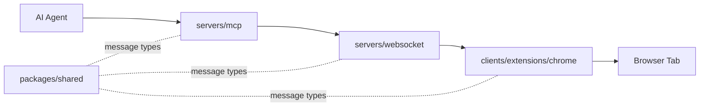
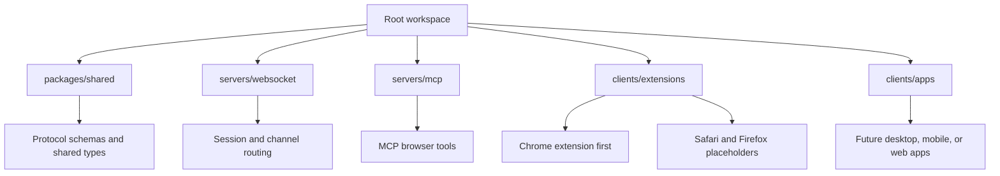

# ADR 0001: Initial Project Skeleton

## Status

Accepted

## Date

2026-05-24

## Context

BrowserBridge needs an initial repository structure before implementation can
begin. The project is a TypeScript monorepo with a WebSocket server, an MCP
server, browser extension clients, future app clients, and shared protocol
types.

The first milestone is intentionally narrow:

1. A local Chrome extension manually connects to the WebSocket server.
2. The MCP server requests browser status through the WebSocket server.
3. The Chrome extension responds with the current tab URL and title.

The skeleton should create the project boundaries needed for that milestone
without implementing runtime behavior yet.

## Decision

Create a pnpm workspace with package boundaries that mirror the runtime
architecture:

- `packages/shared` for cross-package TypeScript types and message schemas.
- `servers/websocket` for the WebSocket session router.
- `servers/mcp` for the MCP server and browser-facing tools.
- `clients/extensions/chrome` for the first browser extension implementation.
- `clients/extensions/safari` as a placeholder.
- `clients/extensions/firefox` as a placeholder.
- `clients/apps` as a placeholder for future app clients.

The initial change will add folders, package manifests, placeholder source
directories, and README files. It will not implement protocol behavior,
WebSocket routing, MCP tools, browser permissions, or extension UI logic.

## Structure

```text
/package.json
/pnpm-workspace.yaml
/.env.example
/docker-compose.yml
/packages
  /shared
    /src
    package.json
    README.md
/servers
  /websocket
    /src
    Dockerfile
    package.json
    README.md
  /mcp
    /src
    Dockerfile
    package.json
    README.md
/clients
  /extensions
    /chrome
      /src
      manifest.json
      package.json
      README.md
    /safari
      README.md
    /firefox
      README.md
  /apps
    README.md
```

## Runtime Boundary Diagram



## Initial Package Responsibilities



## Package Manifest Approach

Use minimal `package.json` files:

- Root package declares the workspace and common scripts.
- Each TypeScript package declares its own package name, entry points, and
  scripts.
- Server and extension packages can depend on `@browserbridge/shared`.
- Placeholder folders do not need package manifests until they contain code.

Use private package names under the `@browserbridge/*` scope.

## Environment And Docker

Add a root `.env.example` with local defaults for:

- WebSocket host and port.
- WebSocket URL.
- Local development token.
- Default local session ID.

Add a root `docker-compose.yml` and minimal server Dockerfiles that document the
intended local service topology. If runtime code does not exist yet, keep the
containers as explicit placeholders and avoid claiming they are production-ready.

## Consequences

This creates clear ownership boundaries before runtime implementation starts.
It also gives future ADRs a concrete place to attach decisions for protocol
schemas, server routing, MCP tools, and extension permissions.

The tradeoff is that some files will initially be placeholders. That is
acceptable because this ADR limits the scope to repository shape and package
documentation.

## Verification

After approval and implementation, verify:

- The workspace files exist at the expected paths.
- `pnpm-workspace.yaml` includes packages, servers, and client packages.
- Package manifests use the expected `@browserbridge/*` names.
- Placeholder README files clearly describe future intent.
- No runtime behavior is implied before it exists.
