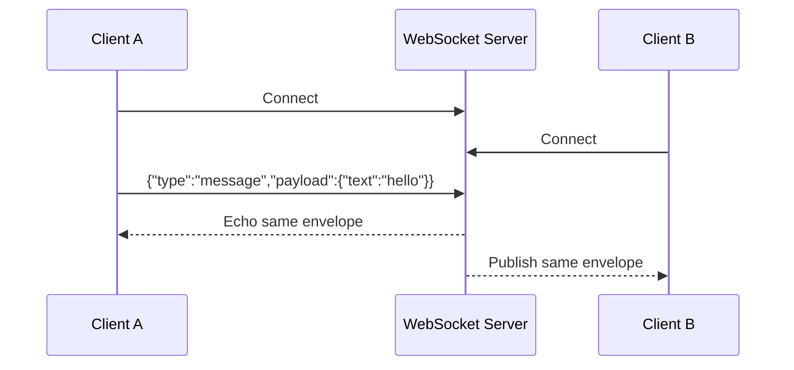
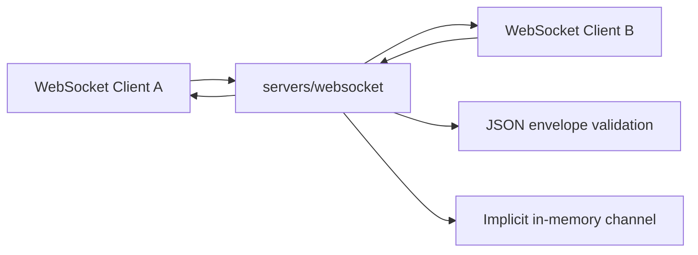

# ADR 0002: WebSocket Single-Channel Echo And Pub/Sub Server

## Status

Accepted

## Date

2026-05-24

## Context

The initial project skeleton created `servers/websocket` as the home for live
browser bridge connections, but no runtime behavior exists yet.

The first WebSocket implementation should be intentionally smaller than the
full BrowserBridge routing model. It should prove the local WebSocket service
can accept connections, receive structured messages, and fan messages out to
connected clients. For this first stab, authentication is out of scope even
though the long-term architecture requires authenticated user, session, and
channel routing.

This creates a temporary mismatch with the broader security model. The mismatch
is acceptable only because this ADR limits the server to local development,
single-channel message exchange, and no browser state access.

## Decision

Implement `servers/websocket` as an unauthenticated local WebSocket server with
one implicit channel.

The server will support two behaviors:

1. Echo any valid client message back to the sending connection.
2. Publish each valid message to every other connected subscriber on the same
   implicit channel.

All connected clients are subscribers. There is no separate subscribe command,
channel name, user ID, session ID, or auth token in this milestone. The single
channel is an implementation stepping stone, not the final BrowserBridge
protocol.

## Message Shape

Use a small structured JSON envelope:

```ts
type WebSocketEnvelope = {
  type: "message";
  id?: string;
  payload: unknown;
};
```

The server should reject invalid JSON or unsupported message shapes with a
structured error response to the sending connection:

```ts
type WebSocketErrorEnvelope = {
  type: "error";
  error: {
    code: "invalid_json" | "invalid_message";
    message: string;
  };
};
```

Valid messages are returned to the sender and broadcast to peers without
mutating the payload.

## Runtime Flow



## Server Boundary



## Considered Approaches

### Option 1: Raw Echo Server

The server accepts connections and sends each received frame back only to the
sender.

This is the smallest possible implementation, but it does not test the
publish/subscribe behavior that the browser bridge will need.

### Option 2: Single Implicit Channel

The server treats every connection as subscribed to one in-memory channel. A
valid message is echoed to the sender and broadcast to all other clients.

This is still small, but it exercises the core fan-out behavior needed by later
session and channel routing. This is the selected approach.

### Option 3: Named Channels Now

The server introduces explicit `subscribe` and `publish` messages with channel
names.

This is closer to the future cloud model, but it adds protocol surface before
the project has tests, clients, or MCP integration.

## Scope

In scope:

- WebSocket server startup from `servers/websocket`.
- Configurable host and port with local defaults.
- In-memory connection tracking.
- JSON message validation.
- Echo to sender for valid messages.
- Broadcast to all other connected clients for valid messages.
- Structured errors for invalid JSON and invalid message envelopes.
- Focused tests for validation, echo, and broadcast behavior.
- README updates that describe the temporary unauthenticated local behavior.

Out of scope:

- Authentication.
- User, session, or named channel routing.
- MCP server integration.
- Browser extension integration.
- Storage or replay of messages.
- Browser page state access.
- Docker production hardening.

## Consequences

The implementation gives the project a working WebSocket baseline without
blocking on the full BrowserBridge protocol. It also creates a clear next step:
replace the implicit channel with authenticated private session/channel routing
when MCP and browser extension clients are introduced.

The main risk is that an unauthenticated WebSocket service could be mistaken for
the intended security model. To reduce that risk, code and documentation should
describe this as local-only milestone behavior and avoid claiming support for
browser state or trusted routing.

## Verification

After approval and implementation, verify:

- Tests fail before implementation for invalid messages, sender echo, and peer
  broadcast.
- Tests pass after implementation.
- `pnpm --filter @browserbridge/websocket test` passes.
- `pnpm --filter @browserbridge/websocket build` or `check` passes if the
  package has those scripts after implementation.
- The websocket README documents the no-auth, single-channel limitation.
