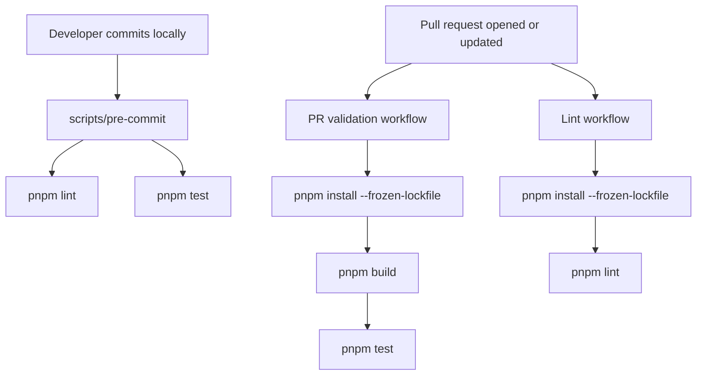

# ADR 0003: PR Validation, Lint, And Local Pre-Commit Tooling

## Status

Accepted

## Date

2026-05-24

## Context

BrowserBridge currently has root monorepo scripts for build, check, dev, and
test:

```json
{
  "build": "pnpm -r build",
  "check": "pnpm -r check",
  "dev": "pnpm -r --parallel dev",
  "test": "pnpm -r test"
}
```

There are no GitHub Actions workflows yet and no local pre-commit script. This
means pull requests do not have an automated repository-level verification path,
and contributors do not have a small local command that mirrors the checks most
likely to fail in CI.

Several package scripts are still milestone placeholders. The first CI setup
should therefore use the existing root commands and avoid introducing a full
linting framework before the codebase needs one.

## Decision

Add two GitHub Actions workflows:

1. `pr-validation.yml` for pull request validation.
2. `lint.yml` for static lint/check validation.

Add a local pre-commit script that runs the same core checks locally before a
commit is created.

The root package scripts will define a dedicated lint command:

```json
{
  "lint": "pnpm -r check",
  "precommit": "scripts/pre-commit"
}
```

The initial lint command will intentionally map to `pnpm -r check`, because the
project already exposes TypeScript/static validation through package `check`
scripts and has not adopted ESLint, Biome, or another formatter/linter yet.

The pull request validation workflow will run:

1. `pnpm install --frozen-lockfile`
2. `pnpm build`
3. `pnpm test`

The lint workflow will run:

1. `pnpm install --frozen-lockfile`
2. `pnpm lint`

The local pre-commit script will run:

1. `pnpm lint`
2. `pnpm test`

This makes local checks faster than full CI while still catching the two most
important regressions before commit: static check failures and test failures.

## Workflow Flow



## Tooling Boundary

```mermaid
flowchart LR
  RootPackage[package.json scripts] --> Packages[pnpm workspace packages]
  GitHubActions[.github/workflows] --> RootPackage
  PreCommitScript[scripts/pre-commit] --> RootPackage

  Packages --> WebSocket[@browserbridge/websocket]
  Packages --> MCP[@browserbridge/mcp]
  Packages --> Shared[@browserbridge/shared]
  Packages --> Chrome[@browserbridge/chrome-extension]
```

## Considered Approaches

### Option 1: Minimal CI Around Existing Scripts

Use the current pnpm workspace scripts and add only a root `lint` alias for
`pnpm -r check`.

This is the selected approach. It is small, readable, and matches the current
repository maturity.

### Option 2: Introduce ESLint Or Biome Now

Add a dedicated linting dependency and configure every package around it.

This would create a more conventional lint workflow, but it would also add
tooling policy, dependency churn, and formatting decisions unrelated to the
current milestone.

### Option 3: Single Combined GitHub Actions Workflow

Run lint, build, and test in one workflow file.

This is simple, but the user requested one workflow to validate the PR and
another workflow to lint the code. Separate workflows also make failures easier
to scan in GitHub.

## Scope

In scope:

- Add `.github/workflows/pr-validation.yml`.
- Add `.github/workflows/lint.yml`.
- Add a root `lint` script.
- Add a root `precommit` script.
- Add `scripts/pre-commit`.
- Keep commands pnpm-based and aligned with existing package scripts.
- Use Node 22 in CI to match the repository engine requirement.
- Use `pnpm/action-setup` with the package manager version declared in
  `package.json`.

Out of scope:

- Adding ESLint, Biome, Prettier, or formatting policy.
- Installing Git hooks automatically.
- Changing package implementation behavior.
- Rewriting placeholder package scripts.
- Adding deployment or release workflows.
- Expanding browser, MCP, or WebSocket runtime behavior.

## Consequences

Pull requests will get repeatable CI feedback for build, tests, and static
checks. Contributors will also have a local `pnpm precommit` command that
mirrors the important checks before pushing.

The main limitation is that `lint` initially means "run package check scripts"
rather than "run a dedicated source-code linter." This should be documented
through the script name and can be upgraded later through a separate ADR when
the project is ready to adopt a linter.

## Verification

After approval and implementation, verify:

- `pnpm lint` passes.
- `pnpm test` passes.
- `pnpm build` passes.
- `pnpm precommit` passes.
- GitHub Actions workflow YAML parses as valid YAML.
- The two workflows use Node 22 and pnpm with frozen lockfile installs.
