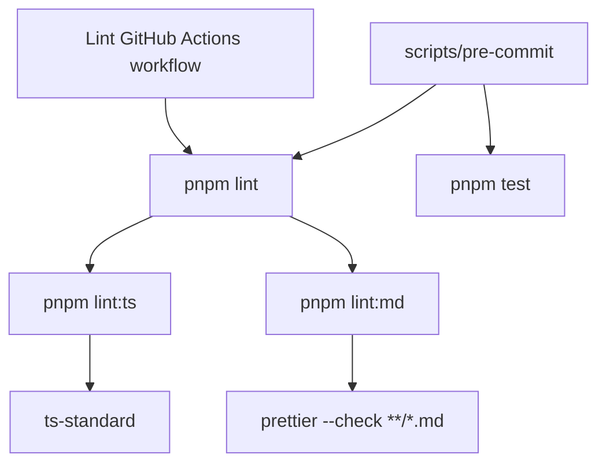
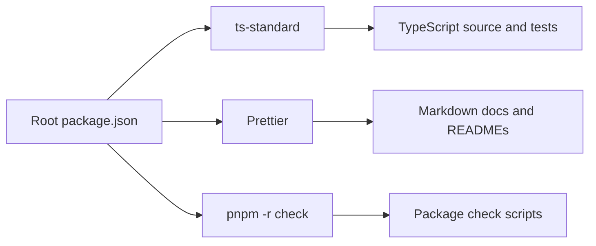

# ADR 0004: TypeScript And Markdown Lint Tooling

## Status

Accepted

## Date

2026-05-24

## Context

ADR 0003 added pull request validation, a dedicated lint workflow, and a local
pre-commit script. Its first implementation maps `pnpm lint` to `pnpm -r check`
because the repository did not yet have a chosen source linter or formatter.

The project now has an explicit tooling preference:

- Use `ts-standard` for TypeScript linting.
- Use Prettier for Markdown formatting checks.

This changes the meaning of the root `lint` command from "run package check
scripts" to "run source lint and format checks." Type checking should remain
available through `pnpm check` and `pnpm build`.

## Decision

Adopt `ts-standard` and Prettier as root development tooling.

The root scripts will use this shape:

```json
{
  "check": "pnpm -r check",
  "format:md": "prettier --write \"**/*.md\"",
  "lint": "pnpm lint:ts && pnpm lint:md",
  "lint:md": "prettier --check \"**/*.md\"",
  "lint:ts": "XDG_CACHE_HOME=.cache ts-standard \"**/*.ts\"",
  "precommit": "scripts/pre-commit"
}
```

The root package will add development dependencies for:

- `ts-standard`
- `prettier`

The repository will include a root `tsconfig.eslint.json` for `ts-standard`.
The TypeScript lint script will set `XDG_CACHE_HOME=.cache` so linter cache
files stay inside the workspace and can be ignored by git.

The lint GitHub Actions workflow added by ADR 0003 will keep calling
`pnpm lint`. The local pre-commit script will keep calling `pnpm lint` before
`pnpm test`.

The implementation may update existing TypeScript source files to satisfy
`ts-standard` style rules. The implementation may also format Markdown files
with Prettier so that `pnpm lint:md` passes.

## Lint Flow



## Tooling Boundary



## Considered Approaches

### Option 1: Use `ts-standard` And Prettier At The Root

Install both tools as root development dependencies and expose root scripts for
TypeScript linting and Markdown formatting checks.

This is the selected approach. It keeps the policy centralized and lets the
existing GitHub Actions and pre-commit script continue to call one root lint
command.

### Option 2: Configure Each Package Separately

Add lint scripts and dependencies inside each workspace package.

This would make package boundaries explicit, but it duplicates tooling policy
before the repository has many package-specific needs.

### Option 3: Keep `pnpm lint` As `pnpm -r check`

Continue using package check scripts as lint.

This no longer matches the requested tooling policy and would leave TypeScript
style and Markdown formatting unchecked.

## Scope

In scope:

- Add root `ts-standard` and `prettier` development dependencies.
- Replace the root `lint` script with `pnpm lint:ts && pnpm lint:md`.
- Add root `lint:ts`, `lint:md`, and `format:md` scripts.
- Add root `tsconfig.eslint.json` for TypeScript linting.
- Ignore workspace-local `.cache` tooling output.
- Keep `pnpm check` as the workspace type/static check command.
- Keep the lint GitHub Actions workflow calling `pnpm lint`.
- Keep `scripts/pre-commit` calling `pnpm lint` then `pnpm test`.
- Update the repository tooling contract test to assert the new lint scripts.
- Apply required TypeScript and Markdown formatting changes so lint passes.

Out of scope:

- Adding ESLint, Biome, or another JavaScript linter.
- Formatting JSON, YAML, or other non-Markdown files with Prettier.
- Installing Git hooks automatically.
- Changing runtime behavior in the WebSocket, MCP, or extension packages.
- Replacing package `check` scripts with `ts-standard`.

## Consequences

The lint workflow will now enforce the requested source style policy instead of
only running package check scripts. Markdown docs will be consistently formatted
through Prettier, and TypeScript files will follow the `ts-standard` style.

The tradeoff is that adopting these tools can create a one-time formatting diff
in existing TypeScript and Markdown files. That diff should be kept mechanical
and separated from runtime behavior changes.

## Verification

After approval and implementation, verify:

- `pnpm lint:ts` passes.
- `pnpm lint:md` passes.
- `pnpm lint` passes.
- `pnpm check` passes.
- `pnpm test` passes.
- `pnpm build` passes.
- `pnpm precommit` passes.
- GitHub Actions workflow YAML still parses as valid YAML.
