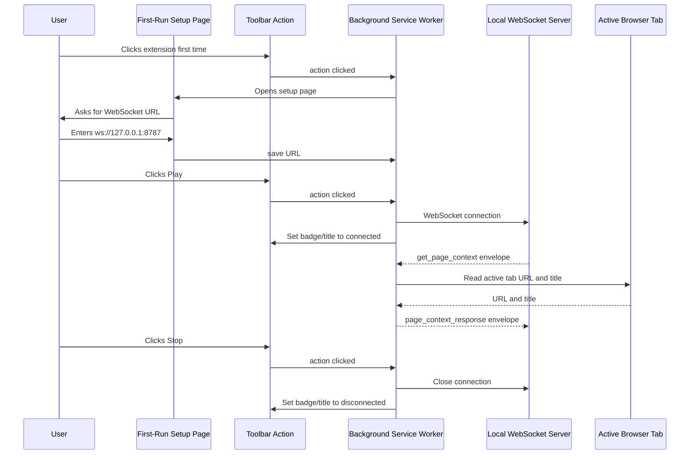
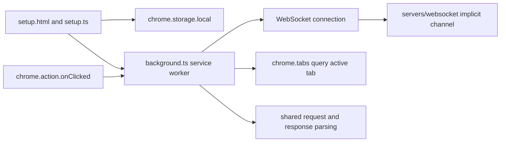

# ADR 0005: First Chrome Extension Page Context Response

## Status

Accepted

## Date

2026-05-24

## Context

ADR 0002 added a local WebSocket server that accepts structured message
envelopes and broadcasts each valid message to every connected client on one
implicit channel. The Chrome extension package currently exists only as a
placeholder with a minimal Manifest V3 manifest and no runtime code.

The next milestone is the first installable Chrome extension. It should prove
that a user can manually configure a WebSocket URL, connect the extension, and
have the extension answer an explicit page context request. This is still before
the full MCP server routing model, authentication model, and richer browser
action protocol.

This milestone intentionally keeps the extension reactive. It should not stream
tab data, collect background page snapshots, or read page content unless a
request arrives over the user-started WebSocket connection.

## Decision

Implement the first Chrome extension as a small Manifest V3 extension in
`clients/extensions/chrome`.

The extension will include:

- A first-run setup page that asks for the WebSocket URL.
- A toolbar action that toggles the bridge between Play and Stop after setup.
- Persistent storage of the WebSocket URL in `chrome.storage.local`.
- A background service worker that owns the WebSocket connection.
- A single supported request: `get_page_context`.
- A response to that request containing the active tab URL and title.
- User-visible connection state through the extension icon badge and title.

The extension will use the current server envelope shape:

```ts
type WebSocketEnvelope = {
  type: "message";
  id?: string;
  payload: unknown;
};
```

The first page context request payload will be:

```ts
type GetPageContextRequest = {
  type: "get_page_context";
};
```

The extension will respond on the same WebSocket with the same envelope `id`
when present:

```ts
type PageContextResponse = {
  type: "page_context_response";
  ok: true;
  data: {
    url: string;
    title: string;
  };
};
```

If the request cannot be handled, the extension will send a structured response
instead of throwing:

```ts
type PageContextErrorResponse = {
  type: "page_context_response";
  ok: false;
  error: {
    code: "not_connected" | "no_active_tab" | "unsupported_request";
    message: string;
  };
};
```

The extension may ignore echoed `page_context_response` messages that come back
from the current single-channel WebSocket server. The full MCP implementation
will replace this temporary single-channel behavior with private routing in a
future ADR.

## Extension Flow



## Runtime Boundary



## Considered Approaches

### Option 1: Popup-Owned WebSocket Connection

The popup opens and owns the WebSocket connection directly.

This is simple, but Chrome popups are short-lived. Closing the popup would close
the connection and make request handling unreliable.

### Option 2: Dedicated Extension Page With Background-Owned WebSocket

A persistent extension-owned page collects configuration and sends
connect/disconnect commands to the background service worker.

This makes testing easier because the UI stays open, but it leaves a visible
control surface around after first setup. That is more UI than this milestone
needs.

### Option 3: Action Toggle With First-Run Setup Page

The toolbar action opens a setup page only when no WebSocket URL is configured.
After setup, each action click toggles the bridge between connected and
disconnected. The background service worker owns the WebSocket connection and
handles incoming requests.

This is the selected approach. It keeps the bridge transparent during normal
use, while preserving explicit user control through Play and Stop.

### Option 4: Content-Script Page Context Collection

The extension injects a content script and reads page data from the DOM.

This will be needed for richer page context later, but it is unnecessary for the
first milestone because Chrome's tabs API can provide the active tab URL and
title.

## Scope

In scope:

- Add buildable TypeScript runtime files for the Chrome extension.
- Add first-run setup HTML and TypeScript for WebSocket URL configuration.
- Add toolbar action handling that opens setup before configuration and toggles
  connection afterward.
- Add a background service worker that connects to the configured WebSocket URL.
- Update the extension action badge and title to show stopped, connected, and
  error states.
- Listen for `WebSocketEnvelope` messages with payload type
  `get_page_context`.
- Query the active tab and send `page_context_response` with `url` and `title`.
- Preserve the request `id` in the response envelope when one is provided.
- Store only the WebSocket URL and connection preference needed for local use.
- Add minimal permissions needed for the behavior and document why they are
  needed.
- Add tests for request parsing, response construction, unsupported requests,
  and active tab context handling.
- Update the Chrome extension README with install, build, and local usage steps.

Out of scope:

- Full MCP server integration.
- Authentication or private user/session/channel routing.
- Continuous browser state streaming.
- Reading body text, selected text, forms, accessibility trees, or DOM snapshots.
- Browser actions such as click, fill, submit, or navigate.
- Content scripts.
- Firefox or Safari implementation.
- Cloud deployment behavior.
- Storing page context or request history.

## Permissions

The manifest will add only the permissions needed for this milestone:

- `storage`, so the extension can remember the user-entered WebSocket URL.
- `tabs`, so the background worker can read the active tab URL and title when
  handling an explicit request.

No host permissions are required for this milestone because the extension is not
injecting scripts or reading DOM content.

## Testing

Use TDD for the implementation:

1. Add failing tests for protocol/request handling in the Chrome extension
   package.
2. Add failing tests for active-tab context response construction using a small
   adapter around Chrome APIs.
3. Implement the smallest runtime code needed to make those tests pass.
4. Add setup/action/background wiring after the protocol behavior is covered.

The implementation should keep Chrome API access behind small functions so the
core request handling can be tested under Node without launching Chrome.

Manual verification should include:

- `pnpm --filter @browserbridge/chrome-extension build` produces an installable
  extension directory.
- The extension can be loaded through Chrome's "Load unpacked" flow.
- The first action click asks for the WebSocket URL when none is stored.
- Later action clicks connect to and disconnect from the local WebSocket server
  without opening visible UI.
- The extension action badge and title show the current bridge state.
- Sending a `get_page_context` envelope through the WebSocket server causes the
  extension to reply with the active tab URL and title.

## Consequences

This creates the first usable browser client while staying within the narrow
milestone. The extension can be installed and manually connected through the
toolbar action, but it still depends on the temporary unauthenticated
single-channel WebSocket server from ADR 0002.

The main risk is confusing this milestone with the final security model. The
implementation and README must state that this is a local development milestone
and that authenticated private routing remains future work.

The second risk is relying on a Manifest V3 service worker for a long-lived
WebSocket connection. This is acceptable for the first local milestone, but the
future MCP routing ADR should revisit connection lifecycle, reconnect behavior,
and user-visible failure states before expanding browser actions.

## Verification

After approval and implementation, verify:

- Tests fail before implementation for the new extension behavior.
- `pnpm --filter @browserbridge/chrome-extension test` passes.
- `pnpm --filter @browserbridge/chrome-extension check` passes.
- `pnpm --filter @browserbridge/chrome-extension build` passes.
- `pnpm lint:ts` passes.
- `pnpm lint:md` passes.
- `pnpm test` passes.
- Manual Chrome install and local WebSocket request/response are documented with
  the exact command or steps used.
