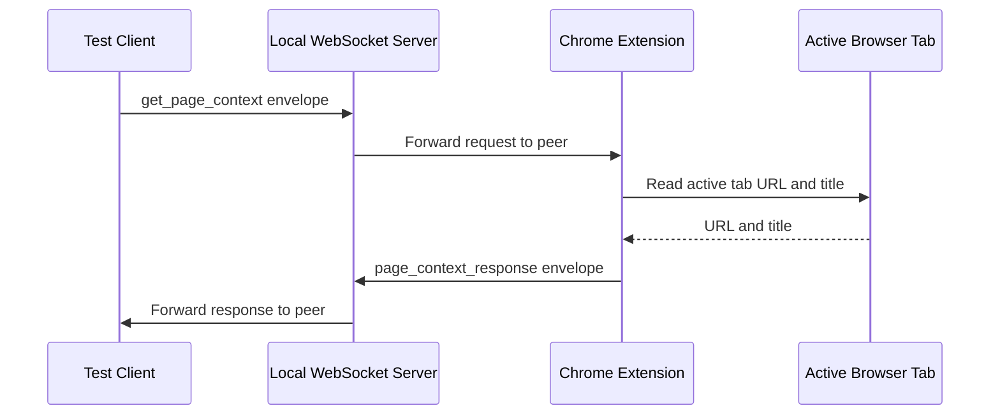
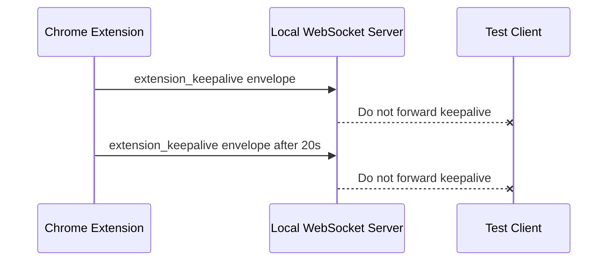

# ADR 0006: WebSocket Peer Forwarding And Extension Keepalive

## Status

Accepted

## Date

2026-05-24

## Context

ADR 0002 intentionally implemented the first WebSocket server as a local
single-channel echo and pub/sub server. That was useful for validating the
server in isolation, but it is now noisy and misleading with the first Chrome
extension client.

When a test client sends a `get_page_context` request, the WebSocket server
returns the original request to the sender before the extension response:

```json
{
  "type": "message",
  "id": "request-1",
  "payload": { "type": "get_page_context" }
}
```

The sender only needs the extension response:

```json
{
  "type": "message",
  "id": "request-1",
  "payload": {
    "type": "page_context_response",
    "ok": true,
    "data": {
      "url": "https://www.google.com/",
      "title": "Google"
    }
  }
}
```

Manual testing also showed intermittent requests that only received the echo and
not the extension response. The extension keeps its WebSocket in a Manifest V3
background service worker. Chrome can stop an idle extension service worker, so
the active bridge needs lightweight WebSocket activity while the user has the
bridge turned on.

This is not browser state streaming. A keepalive message contains no page data
and exists only to keep the user-started connection available while the bridge
is ON.

## Decision

Change the local WebSocket server from sender echo plus peer broadcast to peer
forwarding only.

For valid messages:

- Send the message to every other connected WebSocket client.
- Do not send the original message back to the sender.

For invalid JSON and invalid envelopes:

- Continue returning structured errors directly to the sending connection.

Add a private extension keepalive message while the Chrome extension is
connected:

```ts
type ExtensionKeepalive = {
  type: "extension_keepalive";
};
```

The extension will send this message periodically while the bridge is ON. The
server will accept the keepalive envelope and not forward it to other clients.
The keepalive interval should be below Chrome's service worker idle window; use
20 seconds for this milestone.

Set `minimum_chrome_version` to `116` in the Chrome extension manifest because
Chrome 116 introduced improved support for keeping extension service workers
alive through WebSocket activity.

## Message Flow



## Keepalive Flow



## Considered Approaches

### Option 1: Keep Echo And Filter In The Client

The test client or future MCP client could ignore its own request messages.

This preserves ADR 0002 behavior, but it makes every caller responsible for
filtering protocol noise and does not match request/response expectations.

### Option 2: Peer Forwarding Only

The server forwards valid messages only to other clients.

This is the selected server behavior. It keeps the local single-channel router
simple while removing the noisy sender echo.

### Option 3: Full Session Routing Now

Replace the single-channel server with authenticated user, session, and channel
routing.

This is closer to the final architecture, but it is larger than the current
debugging scope. The MCP integration should get its own ADR when it is ready.

## Scope

In scope:

- Update WebSocket server tests from echo expectations to peer-forwarding
  expectations.
- Update WebSocket server implementation to avoid sending valid messages back to
  the sender.
- Add server handling for `extension_keepalive` messages that should not be
  forwarded.
- Add Chrome extension controller tests for keepalive start and stop behavior.
- Add extension keepalive while the bridge is connected.
- Set `minimum_chrome_version` to `116`.
- Update WebSocket and Chrome extension documentation.

Out of scope:

- Full MCP routing.
- Authentication.
- Named channels.
- Browser page data beyond URL and title.
- Reconnection/backoff policy.
- Replacing the WebSocket server protocol envelope.

## Consequences

The local WebSocket server becomes a closer match for the upcoming MCP flow:
request clients receive responses from browser clients, not their own request
echoes.

The extension will send small keepalive messages while the user has explicitly
started the bridge. This slightly increases local WebSocket traffic, but it does
not expose browser state and it keeps the user-visible ON state aligned with the
connection being available.

## Verification

After approval and implementation, verify:

- WebSocket server tests fail before implementation when sender echo is expected
  to be absent.
- Chrome extension tests fail before implementation when keepalive is expected.
- `pnpm --filter @browserbridge/websocket test` passes.
- `pnpm --filter @browserbridge/chrome-extension test` passes.
- `pnpm --filter @browserbridge/chrome-extension build` passes.
- `pnpm lint:ts` passes.
- `pnpm lint:md` passes.
- `pnpm test` passes.
- Manual `wscat` testing shows `get_page_context` returns only
  `page_context_response` to the request client.
