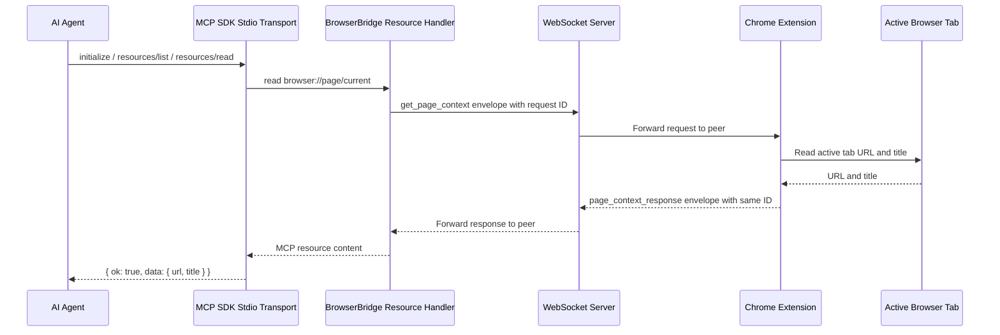
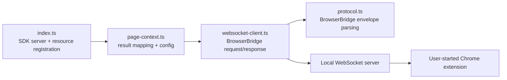

# ADR 0007: First MCP Page Context Resource

## Status

Accepted

## Date

2026-05-24

## Context

ADR 0005 added the first Chrome extension page-context response. ADR 0006
changed the local WebSocket server to peer-forward valid messages so a request
client can receive the extension response without first receiving its own echo.

The `servers/mcp` package is still a placeholder. The next milestone is the
first usable MCP server path that lets an AI agent explicitly request the
current browser page context and receive the active tab URL and title.

The MCP server should not hand-roll MCP JSON-RPC framing, request dispatch,
initialize responses, resource listing, resource reads, or future tool calls.
MCP clients expect protocol details such as initialization, capability
negotiation, notifications, error shaping, resource metadata, and future tools
or prompts to follow the MCP specification. The official TypeScript MCP SDK
provides `McpServer` and stdio transport abstractions for this role.

Page context is read-only browser state. MCP resources are the better fit for
readable contextual data, while MCP tools should be reserved for browser
actions such as navigation, clicking, filling inputs, and submitting forms.

This must remain a local development milestone. It should not add continuous
browser state streaming, background surveillance, storage of page context, or
browser actions.

## Decision

Implement the first MCP server in `servers/mcp` with one resource:

- URI: `browser://page/current`
- Name: `current-page-context`
- MIME type: `application/json`

The resource read handler will:

1. Open a WebSocket connection to the configured local WebSocket server.
2. Send the existing protocol envelope with a generated request ID:

   ```json
   {
     "type": "message",
     "id": "request-id",
     "payload": { "type": "get_page_context" }
   }
   ```

3. Wait for a matching `page_context_response` envelope with the same ID.
4. Return a typed JSON result object:

   ```ts
   type BrowserBridgePageContextResult =
     | {
         ok: true;
         data: {
           url: string;
           title: string;
         };
       }
     | {
         ok: false;
         error: {
           code:
             | "connection_failed"
             | "timeout"
             | "invalid_response"
             | "browser_error";
           message: string;
         };
       };
   ```

The implementation will keep the WebSocket request/response behavior in a small
testable client module and keep MCP resource registration in the SDK entrypoint.
The first CLI entrypoint will run an MCP stdio server for local agents using the
official TypeScript MCP SDK:

1. Create an SDK `McpServer` with BrowserBridge server metadata.
2. Register `browser://page/current` through the SDK resource registration API.
3. Use an SDK `StdioServerTransport` for stdio framing and MCP lifecycle
   handling.
4. Write diagnostics only to stderr, never stdout.

The SDK resource response will return one JSON text content item with the
BrowserBridge result object. The extension currently returns URL and title; the
same resource URI will remain the place for the full page context once the
extension implementation expands.

Configuration will use environment variables:

- `BROWSERBRIDGE_WEBSOCKET_URL`, defaulting to `ws://127.0.0.1:8787`.
- `BROWSERBRIDGE_REQUEST_TIMEOUT_MS`, defaulting to `5000`.

## Request Flow



## Runtime Boundary



## Considered Approaches

### Option 1: Reuse The Placeholder Status Tool

Implement only `get_browser_status` first.

This would satisfy the original first milestone wording, but the extension
already supports `get_page_context`, and the user need is to request page
information through the MCP server.

### Option 2: Add One Page Context Resource

Expose `browser://page/current` and route resource reads through the existing
local WebSocket protocol.

This is the selected approach. It proves the end-to-end agent-to-browser path
while staying within the accepted extension and WebSocket protocol. It also
keeps tools available for future browser actions.

### Option 3: Add All Initial MCP Tools

Add navigation, click, fill, and submit tools now.

This is too broad for the current milestone. Those actions need their own ADR
because they perform browser mutations and require additional extension
approval, permissions, and tests.

### Option 4: Hand-Roll The MCP Runtime

Implement custom stdio parsing and direct handlers for `initialize`,
`resources/list`, and `resources/read`.

This keeps dependencies low, but it makes BrowserBridge responsible for MCP
protocol behavior that should be owned by the official SDK. This approach is
rejected.

### Option 5: Use The Official SDK For Transport And Resource Registration

Adopt the official TypeScript MCP SDK for server lifecycle, stdio transport,
and resource registration while preserving the existing BrowserBridge WebSocket
client.

This is selected for the MCP runtime. It removes custom MCP protocol code
without expanding the browser capability surface.

## Scope

In scope:

- Add official MCP TypeScript SDK dependencies.
- Add MCP server TypeScript runtime files in `servers/mcp/src`.
- Add tests for MCP resource result shaping and WebSocket request/response
  handling.
- Add tests for SDK-backed initialize, resource discovery, and resource read
  behavior.
- Use the official SDK for MCP stdio transport and resource registration.
- Add request ID generation and response correlation.
- Add timeout handling.
- Add clear errors for connection failures, timeout, invalid responses, and
  extension-reported page-context errors.
- Add package scripts for build, dev, check, and test.
- Update `servers/mcp/README.md` with local usage.

Out of scope:

- Browser actions such as navigation, click, fill, and submit.
- Custom MCP stdio JSON-RPC runtime code.
- MCP tools or prompts.
- HTTP MCP transport.
- Authenticated private user/session/channel routing.
- Multiple concurrent browser sessions.
- Continuous browser state streaming.
- Storing page context.
- Reading page body text or DOM content.
- Docker updates beyond existing local package commands.

## Testing

Use TDD:

1. Add failing tests for SDK-backed initialize and resource discovery behavior.
2. Add failing tests for response parsing and resource result shaping.
3. Add failing tests for WebSocket client request/response success, timeout, and
   invalid response behavior.
4. Implement the smallest runtime code needed to pass those tests.
5. Add the SDK-backed MCP stdio entrypoint once the resource behavior is
   covered.

Verification should include:

- `pnpm --filter @browserbridge/mcp test`
- `pnpm --filter @browserbridge/mcp build`
- `pnpm lint:ts`
- `pnpm lint:md`
- `pnpm test`

Manual verification should use a running WebSocket server and connected Chrome
extension to read `browser://page/current` from an MCP-compatible client.

## Consequences

This creates the first agent-facing BrowserBridge path without broadening the
browser capability surface. Agents can request the active tab URL and title only
when the user has explicitly connected the extension.

The implementation will still depend on the temporary local single-channel
WebSocket server. Authenticated private routing remains future work and must be
designed before cloud deployment or multiple user/session support.
