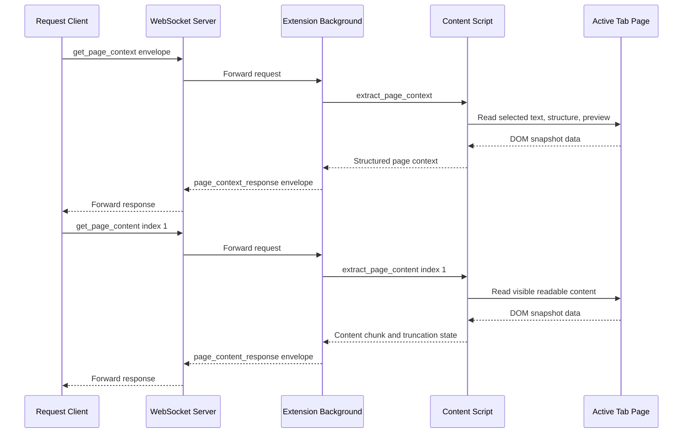
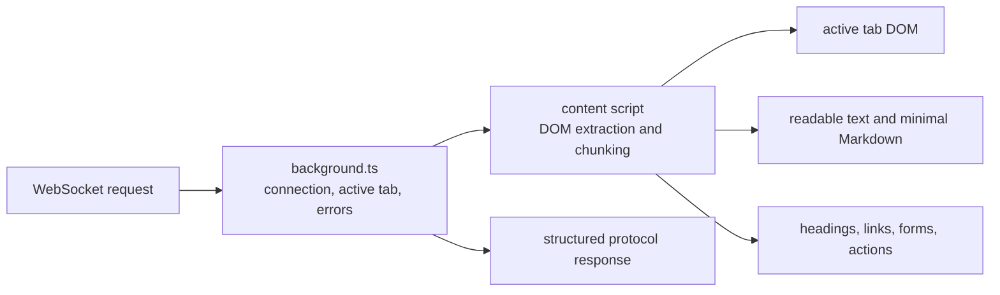

# ADR 0008: Extension Rich Page Context And Paginated Content

## Status

Accepted

## Date

2026-05-25

## Context

ADR 0005 added the first Chrome extension page context response. That response
contains only the active tab URL and title. ADR 0007 exposed that response
through the MCP server as the first read-only page context resource.

The next browser capability needs a richer definition of page context. Agents
need enough information to understand the page and choose useful browser
actions, but BrowserBridge must still avoid silent surveillance, continuous
streaming, raw DOM dumps, and storage of page content.

The richer design should separate two concerns:

- Page structure, which tells the agent what the page is and what can be acted
  on.
- Page content, which can be large and should be fetched incrementally.

This ADR covers only the Chrome extension and BrowserBridge WebSocket protocol.
MCP resource registration and MCP server implementation changes are out of
scope for this decision. A future MCP ADR can expose paginated content with a
resource shape such as `browser://page/current/content/{index}`.

## Decision

Extend the Chrome extension protocol with two read-only request types:

- `get_page_context`, returning active-tab structure, selected text, and a
  small readable preview.
- `get_page_content`, returning normalized readable page content in 1-based
  chunks.

The extension will continue to answer only explicit requests received while the
user-started WebSocket connection is active. It will not stream page data,
persist page content, or read background tabs.

`get_page_context` will return the page structure and actionability map:

```ts
type PageContext = {
  url: string;
  title: string;
  timestamp: string;
  selectedText: string | null;
  preview: {
    content: string;
    truncated: boolean;
    maxBytes: number;
  };
  structure: {
    headings: PageHeading[];
    landmarks: PageLandmark[];
    links: PageLink[];
    images: PageImage[];
    forms: PageForm[];
    actions: PageAction[];
  };
  content: {
    available: boolean;
    requestType: "get_page_content";
    firstIndex: 1;
    defaultMaxPayloadBytes: 131072;
  };
};
```

`get_page_content` will return readable content chunks:

```ts
type GetPageContentRequest = {
  type: "get_page_content";
  index?: number;
};
```

```ts
type PageContentResponse = {
  type: "page_content_response";
  ok: true;
  data: {
    url: string;
    title: string;
    timestamp: string;
    index: number;
    content: string;
    truncated: boolean;
    maxPayloadBytes: 131072;
  };
};
```

The `index` is 1-based and defaults to `1`. `truncated: true` means more
content exists after the current chunk, so the requester may ask for
`index + 1` until `truncated` is `false`.

The extension will use a default serialized WebSocket message upper bound of
`131072` bytes. This limit is an upper bound for the complete serialized
WebSocket message, not just the `content` string. The content chunker should
therefore target a smaller internal content budget to leave room for the
envelope and JSON escaping. The default exists to avoid provider limits such as
the AWS API Gateway WebSocket message size limit.

The content format will not be HTML. It will be normalized readable text with
minimal Markdown:

- Markdown headings where obvious.
- Links as `[text](url)`.
- Images as `` when alt text or a useful source is available.
- Simple visible tables as Markdown tables when headers and cells are clear.
- Complex tables degraded to readable row blocks when Markdown tables would be
  misleading.
- Form controls represented by readable labels and field types.
- No raw HTML.

Sensitive fields will be represented structurally but sensitive values will be
omitted. For example, a password input labeled `Password` may appear in the
structure, but its current value must not appear in context or content.

## Request Flow



## Runtime Boundary



The background service worker owns:

- WebSocket connection state.
- Request parsing and response envelopes.
- Active tab lookup.
- Content script messaging.
- Structured error responses.

The content script owns:

- DOM extraction.
- Selected text extraction.
- Visible text normalization.
- Minimal Markdown conversion.
- Structure and interaction map generation.
- Chunking page content under the serialized message upper bound.

Shared protocol definitions should move into `packages/shared` when both the
extension and other packages need the richer request and response types.

## Extraction Rules

The extension will extract data only from the active tab after an explicit
request.

`get_page_context` should include:

- `selectedText`, or `null` when there is no current selection.
- A small readable `preview` with its own truncation flag.
- Headings with level, text, and snapshot-scoped element ID.
- Landmarks where available.
- Links with text, href, and snapshot-scoped element ID.
- Images with alt text, useful source, and snapshot-scoped element ID.
- Forms with labels, control types, required state, disabled state, and
  snapshot-scoped element IDs.
- Actions such as buttons and clickable controls with role, name or text,
  enabled state, and snapshot-scoped element ID.

`get_page_content` should:

- Exclude `script`, `style`, `template`, `noscript`, hidden elements, and
  disabled non-visible content.
- Preserve readable block boundaries with newlines.
- Include links, images, and simple tables in minimal Markdown.
- Omit password, hidden, and token-like field values.
- Keep labels and field types for sensitive fields.
- Return chunks under the configured serialized message upper bound.

Snapshot-scoped element IDs are generated by the extension for the current
extraction result. They are not persisted and may become stale after navigation
or DOM changes.

## Error Handling

The extension will return structured errors rather than throwing or silently
dropping supported requests.

Common error codes:

- `no_active_tab`
- `unsupported_page`
- `content_script_unavailable`
- `extraction_failed`
- `invalid_index`
- `unsupported_request`

Out-of-range or non-1-based content indexes should return `invalid_index`:

```json
{
  "type": "page_content_response",
  "ok": false,
  "error": {
    "code": "invalid_index",
    "message": "Page content chunk index must be available and 1-based."
  }
}
```

## Considered Approaches

### Option 1: Single Expanded Page Context Response

Return structure and all readable content from `get_page_context`.

This is convenient for small pages, but it makes the context response large and
harder to keep within WebSocket provider limits. It also couples actionability
data to long-form page content.

### Option 2: Structure Plus Paginated Content

Return structure, selected text, and a small preview from `get_page_context`.
Return full readable page content through `get_page_content` chunks.

This is the selected approach. It gives agents enough immediate context to
choose actions and lets them fetch large page content incrementally.

### Option 3: Content-Only Expansion

Add only `get_page_content` and leave `get_page_context` as URL and title.

This keeps implementation smaller, but it does not support the actionability
goal. Agents need forms, links, buttons, and element references to plan browser
actions safely.

### Option 4: Raw HTML Or DOM Serialization

Return the page HTML or a serialized DOM tree.

This is rejected. Raw DOM output is noisy, large, harder to keep private, and
less useful for agents than a normalized structure and readable content model.

## Scope

In scope:

- Add rich `get_page_context` response behavior to the Chrome extension.
- Add `get_page_content` request and `page_content_response`.
- Add content script extraction for active-tab DOM reads.
- Include selected text and a small preview in page context.
- Generate a structure snapshot for headings, landmarks, links, images, forms,
  and actions.
- Generate normalized readable content with minimal Markdown for headings,
  links, images, and simple tables.
- Chunk page content using a serialized WebSocket message upper bound of
  `131072` bytes by default.
- Describe sensitive fields while omitting sensitive values.
- Add structured extension errors for missing tabs, unsupported pages, content
  script failures, extraction failures, invalid indexes, and unsupported
  requests.
- Add tests for protocol handling, extraction behavior, chunking, and redaction.
- Document the extension behavior and limits.

Out of scope:

- MCP resource implementation for `browser://page/current/content/{index}`.
- Browser actions such as navigation, click, fill, and submit.
- Continuous browser state streaming.
- Storing page context or page content.
- Reading cookies, local storage, session storage, or hidden form values.
- Multiple browser sessions or private user/session/channel routing.
- Cloud deployment routing changes.
- Firefox or Safari implementation.

## Testing

Tests should cover:

- `get_page_context` returns URL, title, timestamp, selected text, preview, and
  structure.
- `get_page_context` omits sensitive field values while preserving sensitive
  field labels and types.
- `get_page_content` returns index `1` by default.
- `get_page_content` returns later indexes until `truncated` is `false`.
- `page_content_response` stays below the configured serialized message upper
  bound.
- Hidden, script, style, template, and noscript content is excluded.
- Links and images render as minimal Markdown.
- Simple tables render as Markdown tables.
- Complex tables degrade to readable row blocks.
- Unsupported pages, no active tab, unavailable content script, extraction
  failure, and invalid index return structured errors.

## Consequences

The Chrome extension will need content script permissions and documentation for
why DOM access is required. This increases the permission surface compared with
the URL/title milestone, so the implementation must keep extraction
request-driven and active-tab scoped.

Separating structure from content keeps the protocol readable and leaves room
for future action tools to use snapshot-scoped element IDs without forcing
large content transfers on every page context request.

The chunking model avoids assuming that every WebSocket provider can accept
large messages. Because the limit applies to the serialized response, chunking
must account for envelope overhead and JSON escaping.
