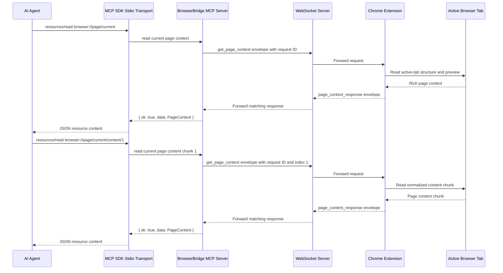
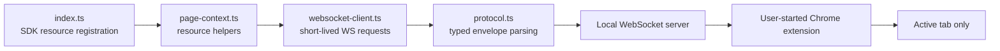

# ADR 0009: MCP Rich Page Context And Paginated Content Resources

## Status

Accepted

## Date

2026-05-25

## Context

ADR 0007 added the first MCP page context resource at
`browser://page/current`. It intentionally returned only the active tab URL and
title because that was the only extension context available at the time.

ADR 0008 extended the Chrome extension protocol so `get_page_context` returns
rich active-tab structure and so `get_page_content` returns normalized readable
content in 1-based chunks. ADR 0008 explicitly left MCP resource registration
for `browser://page/current/content/{index}` out of scope.

The MCP server now needs to expose the richer browser data without changing the
BrowserBridge privacy model. Browser state should still be fetched only through
explicit MCP resource reads while the user-started extension connection is
active. The MCP server should not stream page state, store page content, or add
browser action tools as part of this change.

## Decision

Extend the `servers/mcp` package with two read-only resource paths:

- `browser://page/current`, named `current-page-context`
- `browser://page/current/content/{index}`, named `current-page-content`

The existing `browser://page/current` resource will keep the same URI and will
return the full successful `page_context_response.data` object received from
the WebSocket server. The MCP protocol parser will validate the ADR 0008 rich
context shape instead of narrowing successful responses to `{ url, title }`.
This preserves backward compatibility for callers that already read URL and
title while making the selected text, preview, structure, and content descriptor
available through the same resource.

The new content resource will parse `{index}` as a positive 1-based integer,
send a matching WebSocket envelope with payload `{ "type": "get_page_content",
"index": N }`, wait for the matching `page_content_response`, and return the
structured result object as JSON.

Both resources will keep the existing result envelope style:

```ts
type BrowserBridgeResourceResult<T> =
  | {
      ok: true;
      data: T;
    }
  | {
      ok: false;
      error: {
        code:
          | "connection_failed"
          | "timeout"
          | "invalid_response"
          | "browser_error"
          | "invalid_resource_uri";
        message: string;
      };
    };
```

Extension-reported errors will continue to map to `browser_error` at the MCP
boundary, preserving the extension's human-readable message. Malformed resource
URIs such as `browser://page/current/content/0` or
`browser://page/current/content/latest` will return `invalid_resource_uri`
without opening a WebSocket connection.

The implementation will keep the existing small module boundaries:

- `protocol.ts`: create and parse BrowserBridge WebSocket envelopes for page
  context and page content.
- `websocket-client.ts`: open a short-lived WebSocket request, correlate the
  request ID, handle timeout and connection errors.
- `page-context.ts`: expose page context and page content helper functions plus
  environment configuration.
- `index.ts`: register MCP resources through the official TypeScript MCP SDK.

No MCP tools, prompts, browser actions, auth changes, storage, streaming, or
multiple-session routing will be added in this ADR.

## Request Flow



## Runtime Boundary



## Considered Approaches

### Option 1: Only Widen `browser://page/current`

Return the richer `page_context_response.data` through the existing resource
and skip content pagination.

This is too limited. ADR 0008 separates structure from larger readable content,
and agents need a way to fetch later chunks when `content.available` is true.

### Option 2: Widen Context And Add A Content Resource

Keep `browser://page/current` for rich structure and add
`browser://page/current/content/{index}` for explicit content chunks.

This is the selected approach. It follows the URI shape called out by ADR 0008,
preserves the existing context resource, and keeps page content reads explicit
and incremental.

### Option 3: Add An MCP Tool For `get_page_content`

Expose content chunks as a tool call instead of an MCP resource.

This would work mechanically, but page content is read-only context. Resources
remain the better MCP fit, while tools should be reserved for browser actions.

### Option 4: Fetch All Content Automatically With Context

Have the `browser://page/current` handler automatically read every content
chunk and combine it into one MCP response.

This is rejected. It would turn one context read into unbounded page content
collection, weaken the explicit request model, and make large pages harder to
handle predictably.

## Scope

In scope:

- Preserve rich ADR 0008 page context data in the MCP `browser://page/current`
  resource.
- Add `browser://page/current/content/{index}` as a read-only MCP resource
  template.
- Add WebSocket envelope creation and response parsing for `get_page_content`
  and `page_content_response`.
- Validate content resource indexes as positive 1-based integers before opening
  a WebSocket connection.
- Keep structured `ok`, `data`, and `error` MCP resource results.
- Add tests for protocol parsing, WebSocket request routing, resource helper
  behavior, and MCP SDK resource discovery/read behavior.
- Update `servers/mcp/README.md` with the richer context and content resource
  behavior.

Out of scope:

- MCP tools for navigation, click, fill, submit, or other browser actions.
- Continuous browser state streaming.
- Storing page context or page content.
- Authentication and private user/session/channel routing changes.
- Multiple browser sessions.
- HTTP MCP transport.
- Chrome extension changes beyond relying on the ADR 0008 protocol.
- Docker changes.

## Testing

Tests should cover:

- `browser://page/current` returns selected text, preview, structure, and
  content metadata when those fields are present in `page_context_response`.
- The context parser rejects malformed rich context responses.
- `browser://page/current/content/1` sends `get_page_content` with index `1`.
- Content parser returns `page_content_response.data` including `index`,
  `content`, `truncated`, and `maxPayloadBytes`.
- Content parser maps extension errors to `browser_error`.
- Invalid content resource indexes return `invalid_resource_uri` without a
  WebSocket connection.
- MCP resource discovery lists both the context resource and content resource
  template.
- Existing empty tool discovery continues to work.

## Consequences

Agents can now explicitly request actionable page structure first and only fetch
readable page content chunks when needed. This keeps the BrowserBridge MCP
surface aligned with the user-controlled, request-driven privacy model.

The MCP parser becomes stricter because it validates the richer response shape.
That improves predictable resource results, but it means extension and MCP
protocol changes must remain synchronized.

The content resource URI introduces an index parsing boundary in the MCP server.
Keeping invalid indexes local avoids unnecessary WebSocket traffic and gives
MCP clients a clear error before any browser read is attempted.
