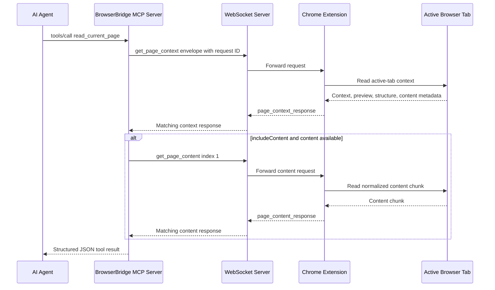
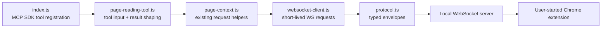

# ADR 0010: First MCP Page Reading Tool

## Status

Accepted

## Date

2026-05-25

## Context

ADR 0007 and ADR 0009 expose the current browser page through MCP resources:

- `browser://page/current`
- `browser://page/current/content/{index}`

Those resources are read-only, explicit, and aligned with BrowserBridge's
privacy model. They require the user-started Chrome extension to be connected,
and they do not stream or store browser state.

Some MCP clients and LLMs discover and use tools more reliably than resources.
The MCP server currently responds to `tools/list` with an empty tool list, so
an agent that primarily plans around tools may miss the page-reading capability
even though the resources exist.

The first MCP tool should therefore make the existing page-reading capability
discoverable as a tool without expanding BrowserBridge into browser actions,
ambient monitoring, storage, or server-side LLM summarization.

## Decision

Add one read-only MCP tool to `servers/mcp`:

- Name: `read_current_page`
- Description: read the current browser page context and optional readable
  content chunks so an agent can understand or summarize the active page.

The tool will reuse the existing MCP page-context helpers:

- `getCurrentPageContext(...)`
- `getCurrentPageContent(...)`

The tool will not introduce a new BrowserBridge WebSocket protocol message.
Instead, it will perform the same explicit request flow as the accepted
resources:

1. Request current page context with `get_page_context`.
2. If requested and available, request one or more readable content chunks with
   `get_page_content`.
3. Return one structured MCP tool result containing the BrowserBridge result
   envelope.

The default behavior will be intentionally narrow:

- Read page context.
- Include the first readable content chunk when the page reports content is
  available.
- Limit the number of content chunks to a small bounded value.

The tool input schema will support:

```ts
type ReadCurrentPageInput = {
  includeContent?: boolean;
  maxContentChunks?: number;
};
```

Input behavior:

- `includeContent` defaults to `true`.
- `maxContentChunks` defaults to `1`.
- `maxContentChunks` must be an integer from `0` through `5`.
- `maxContentChunks: 0` behaves the same as `includeContent: false`.

Successful tool results will use the existing BrowserBridge envelope style:

```ts
type ReadCurrentPageToolResult =
  | {
      ok: true;
      data: {
        context: PageContext;
        content: PageContent[];
        contentTruncated: boolean;
        nextContentIndex: number | null;
      };
    }
  | {
      ok: false;
      error: {
        code:
          | "connection_failed"
          | "timeout"
          | "invalid_response"
          | "browser_error"
          | "invalid_tool_input";
        message: string;
      };
    };
```

The MCP SDK tool response will return this object as JSON text content. The
server will not generate its own natural-language summary because that would
require either a server-side LLM dependency or brittle extractive heuristics.
The tool gives the calling agent page data in a tool-shaped contract that it
can use to understand or summarize the page.

If the context request fails, the tool returns that error immediately. If a
later content chunk request fails after context succeeds, the tool returns
`ok: false` with the content request error rather than mixing partial success
and failure in one response.

## Request Flow



## Runtime Boundary



## Considered Approaches

### Option 1: Keep Resources Only

Leave the MCP server as-is because page context is already exposed through
resources.

This preserves the clean MCP distinction between resources and tools, but it
does not address tool-first clients or models that are less likely to discover
or use resources.

### Option 2: Add A Thin Read-Only Page Tool

Expose a tool that wraps the accepted page-context and page-content resource
behavior.

This is the selected approach. It improves discoverability while keeping
browser access explicit and read-only. It also avoids new extension behavior,
new WebSocket protocol messages, and server-side summarization dependencies.

### Option 3: Add A Server-Side Summarization Tool

Expose `summarize_current_page` and have the MCP server generate a summary.

This is rejected for the first tool. BrowserBridge does not currently own an
LLM provider configuration, prompt contract, token budget, or model selection.
The agent calling the MCP server is already the right place to summarize the
structured page data returned by the tool.

### Option 4: Add All Initial Browser Tools

Add `get_browser_status`, `navigate_to_url`, `click_element`, `fill_input`,
and `submit_form` together.

This is too broad. Browser actions mutate user state and need separate design
for permissions, user approval, element identity, and error handling. The first
tool should prove the read-only tool surface before adding actions.

## Scope

In scope:

- Register `read_current_page` in MCP `tools/list`.
- Handle `tools/call` for `read_current_page`.
- Reuse existing WebSocket page-context and page-content request helpers.
- Validate tool input with clear `invalid_tool_input` errors.
- Bound automatic content chunk reads to at most five chunks.
- Preserve the existing resources.
- Add TDD coverage for tool discovery, input validation, context-only reads,
  context-plus-content reads, and structured error mapping.
- Update `servers/mcp/README.md`.
- Add an artifact document in `docs/artifacts` after the project area is
  complete.

Out of scope:

- Browser-mutating action tools.
- Continuous page streaming.
- Storage of page context or content.
- Server-side LLM summarization.
- Multiple browser sessions.
- Authentication and private routing changes.
- Chrome extension changes.
- Docker changes.

## Testing

Use TDD:

1. Add failing tests that `tools/list` includes `read_current_page` with the
   expected input schema.
2. Add failing tests that invalid `maxContentChunks` values return
   `invalid_tool_input`.
3. Add failing tests that `read_current_page` can return only context when
   `includeContent` is false.
4. Add failing tests that the default call returns context plus the first
   content chunk when content is available.
5. Add failing tests that multiple chunks are fetched up to `maxContentChunks`
   and stop when a chunk is not truncated.
6. Add failing tests that WebSocket and browser errors are returned as
   structured tool errors.

Verification should include:

- `pnpm --filter @browserbridge/mcp test`
- `pnpm --filter @browserbridge/mcp build`
- `pnpm lint:ts`
- `pnpm lint:md`
- `pnpm test`

## Consequences

Agents get a tool-shaped path for the current page without losing the explicit
request-driven privacy model. The existing resources remain available for MCP
clients that prefer resources.

The MCP server now has two read-only ways to expose the same browser data. This
adds a small maintenance burden, but it is contained by sharing the same helper
functions and tests.

The server deliberately avoids generating summaries. The calling agent receives
page context and bounded readable content, then performs summarization in its
own model context.
