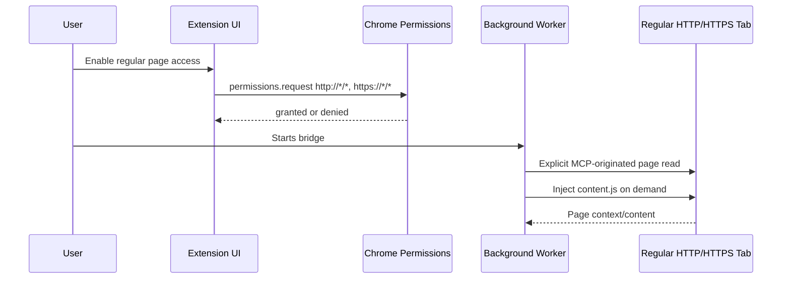

# ADR 0011: Regular Page Host Permissions For Chrome Extension

## Status

Accepted

## Date

2026-05-25

## Context

The Chrome extension currently reads page context by querying the active tab,
injecting `content.js` on demand with `chrome.scripting.executeScript`, and
then sending a message to that content script.

The manifest uses:

- `activeTab`
- `scripting`
- `storage`
- `tabs`

This keeps the extension small and user-controlled, but `activeTab` access is
temporary. It can fail for regular pages if the active-tab grant is not
available when an MCP page read happens. The current implementation maps these
failures to:

```json
{
  "code": "content_script_unavailable",
  "message": "Unable to reach the page content script."
}
```

The user only wants access for regular web pages. BrowserBridge should not try
to bypass Chrome's protected-page model or read internal/browser-managed pages.

## Decision

Add an explicit user-approved permission path for regular HTTP and HTTPS pages.

The Chrome extension will keep `activeTab` for the initial lightweight path and
add optional host permissions for:

```json
["http://*/*", "https://*/*"]
```

When a page read fails because the content script cannot be reached on a
regular `http://` or `https://` page, the extension should return a clearer
structured error indicating that regular-page host permission may be required.
A future setup or connection UI can request the optional host permission from
the user before retrying.

The extension must continue to reject non-regular pages before attempting
script injection. Supported read targets remain:

- `http://...`
- `https://...`

Unsupported targets remain out of scope:

- `chrome://...`
- `chrome-extension://...`
- Chrome Web Store pages
- browser PDF/internal viewer pages that deny extension injection
- file URLs unless a later ADR explicitly approves them
- debugger/CDP-based access

The first implementation should stay narrow:

1. Add optional host permissions for HTTP and HTTPS.
2. Add a small permission adapter around `chrome.permissions`.
3. Request optional regular-page host permission from a user-initiated flow,
   not silently from background request handling.
4. Keep MCP page reads request-driven and tied to the user-started bridge.
5. Improve errors so agents and users can distinguish unsupported pages from
   regular pages that need permission.

## Permission Flow



## Runtime Boundary


## Considered Approaches

### Option 1: Keep `activeTab` Only

Do not add host permissions. Tell the user to click the extension action again
when access fails.

This preserves the smallest permission footprint, but it is brittle for
MCP-driven reads because the read may happen after the temporary active-tab
grant is gone.

### Option 2: Optional HTTP/HTTPS Host Permissions

Declare optional host permissions for regular web pages and request them only
through an explicit user action.

This is the selected approach. It handles normal websites without attempting to
read protected browser pages, and it keeps access user-approved rather than
silent.

### Option 3: Required `<all_urls>` Host Permission

Declare broad host access as a required install-time permission.

This is rejected for now. It would make setup simpler but unnecessarily
expands the extension's baseline access and weakens the small, readable first
implementation.

### Option 4: Chrome Debugger Or CDP Access

Use debugging APIs to inspect pages when content script injection fails.

This is rejected. It is too broad, too invasive, and misaligned with
BrowserBridge's user-controlled, explicit-request security model.

## Scope

In scope:

- Add optional HTTP and HTTPS host permissions to the Chrome manifest.
- Add a small `chrome.permissions` adapter for checking/requesting regular web
  page access.
- Add a user-initiated setup or control path to request the optional
  permission.
- Preserve explicit MCP-originated reads and on-demand content script
  injection.
- Improve structured errors for regular pages that need permission.
- Add tests for permission checks, request handling, denied permissions,
  regular page reads, and unsupported page rejection.
- Update Chrome extension documentation and artifacts.

Out of scope:

- Reading Chrome internal pages.
- Reading Chrome Web Store pages.
- Reading extension pages.
- Reading local files.
- Debugger/CDP access.
- Continuous page streaming.
- Silent background page access.
- MCP server changes unless an error code needs to be documented.

## Testing

Use TDD:

1. Add failing tests for regular `http://` and `https://` permission checks.
2. Add failing tests for denied optional permission requests.
3. Add failing tests proving unsupported page schemes still return
   `unsupported_page` without requesting host permission.
4. Add failing tests proving page reads still use explicit request handling and
   on-demand content script injection.
5. Add failing tests for clearer structured errors when a regular page cannot
   be reached because permission is missing.

Verification should include:

- `pnpm --filter @browserbridge/chrome-extension test`
- `pnpm --filter @browserbridge/chrome-extension build`
- `pnpm lint:ts`
- `pnpm lint:md`
- `pnpm test`

## Consequences

BrowserBridge can read regular web pages more reliably while staying inside
Chrome's extension permission model. Users must explicitly grant broader web
page access before the extension can use it.

The permission surface increases, so documentation and UI copy need to be clear
that the access is for regular pages only and that reads still happen only
after the user starts the bridge and an MCP request asks for page data.

Protected browser pages remain inaccessible. BrowserBridge should report those
as unsupported rather than trying to bypass Chrome's security boundaries.
