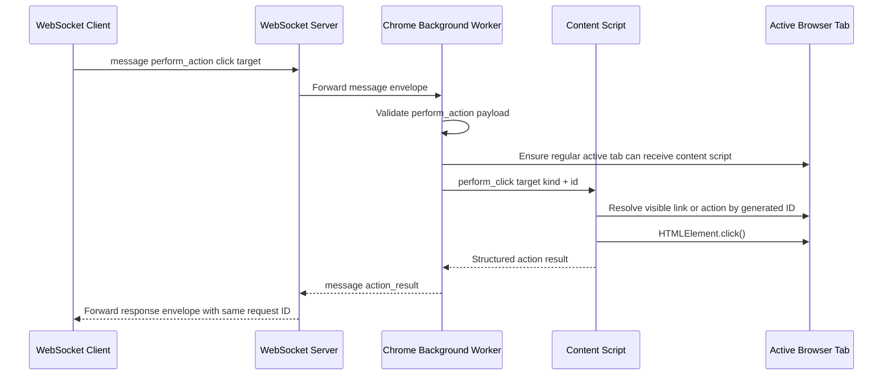
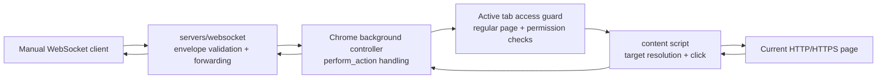

# ADR 0012: Extension Click Actions Over WebSocket

## Status

Accepted

## Date

2026-05-25

## Context

BrowserBridge can currently read the active Chrome tab through explicit
WebSocket requests while the user-started extension connection is active. The
WebSocket server validates only the outer message envelope and forwards valid
messages to connected peers. The Chrome extension background controller handles
read requests for:

- `get_page_context`
- `get_page_content`

The current page context already exposes clickable page structure:

- `structure.links[]`
- `structure.actions[]`

Those items use generated IDs such as `bb-1`, scoped to their own collection.
The IDs are stable for a single extraction pass but are not durable page
identifiers across reloads or major DOM changes.

The next step is to let the extension perform a basic user-visible browser
action when a WebSocket peer sends a request directly to the local WebSocket
server. The MCP server is intentionally not part of this implementation.

This feature must stay aligned with the BrowserBridge security model:

- The extension acts only while the user has manually connected it.
- Browser actions happen only after explicit WebSocket requests.
- The extension must not continuously observe, stream, or store browser state.
- The first action surface should be small, predictable, and testable.

## Decision

Add a narrow browser-side click action protocol over the existing WebSocket
message envelope.

The request payload will use the required protocol name `perform_action` with a
specific action of `click`:

```ts
type PerformActionRequest = {
  type: "perform_action";
  action: {
    type: "click";
    target: {
      kind: "link" | "action";
      id: string;
    };
  };
};
```

The response payload will use the required protocol name `action_result`:

```ts
type ActionResultResponse =
  | {
      type: "action_result";
      ok: true;
      data: {
        action: "click";
        target: {
          kind: "link" | "action";
          id: string;
        };
      };
    }
  | {
      type: "action_result";
      ok: false;
      error: {
        code:
          | "no_active_tab"
          | "unsupported_page"
          | "regular_page_permission_required"
          | "content_script_unavailable"
          | "unsupported_action"
          | "invalid_action_target"
          | "target_not_found"
          | "target_disabled"
          | "action_failed";
        message: string;
      };
    };
```

The extension background controller will recognize `perform_action` envelopes
and forward click requests to the active tab content script. The content script
will resolve targets by reusing the same visible-element ordering that creates
page-context IDs:

- `kind: "link"` targets visible `a[href]` elements from `structure.links`.
- `kind: "action"` targets visible button-like elements from
  `structure.actions`.

The implementation will click the resolved DOM element by calling
`HTMLElement.click()`. For disabled button-like targets, the content script
will return `target_disabled` instead of clicking.

The WebSocket server will not gain action-specific routing or behavior in this
milestone. It will continue to validate the outer envelope and forward messages
between connected peers.

## Message Flow



## Runtime Boundary



## Considered Approaches

### Option 1: Add Direct `click_element` Payloads

Accept WebSocket payloads such as `{ "type": "click_element", "id": "bb-1" }`.

This is compact, but it diverges from the required protocol name
`perform_action` and does not leave an obvious place for future action types.

### Option 2: Add `perform_action` With A Narrow `click` Action

Use the existing required protocol name and keep the first action type limited
to clicks on known page-context targets.

This is the selected approach. It keeps the manual WebSocket API explicit,
avoids adding MCP behavior, and gives future actions a consistent envelope
without implementing them now.

### Option 3: Accept Arbitrary CSS Selectors

Allow callers to send selectors and click the first matching element.

This is rejected for now. Selectors are powerful but easy to misuse, can target
elements the user did not see in BrowserBridge context, and create more edge
cases around shadow DOM, visibility, and sensitive UI.

### Option 4: Use Browser Automation Or Debugger APIs

Use Chrome debugger/CDP-style capabilities for richer click behavior.

This is rejected. It is broader and more invasive than the current extension
model, and it is unnecessary for the first local click action.

## Scope

In scope:

- Add Chrome extension protocol types and guards for `perform_action` click
  requests.
- Add Chrome extension response helpers for `action_result`.
- Add a background-controller action adapter path parallel to page reads.
- Add content-script handling for a narrow `perform_click` request.
- Resolve targets by `kind` and generated page-context ID.
- Click visible regular page links and enabled button-like actions.
- Preserve request IDs in action responses.
- Return structured errors for invalid targets, unsupported actions, missing
  active tabs, unsupported pages, permission failures, unreachable content
  scripts, disabled targets, and failed clicks.
- Add TDD coverage for protocol parsing, background routing, content-script
  target resolution, successful link clicks, successful button clicks, disabled
  targets, missing targets, and structured error mapping.
- Update Chrome extension documentation and write a project artifact when this
  project area is complete.

Out of scope:

- MCP server tools or resources.
- Navigation-specific tools beyond normal browser behavior caused by clicking a
  link.
- Form fill or submit actions.
- Arbitrary CSS selector execution.
- Keyboard input, hover, drag, or multi-step interactions.
- Multiple browser sessions or private channel routing changes.
- WebSocket server action awareness beyond existing envelope forwarding.
- Persistent element IDs across page reloads.
- Continuous page observation or action streaming.

## Testing

Use TDD:

1. Add failing protocol tests for valid and invalid `perform_action` click
   envelopes.
2. Add failing background-controller tests proving action requests are routed
   and action responses preserve request IDs.
3. Add failing content-script tests for clicking a link target by ID.
4. Add failing content-script tests for clicking an enabled button-like action
   by ID.
5. Add failing content-script tests for `target_not_found`,
   `target_disabled`, `invalid_action_target`, and `unsupported_action`.
6. Add failing tests for background error mapping when the active tab is
   missing, unsupported, permission-blocked, or cannot receive the content
   script.

Verification should include:

- `pnpm --filter @browserbridge/chrome-extension test`
- `pnpm --filter @browserbridge/chrome-extension build`
- `pnpm lint:ts`
- `pnpm lint:md`
- `pnpm test`

## Consequences

After implementation, a local WebSocket client can send a `perform_action`
message to the WebSocket server and the connected Chrome extension can click a
visible link or button-like page action in the active regular web page.

The feature introduces browser-mutating behavior, so action requests must remain
explicit, structured, and limited. The first implementation intentionally
depends on page-context target IDs, which means callers should read page context
before clicking and should treat IDs as short-lived references to the current
page state.

Because the MCP server is out of scope, agents will not discover this action
through MCP tools yet. Manual WebSocket testing and future MCP action design can
build on the same `perform_action` and `action_result` message contract.
