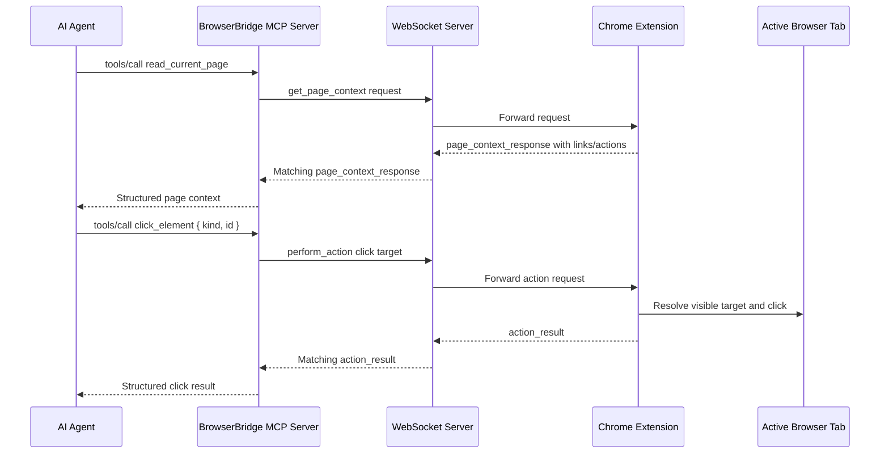
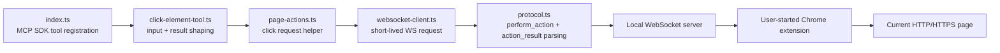

# ADR 0013: MCP Click Element Tool

## Status

Accepted

## Date

2026-05-25

## Context

ADR 0010 added the first MCP tool, `read_current_page`, so tool-first agents can
explicitly read the current browser page through the user-started extension
connection. ADR 0012 added a narrow extension-side click action over WebSocket
using the required `perform_action` and `action_result` protocol messages.

The accepted extension action deliberately kept MCP behavior out of scope. As a
result, a manual WebSocket client can ask the connected Chrome extension to
click a visible link or button-like action, but an MCP client still cannot
discover or call that capability through tools.

The MCP action surface must stay aligned with BrowserBridge's security model:

- The extension must already be manually connected by the user.
- Actions must happen only after explicit MCP tool calls.
- The MCP server must not observe or stream browser state in the background.
- Element references must be short-lived IDs from an explicit page context read.
- Browser-mutating behavior should remain small, typed, and predictable.

## Decision

Add one MCP tool to `servers/mcp`:

- Name: `click_element`
- Description: click a visible link or button-like action from the current page
  using a short-lived BrowserBridge page-context target ID.

The tool will reuse ADR 0012's WebSocket action protocol. It will send a
`perform_action` envelope with a `click` action:

```ts
type ClickElementInput = {
  kind: "link" | "action";
  id: string;
};
```

The WebSocket request payload will be:

```ts
{
  type: "perform_action",
  action: {
    type: "click",
    target: {
      kind,
      id
    }
  }
}
```

The MCP tool will return structured JSON text content using the existing tool
result style:

```ts
type ClickElementToolResult =
  | {
      ok: true;
      data: {
        action: "click";
        target: {
          kind: "link" | "action";
          id: string;
        };
      };
    }
  | {
      ok: false;
      error: {
        code:
          | "connection_failed"
          | "timeout"
          | "invalid_response"
          | "browser_error"
          | "invalid_tool_input";
        message: string;
      };
    };
```

Tool input validation will happen before opening a WebSocket connection:

- `kind` must be exactly `link` or `action`.
- `id` must be a non-empty string.

The tool will not read page context automatically. Callers are expected to call
`read_current_page` first, choose a target from `data.context.structure.links`
or `data.context.structure.actions`, then pass that target's `kind` and `id` to
`click_element`. This keeps browser reads and browser actions separate,
explicit tool calls.

Extension-side action errors from `action_result` will be mapped to
`browser_error`, preserving the user-facing message. This matches the current
MCP page-reading behavior, where detailed extension error codes are not exposed
as first-class MCP error codes.

## MCP Flow



## Runtime Boundary



## Considered Approaches

### Option 1: Add `click_element` As A Thin Action Tool

Expose a single MCP tool that accepts a page-context target kind and ID, then
relays that click through ADR 0012's `perform_action` protocol.

This is the selected approach. It is discoverable to MCP clients, small enough
to test thoroughly, and avoids duplicating browser action logic in the MCP
server.

### Option 2: Fold Clicking Into `read_current_page`

Add an optional click input to the existing page-reading tool.

This is rejected. Reading page state and mutating browser state should remain
separate explicit actions. Combining them would make tool intent less clear and
would increase the chance of an accidental browser action.

### Option 3: Add All Browser Action Tools Together

Add navigation, click, fill, and submit tools in one MCP update.

This is rejected for this milestone. Clicking already introduces
browser-mutating behavior, and the extension currently has an accepted
implementation path for clicks only. Fill and submit need their own target,
sensitivity, and user-expectation design.

### Option 4: Accept CSS Selectors Or Text Queries

Let agents send selectors or button/link text directly to the MCP server.

This is rejected for now. Page-context IDs keep the click tied to a previously
observed BrowserBridge structure item. Selectors and text queries are broader,
less predictable, and easier to apply to an unintended element.

## Scope

In scope:

- Add MCP protocol helpers for `perform_action` click request envelopes and
  matching `action_result` responses.
- Add a WebSocket client helper for click actions.
- Add a small MCP action helper/module for `click_element`.
- Register `click_element` in MCP `tools/list`.
- Handle `tools/call` for `click_element`.
- Validate tool input with `invalid_tool_input` errors.
- Map connection failures, timeouts, invalid responses, and extension action
  failures to the same structured MCP tool result style used by page reading.
- Add TDD coverage for protocol helpers, WebSocket routing, tool input
  validation, successful click results, extension error mapping, and MCP SDK
  tool discovery/call behavior.
- Update `servers/mcp/README.md`.
- Write a project artifact in `docs/artifacts` when the project area is
  complete.

Out of scope:

- Chrome extension click implementation changes beyond any fixes required to
  consume the accepted ADR 0012 protocol.
- WebSocket server action-specific behavior beyond existing envelope
  forwarding.
- Automatic page-context reads before clicking.
- Persistent element IDs across reloads or DOM changes.
- CSS selector, XPath, text-query, coordinate, hover, keyboard, drag, fill, or
  submit support.
- Navigation-specific result tracking after a link click.
- Multiple browser sessions or private cloud routing changes.
- Storage of page context, page content, or action history.
- Continuous page observation or action streaming.

## Testing

Use TDD:

1. Add failing protocol tests for creating `perform_action` click envelopes.
2. Add failing protocol tests for parsing successful matching `action_result`
   responses.
3. Add failing protocol tests for mismatched request IDs, malformed responses,
   and extension action errors.
4. Add failing WebSocket client tests proving click requests send the expected
   payload and return matching responses.
5. Add failing tool tests for invalid `kind`, empty `id`, success, WebSocket
   errors, and extension action errors.
6. Add failing MCP SDK lifecycle tests proving `tools/list` includes
   `click_element` and `tools/call` returns the structured click result.

Verification should include:

- `pnpm --filter @browserbridge/mcp test`
- `pnpm --filter @browserbridge/mcp build`
- `pnpm lint:ts`
- `pnpm lint:md`
- `pnpm test`

## Consequences

After implementation, an MCP client can explicitly click a visible link or
button-like action by first reading page context and then calling
`click_element` with the selected target ID.

This makes the MCP server capable of browser-mutating behavior for the first
time. The design limits that risk by keeping the action tied to the
user-started extension connection, requiring a discrete tool call, avoiding
automatic page reads, and reusing the narrow action protocol already accepted
for the Chrome extension.
