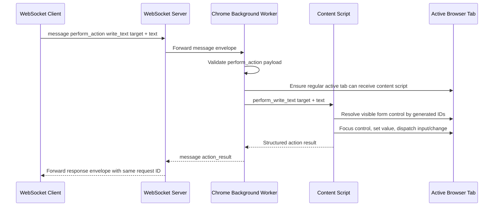
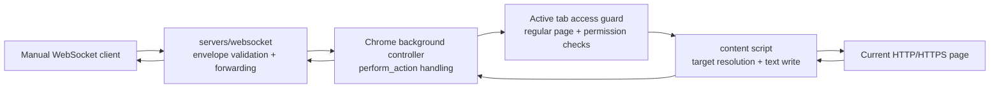

# ADR 0014: Extension Write Text Actions Over WebSocket

## Status

Accepted

## Date

2026-05-25

## Context

ADR 0012 added the first browser-mutating extension action over WebSocket:
`perform_action` with a narrow `click` action. That implementation kept the MCP
server out of scope and let the Chrome extension perform one explicit action
only while the user-started bridge connection is active.

BrowserBridge page context already exposes form controls inside
`structure.forms[]`. Each form has a short-lived generated ID, and each form
control has a short-lived generated ID scoped to that form:

- `structure.forms[].id`
- `structure.forms[].controls[].id`

Those IDs are stable for a single extraction pass but are not durable page
identifiers across reloads or major DOM changes.

The next action should let a WebSocket peer write user-provided text into a
visible editable text control. This is browser-mutating behavior, so it must
stay aligned with the BrowserBridge security model:

- The extension acts only while the user has manually connected it.
- Browser actions happen only after explicit WebSocket requests.
- The extension must not continuously observe, stream, or store browser state.
- Text writing must not imply form submission.
- The first text-writing surface should be small, predictable, and testable.

## Decision

Add a narrow browser-side text writing action to the existing
`perform_action` protocol.

The request payload will use the required protocol name `perform_action` with a
specific action of `write_text`:

```ts
type PerformWriteTextAction = {
  type: "write_text";
  target: {
    formId: string;
    controlId: string;
  };
  text: string;
};
```

The response payload will continue to use the required protocol name
`action_result`:

```ts
type ActionResultResponse =
  | {
      type: "action_result";
      ok: true;
      data: {
        action: "write_text";
        target: {
          formId: string;
          controlId: string;
        };
        textLength: number;
      };
    }
  | {
      type: "action_result";
      ok: false;
      error: {
        code:
          | "no_active_tab"
          | "unsupported_page"
          | "regular_page_permission_required"
          | "content_script_unavailable"
          | "unsupported_action"
          | "invalid_action_target"
          | "target_not_found"
          | "target_disabled"
          | "target_readonly"
          | "unsupported_control"
          | "action_failed";
        message: string;
      };
    };
```

The extension background controller will recognize `perform_action` envelopes
with `action.type: "write_text"` and forward write requests to the active tab
content script.

The content script will resolve targets by reusing the same visible-element
ordering that creates page-context form and control IDs:

- `formId` identifies a visible `form` from `structure.forms`.
- `controlId` identifies a visible control inside that form from
  `structure.forms[].controls`.

The first supported controls are:

- `<textarea>`
- `<input type="text">`
- `<input>` with no explicit `type`, which browsers treat as text
- `<input type="search">`

The implementation will replace the control value with the requested text,
focus the control, and dispatch `input` and `change` events with bubbling
enabled. It will not press keys, synthesize keyboard events, submit the form, or
click adjacent controls.

Disabled controls will return `target_disabled`. Read-only controls will return
`target_readonly`. Existing unsupported controls, including password fields,
selects, checkboxes, radios, file inputs, submit buttons, and contenteditable
regions, will return `unsupported_control`.

The WebSocket server will not gain action-specific routing or behavior in this
milestone. It will continue to validate the outer envelope and forward messages
between connected peers.

## Message Flow



## Runtime Boundary



## Considered Approaches

### Option 1: Add `perform_action` With A Narrow `write_text` Action

Reuse ADR 0012's action envelope and add one explicit text-writing action that
targets visible page-context form controls by generated IDs.

This is the selected approach. It keeps the manual WebSocket API explicit,
avoids adding MCP behavior, and lets future MCP tools reuse the same
browser-side action protocol after a separate ADR.

### Option 2: Add Direct `fill_input` Or `write_text` Payloads

Accept WebSocket payloads such as
`{ "type": "write_text", "formId": "bb-1", "controlId": "bb-1" }`.

This is rejected. It diverges from the existing `perform_action` protocol and
would create a second action envelope after ADR 0012 already established the
extension-side action shape.

### Option 3: Accept CSS Selectors

Allow callers to send a selector and write into the first matching element.

This is rejected for now. Selectors are broader than page-context targets and
can write into elements the user did not inspect through BrowserBridge context.

### Option 4: Simulate Keyboard Input

Focus the target and dispatch keyboard-like events or use browser automation
APIs to type text.

This is rejected. It is more complex and invasive than replacing an editable
control value directly, and it creates more page-specific edge cases before the
basic write path is proven.

### Option 5: Write And Submit In One Action

Allow a single request to write text and submit the containing form.

This is rejected. Writing text and submitting a form are separate browser
mutations and should require separate explicit action designs.

## Scope

In scope:

- Add Chrome extension protocol types and guards for `perform_action`
  `write_text` requests.
- Keep existing click action behavior intact.
- Add Chrome extension response typing for `action_result` write results.
- Add a background-controller action adapter path for text writing.
- Add content-script handling for a narrow `perform_write_text` request.
- Resolve targets by visible `formId` and form-scoped `controlId`.
- Replace text in supported visible text controls.
- Dispatch `input` and `change` events after updating the value.
- Preserve request IDs in action responses.
- Return structured errors for invalid targets, unsupported actions, missing
  active tabs, unsupported pages, permission failures, unreachable content
  scripts, missing targets, disabled controls, read-only controls, unsupported
  controls, and failed writes.
- Add TDD coverage for protocol parsing, background routing, content-script
  target resolution, successful text writes, event dispatch, disabled controls,
  read-only controls, unsupported controls, missing targets, and structured
  error mapping.
- Update Chrome extension documentation and write a project artifact when this
  project area is complete.

Out of scope:

- MCP server tools or resources.
- Automatic page-context reads before writing text.
- Form submission.
- Select, checkbox, radio, file, password, email, telephone, URL, number, date,
  color, range, hidden, button, submit, reset, or contenteditable support.
- Arbitrary CSS selector, XPath, text-query, coordinate, keyboard, paste,
  drag, hover, or multi-step interaction support.
- App-specific framework adapters for controlled inputs.
- Multiple browser sessions or private channel routing changes.
- Persistent element IDs across page reloads.
- Storage of page context, page content, written text, or action history.
- Continuous page observation or action streaming.

## Testing

Use TDD:

1. Add failing protocol tests for valid and invalid `perform_action`
   `write_text` envelopes.
2. Add failing background-controller tests proving write requests are routed
   and action responses preserve request IDs.
3. Add failing content-script tests for writing to a text input target by
   `formId` and `controlId`.
4. Add failing content-script tests for writing to a textarea target.
5. Add failing content-script tests proving `input` and `change` events are
   dispatched.
6. Add failing content-script tests for `target_not_found`,
   `target_disabled`, `target_readonly`, `unsupported_control`,
   `invalid_action_target`, and `unsupported_action`.
7. Add failing tests for background error mapping when the active tab is
   missing, unsupported, permission-blocked, or cannot receive the content
   script.

Verification should include:

- `pnpm --filter @browserbridge/chrome-extension test`
- `pnpm --filter @browserbridge/chrome-extension build`
- `pnpm lint:ts`
- `pnpm lint:md`
- `pnpm test`

## Consequences

After implementation, a local WebSocket client can send a `perform_action`
message to the WebSocket server and the connected Chrome extension can write
provided text into a visible supported form control in the active regular web
page.

The feature introduces a second browser-mutating action, so action requests
must remain explicit, structured, and limited. The first implementation
intentionally depends on page-context form and control IDs, which means callers
should read page context before writing and treat IDs as short-lived references
to the current page state.

Because the MCP server is out of scope, agents will not discover this action
through MCP tools yet. Manual WebSocket testing and a future MCP action design
can build on the same `perform_action` and `action_result` message contract.
