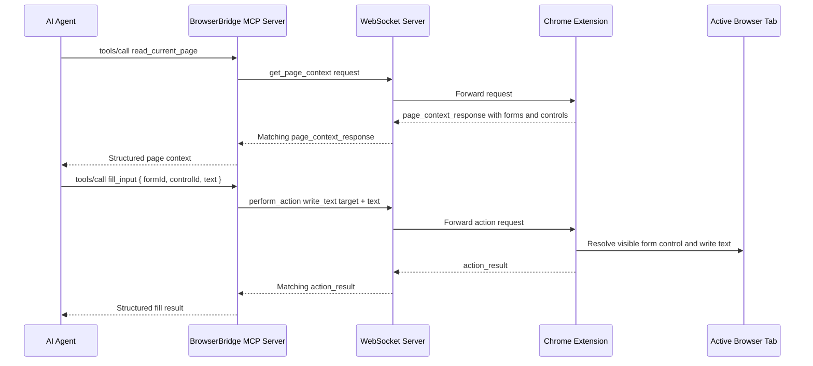
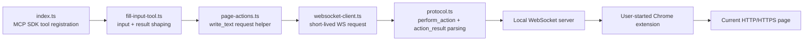

# ADR 0015: MCP Fill Input Tool

## Status

Accepted

## Date

2026-05-25

## Context

ADR 0014 added the Chrome extension-side `perform_action` `write_text`
capability. A WebSocket peer can now ask the user-started extension connection
to write provided text into a supported visible form control by using short-lived
page-context IDs.

That ADR deliberately kept MCP behavior out of scope. As a result, MCP clients
can read page context and click visible links or actions, but they still cannot
write into a form control through the tool surface.

The MCP write tool must stay aligned with BrowserBridge's security model:

- The extension must already be manually connected by the user.
- Writing text must happen only after an explicit MCP tool call.
- The MCP server must not observe or stream browser state in the background.
- Form-control references must be short-lived IDs from an explicit page context
  read.
- Writing text must not submit the form.
- Browser-mutating behavior should remain small, typed, and predictable.

## Decision

Add one MCP tool to `servers/mcp`:

- Name: `fill_input`
- Description: write text into a supported visible form control from the current
  page using short-lived BrowserBridge page-context form and control IDs.

The tool will reuse ADR 0014's WebSocket action protocol. It will send a
`perform_action` envelope with a `write_text` action:

```ts
type FillInputInput = {
  formId: string;
  controlId: string;
  text: string;
};
```

The WebSocket request payload will be:

```ts
{
  type: "perform_action",
  action: {
    type: "write_text",
    target: {
      formId,
      controlId
    },
    text
  }
}
```

The MCP tool will return structured JSON text content using the existing tool
result style:

```ts
type FillInputToolResult =
  | {
      ok: true;
      data: {
        action: "write_text";
        target: {
          formId: string;
          controlId: string;
        };
        textLength: number;
      };
    }
  | {
      ok: false;
      error: {
        code:
          | "connection_failed"
          | "timeout"
          | "invalid_response"
          | "browser_error"
          | "invalid_tool_input";
        message: string;
      };
    };
```

Tool input validation will happen before opening a WebSocket connection:

- `formId` must be a non-empty string.
- `controlId` must be a non-empty string.
- `text` must be a string. Empty text is allowed because clearing a supported
  text control is a valid write.

The tool will not read page context automatically. Callers are expected to call
`read_current_page` first, choose a target from
`data.context.structure.forms[].controls[]`, then pass that target's `formId`,
`controlId`, and desired text to `fill_input`. This keeps browser reads and
browser actions separate, explicit tool calls.

Extension-side action errors from `action_result` will be mapped to
`browser_error`, preserving the user-facing message. This matches the existing
`click_element` tool behavior.

## MCP Flow



## Runtime Boundary



## Considered Approaches

### Option 1: Add `fill_input` As A Thin Action Tool

Expose a single MCP tool that accepts page-context form/control IDs and text,
then relays that write through ADR 0014's `perform_action` protocol.

This is the selected approach. It completes the first milestone's planned MCP
tool surface incrementally, is small enough to test thoroughly, and avoids
duplicating browser action logic in the MCP server.

### Option 2: Add A Tool Named `write_text`

Expose MCP behavior with the same name as the extension action.

This is rejected. `fill_input` already appears in the initial MCP tool list and
describes the user-visible form operation, while `write_text` remains the lower
level extension action name.

### Option 3: Fold Writing Into `read_current_page`

Add optional write inputs to the existing page-reading tool.

This is rejected. Reading page state and mutating browser state should remain
separate explicit actions. Combining them would make tool intent less clear and
would increase the chance of an accidental browser action.

### Option 4: Accept CSS Selectors Or Input Labels

Let agents send selectors, labels, placeholders, or text queries directly to the
MCP server.

This is rejected for now. Page-context IDs keep the write tied to a previously
observed BrowserBridge structure item. Selectors and text queries are broader,
less predictable, and easier to apply to an unintended control.

### Option 5: Fill And Submit In One Tool

Allow one MCP call to write text and submit the containing form.

This is rejected. Writing text and submitting a form are separate browser
mutations and should require separate explicit action designs.

## Scope

In scope:

- Add MCP protocol helpers for `perform_action` `write_text` request envelopes
  and matching `action_result` responses.
- Add a WebSocket client helper for write-text actions.
- Add a small MCP action helper/module for `fill_input`.
- Register `fill_input` in MCP `tools/list`.
- Handle `tools/call` for `fill_input`.
- Validate tool input with `invalid_tool_input` errors.
- Map connection failures, timeouts, invalid responses, and extension action
  failures to the same structured MCP tool result style used by `click_element`.
- Add TDD coverage for protocol helpers, WebSocket routing, tool input
  validation, successful fill results, extension error mapping, and MCP SDK tool
  discovery/call behavior.
- Update `servers/mcp/README.md`.
- Write a project artifact in `docs/artifacts` when the project area is
  complete.

Out of scope:

- Chrome extension write-text implementation changes beyond any fixes required
  to consume the accepted ADR 0014 protocol.
- WebSocket server action-specific behavior beyond existing envelope
  forwarding.
- Automatic page-context reads before filling input.
- Form submission.
- Persistent element IDs across reloads or DOM changes.
- CSS selector, XPath, label-query, placeholder-query, coordinate, keyboard,
  paste, drag, hover, select, checkbox, radio, file, password, or submit
  support.
- App-specific framework adapters for controlled inputs.
- Multiple browser sessions or private cloud routing changes.
- Storage of page context, page content, written text, or action history.
- Continuous page observation or action streaming.

## Testing

Use TDD:

1. Add failing protocol tests for creating `perform_action` `write_text`
   envelopes.
2. Add failing protocol tests for parsing successful matching `action_result`
   responses.
3. Add failing protocol tests for mismatched request IDs, malformed responses,
   and extension action errors.
4. Add failing WebSocket client tests proving write-text requests send the
   expected payload and return matching responses.
5. Add failing tool tests for invalid `formId`, invalid `controlId`, non-string
   `text`, empty string text, success, WebSocket errors, and extension action
   errors.
6. Add failing MCP SDK lifecycle tests proving `tools/list` includes
   `fill_input` and `tools/call` returns the structured fill result.

Verification should include:

- `pnpm --filter @browserbridge/mcp test`
- `pnpm --filter @browserbridge/mcp build`
- `pnpm lint:ts`
- `pnpm lint:md`
- `pnpm test`

## Consequences

After implementation, an MCP client can explicitly write text into a supported
visible form control by first reading page context and then calling `fill_input`
with the selected form/control IDs.

This adds another browser-mutating MCP tool. The design limits risk by keeping
the action tied to the user-started extension connection, requiring a discrete
tool call, avoiding automatic page reads, allowing only short-lived
page-context targets, and reusing the narrow extension action protocol already
accepted for the Chrome extension.
