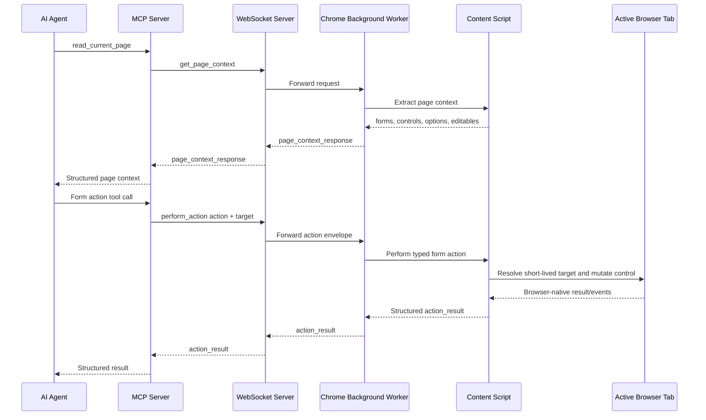
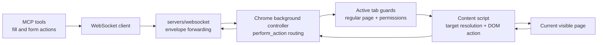

# ADR 0016: Extension Form Control Actions

## Status

Accepted

## Date

2026-05-25

## Context

ADR 0012 added extension-side click actions over the existing
`perform_action` WebSocket protocol. ADR 0014 added a narrow `write_text`
action that can replace text in visible text controls discovered through
`structure.forms[]`. ADR 0015 exposed that write path through the MCP
`fill_input` tool.

Manual testing with `test.html` proves the extension can connect and respond,
but the test form also shows the remaining interaction gaps. The current
extension can write into:

- `<input type="text">`
- `<input>` with no explicit `type`
- `<input type="search">`
- `<textarea>`

The same test form includes other controls that are visible in page context but
cannot be changed yet:

- Text-like inputs: `email`, `url`, `tel`, `number`
- Date/time-like inputs: `date`, `time`, `datetime-local`, `month`, `week`
- Value inputs: `color`, `range`
- Choice inputs: `checkbox`, `radio`
- Select controls: single `select` and `select multiple`
- Form-level behavior: submit and reset
- Non-form editable text: `contenteditable`

Some controls should remain unsupported in this ADR:

- `password`, because writing secrets through an agent-controlled generic text
  action deserves a separate credential-handling design.
- `file`, because browsers intentionally block programmatic file input value
  assignment.
- `hidden`, because BrowserBridge actions should target visible user-facing
  page elements.

The implementation must stay aligned with the BrowserBridge security model:

- The extension acts only while the user has manually connected it.
- Browser state and actions are available only after explicit tool or
  WebSocket requests.
- The extension must not continuously observe, stream, or store page data.
- Form-control IDs remain short-lived references from an explicit page-context
  read.
- Each browser mutation should be a discrete, typed, predictable action.

## Decision

Expand the Chrome extension's form interaction surface through the existing
`perform_action` envelope instead of adding a second action protocol.

The extension will support these action types:

- `write_text`
- `set_checked`
- `select_options`
- `submit_form`

The existing `click` action remains unchanged except that page-context action
extraction will include visible `input[type="reset"]` controls so reset buttons
can be clicked like other visible button-like controls.

### Extend `write_text`

Keep the existing `write_text` action name and current form-control target for
backward compatibility:

```ts
type WriteTextFormControlTarget = {
  formId: string;
  controlId: string;
};

type WriteTextEditableTarget = {
  kind: "editable";
  id: string;
};

type PerformWriteTextAction = {
  type: "write_text";
  target: WriteTextFormControlTarget | WriteTextEditableTarget;
  text: string;
};
```

Targets without `kind` are treated as the existing form-control target shape.

For form controls, `write_text` will support visible, enabled, non-readonly:

- `<textarea>`
- `<input type="text">`
- `<input>` with no explicit `type`
- `<input type="search">`
- `<input type="email">`
- `<input type="url">`
- `<input type="tel">`
- `<input type="number">`
- `<input type="date">`
- `<input type="time">`
- `<input type="datetime-local">`
- `<input type="month">`
- `<input type="week">`
- `<input type="color">`
- `<input type="range">`

The action will set the control's `.value`, focus the control, and dispatch
bubbling `input` and `change` events. Browser-native input validation and
normalization remain authoritative. If a non-empty requested value cannot be
represented by the control after assignment, the action returns
`invalid_control_value`.

For editable surfaces, `write_text` will support visible
`contenteditable="true"` and `contenteditable="plaintext-only"` elements
discovered through the new `structure.editables[]` page-context collection. The
extension will focus the element, replace its text content, and dispatch a
bubbling `input` event. It will not support arbitrary rich HTML insertion.

`write_text` will continue to reject disabled, readonly, hidden, file, password,
checkbox, radio, select, button, submit, reset, image, and unsupported controls.

### Add `set_checked`

Add a control-specific action for checkboxes and radios:

```ts
type PerformSetCheckedAction = {
  type: "set_checked";
  target: {
    formId: string;
    controlId: string;
  };
  checked: boolean;
};
```

For checkboxes, the action sets the requested checked state and dispatches
bubbling `input` and `change` events when the state changes.

For radios, the action supports `checked: true` to select the targeted radio
option. Requesting `checked: false` for a radio returns `unsupported_control`
with a message explaining that another radio option should be selected instead.

Successful responses include:

```ts
type SetCheckedActionResultData = {
  action: "set_checked";
  target: {
    formId: string;
    controlId: string;
  };
  checked: boolean;
  changed: boolean;
};
```

### Add `select_options`

Add a select-specific action for single-select and multi-select controls:

```ts
type PerformSelectOptionsAction = {
  type: "select_options";
  target: {
    formId: string;
    controlId: string;
  };
  values: string[];
};
```

Single-select controls require exactly one value. Multi-select controls accept
zero or more values, allowing an empty array to clear the selection. The action
will reject missing option values with `option_not_found` and disabled selected
options with `target_option_disabled`.

Successful responses include:

```ts
type SelectOptionsActionResultData = {
  action: "select_options";
  target: {
    formId: string;
    controlId: string;
  };
  values: string[];
};
```

The page-context representation for select controls will include option
metadata so an agent can choose from values it has explicitly observed:

```ts
type PageFormControlOption = {
  value: string;
  label: string;
  selected: boolean;
  disabled: boolean;
};
```

### Add `submit_form`

Add an explicit form submission action:

```ts
type PerformSubmitFormAction = {
  type: "submit_form";
  target: {
    formId: string;
  };
};
```

The content script will resolve the visible form by page-context form ID and
call `HTMLFormElement.requestSubmit()` when available. This preserves browser
validation and submit-event behavior. If `requestSubmit()` is unavailable, the
extension returns `action_failed` rather than bypassing validation with
`form.submit()`.

Successful responses include:

```ts
type SubmitFormActionResultData = {
  action: "submit_form";
  target: {
    formId: string;
  };
};
```

`reset_form` is not added in this ADR. Reset remains available by clicking a
visible reset button after `input[type="reset"]` is included in
`structure.actions[]`.

### Extend Page Context

Extend form control metadata enough for agents to choose the new actions
without guessing:

```ts
type PageFormControl = {
  id: string;
  label: string;
  type: string;
  required: boolean;
  disabled: boolean;
  readonly?: boolean;
  sensitive: boolean;
  checked?: boolean;
  multiple?: boolean;
  options?: PageFormControlOption[];
};
```

Add a new top-level structure collection for non-form editable surfaces:

```ts
type PageEditable = {
  id: string;
  label: string;
  role: string;
  multiline: boolean;
};
```

The extension will not expose current text values for text, password, textarea,
or contenteditable controls. It may expose choice state such as checkbox
`checked` and select option `selected` because those states are necessary to
present the available action choices and are returned only by explicit page
context requests.

## Message Flow



## Runtime Boundary



## Considered Approaches

### Option 1: Expand `write_text` Only

Use the existing `write_text` action for every control by assigning DOM
properties such as `.value`, `.checked`, and `.selected`.

This is rejected. It would overload text writing with non-text semantics and
make MCP results unclear. Checkboxes, radios, selects, and form submission need
distinct intent and distinct validation.

### Option 2: Add Typed Control Actions

Keep `write_text` for value-entry controls, add `set_checked` for checkbox and
radio controls, add `select_options` for selects, and add `submit_form` for
explicit form submission.

This is the selected approach. It keeps the action protocol small while giving
each browser mutation a clear shape and testable behavior.

### Option 3: Use Clicks For All Remaining Controls

Teach agents to click checkboxes, radio buttons, select controls, submit
buttons, and reset buttons by extending `click` targets.

This is rejected for checkboxes, radios, and selects because desired state is
not explicit. It remains acceptable for reset buttons because clicking a reset
button is already the browser's native visible command.

### Option 4: Accept CSS Selectors Or Labels

Allow callers to send selectors, label text, placeholders, or option labels
directly to the extension.

This is rejected. BrowserBridge actions should stay tied to short-lived IDs
from an explicit page-context read. Selectors and label queries are broader and
increase the chance of mutating an element the user did not inspect.

### Option 5: Support Password Fields Now

Treat password fields like other value-entry controls.

This is rejected for this ADR. Password entry needs a separate design for
credential handling, user confirmation, and secret redaction before the generic
form-fill surface can support it.

## Scope

In scope:

- Extend Chrome extension protocol types and guards for `set_checked`,
  `select_options`, and `submit_form`.
- Extend `write_text` support to email, URL, telephone, number, date, time,
  datetime-local, month, week, color, and range inputs.
- Add `write_text` support for plain text replacement in visible contenteditable
  surfaces discovered in page context.
- Preserve the existing `write_text` form-control target shape.
- Add page-context metadata for readonly controls, checkbox/radio checked
  state, select multiple state, select options, and contenteditable targets.
- Include visible `input[type="reset"]` in `structure.actions[]`.
- Return structured action results for each new action.
- Return clear structured errors for invalid targets, missing targets, disabled
  controls, readonly controls, unsupported controls, invalid values, missing
  options, disabled options, failed submissions, and unsupported actions.
- Add TDD coverage for protocol parsing, background routing, content-script
  target resolution, successful writes, rejected invalid values, checkbox
  state changes, radio selection, select option changes, form submission, reset
  button extraction, contenteditable writes, and structured error mapping.
- Update Chrome extension documentation and write a project artifact when this
  project area is complete.

Out of scope:

- Password-field support.
- File-input support.
- Hidden-control support.
- Arbitrary CSS selector, XPath, label-query, placeholder-query, coordinate,
  keyboard, paste, hover, drag, or multi-step automation.
- Rich HTML insertion into contenteditable surfaces.
- Automatic page-context reads before form actions.
- Persistent element IDs across reloads or DOM changes.
- Storage of page context, page content, written text, selected values, action
  history, or submitted form data.
- Continuous page observation or action streaming.
- Cloud routing or multi-session behavior changes.

## Testing

Use TDD:

1. Add failing protocol tests for the new `perform_action` action variants and
   invalid target shapes.
2. Add failing page-context tests for the `test.html` control categories:
   readonly, checked, multiple, options, reset action extraction, and
   contenteditable extraction.
3. Add failing background-controller tests proving each new action routes to the
   page action adapter and preserves request IDs.
4. Add failing content-script tests for successful extended `write_text` input
   types and invalid browser-native values.
5. Add failing content-script tests for checkbox and radio `set_checked`.
6. Add failing content-script tests for single and multi-select
   `select_options`, including missing and disabled options.
7. Add failing content-script tests for `submit_form` using a prevented submit
   event.
8. Add failing content-script tests for contenteditable `write_text`.
9. Add failing tests for unsupported password, file, hidden, disabled, and
   readonly targets.

Verification should include:

- `pnpm --filter @browserbridge/chrome-extension test`
- `pnpm --filter @browserbridge/chrome-extension build`
- `pnpm lint:ts`
- `pnpm lint:md`
- `pnpm test`

## Consequences

After implementation, the extension will be able to exercise the meaningful
interactive controls in `test.html` through explicit BrowserBridge actions
while preserving the user-controlled bridge model.

Most value-entry controls will continue to use `write_text`, so MCP's existing
`fill_input` tool can cover many more fields without a new tool shape. Choice
controls, selects, and form submission will require separate MCP tool ADRs or
tool updates before agents can access them through the MCP surface.

The action surface grows, so strict page-context targeting, typed payloads, and
clear error responses become more important. Passwords, files, hidden controls,
selectors, and rich contenteditable HTML remain intentionally excluded until
they have separate approved designs.
