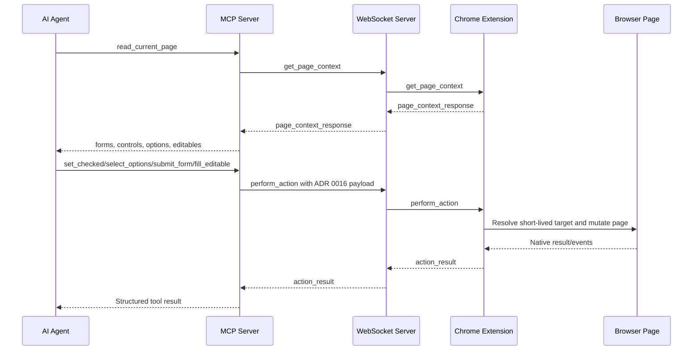
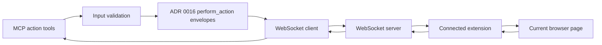

# ADR 0017: MCP Form Action Tools

## Status

Accepted

## Date

2026-05-25

## Context

ADR 0016 expanded the Chrome extension action protocol to support richer form
interactions through the existing `perform_action` WebSocket envelope:

- `write_text` for additional form value controls and contenteditable targets.
- `set_checked` for checkboxes and radio options.
- `select_options` for single-select and multi-select controls.
- `submit_form` for explicit form submission.

The MCP server currently exposes browser reads, clicks, and the original
form-control text write path through these tools:

- `read_current_page`
- `click_element`
- `fill_input`

That means several ADR 0016 messages can be sent manually over WebSocket but
cannot yet be reached through MCP tools. The MCP surface should remain thin,
typed, and explicit: read page context first, select short-lived IDs from that
context, then call one discrete browser-mutating tool.

## Decision

Add MCP tools that map directly to the ADR 0016 action messages:

- `set_checked`
- `select_options`
- `submit_form`
- `fill_editable`

Keep the existing `fill_input` tool for form-control `write_text` actions.
`fill_editable` will use the same `write_text` extension action with the ADR
0016 editable target shape:

```ts
{
  type: "write_text",
  target: {
    kind: "editable",
    id: string
  },
  text: string
}
```

The new tools will validate only MCP input shape before forwarding. Browser
semantics, target resolution, control-type checks, native validation,
permission checks, and page mutation behavior remain extension responsibilities.

Tool responses will follow the current MCP convention:

```ts
type BrowserBridgeToolResult<T> =
  | { ok: true; data: T }
  | { ok: false; error: { code: string; message: string } };
```

Browser and WebSocket errors will be returned without rewriting beyond the
existing `browser_error`, `timeout`, `connection_failed`, and
`invalid_response` mapping. Tool input validation errors will use
`invalid_tool_input`.

## Tool Shapes

`set_checked` accepts:

```json
{
  "formId": "bb-1",
  "controlId": "bb-20",
  "checked": true
}
```

It sends:

```json
{
  "type": "perform_action",
  "action": {
    "type": "set_checked",
    "target": {
      "formId": "bb-1",
      "controlId": "bb-20"
    },
    "checked": true
  }
}
```

`select_options` accepts:

```json
{
  "formId": "bb-1",
  "controlId": "bb-24",
  "values": ["two"]
}
```

It sends:

```json
{
  "type": "perform_action",
  "action": {
    "type": "select_options",
    "target": {
      "formId": "bb-1",
      "controlId": "bb-24"
    },
    "values": ["two"]
  }
}
```

`submit_form` accepts:

```json
{
  "formId": "bb-1"
}
```

It sends:

```json
{
  "type": "perform_action",
  "action": {
    "type": "submit_form",
    "target": {
      "formId": "bb-1"
    }
  }
}
```

`fill_editable` accepts:

```json
{
  "id": "bb-1",
  "text": "Plain text replacement"
}
```

It sends:

```json
{
  "type": "perform_action",
  "action": {
    "type": "write_text",
    "target": {
      "kind": "editable",
      "id": "bb-1"
    },
    "text": "Plain text replacement"
  }
}
```

## Message Flow



## Runtime Boundary



## Scope

In scope:

- Add protocol types and envelope builders for `set_checked`,
  `select_options`, `submit_form`, and editable-target `write_text`.
- Parse successful `action_result` payloads for the new action result shapes.
- Add WebSocket client request helpers for the new action messages.
- Add MCP tool modules with focused input validation.
- Register the new tools in `servers/mcp/src/index.ts`.
- Update MCP README and write a project artifact for the completed MCP tool
  surface.
- Use TDD for protocol helpers, WebSocket request routing, tool modules, and
  MCP SDK tool discovery/calls.

Out of scope:

- New extension behavior; ADR 0016 owns extension-side action semantics.
- Automatic page-context reads before actions.
- CSS selectors, XPath, labels, placeholders, coordinates, keyboard, paste,
  hover, drag, or multi-step automation.
- Password, file, hidden, or rich HTML contenteditable support.
- A generic arbitrary `perform_action` MCP tool.
- Navigation tools.
- Cloud session routing or authentication changes.

## Testing

Use TDD:

1. Add failing protocol tests for new envelope builders and action-result
   parsing.
2. Add failing WebSocket client tests proving each request sends the expected
   ADR 0016 payload and accepts only the matching action result.
3. Add failing tool-module tests for valid calls, invalid MCP inputs, and
   unchanged browser error propagation.
4. Add failing MCP SDK lifecycle tests proving the new tools appear in
   `tools/list` with predictable schemas and return structured results from
   `tools/call`.
5. Implement the smallest code to pass those tests.
6. Update documentation and artifact notes after the MCP area is complete.

Verification should include:

- `pnpm --filter @browserbridge/mcp test`
- `pnpm --filter @browserbridge/mcp build`
- `pnpm lint:ts`
- `pnpm lint:md`
- `pnpm test`

## Consequences

Agents will be able to use every ADR 0016 browser mutation through explicit MCP
tools after reading page context. The MCP layer remains a narrow router and
validator rather than a browser automation engine.

Adding separate tools keeps action intent visible in MCP clients and avoids a
generic mutation escape hatch. It does increase tool count, but each tool maps
to one browser behavior and one testable protocol message.
