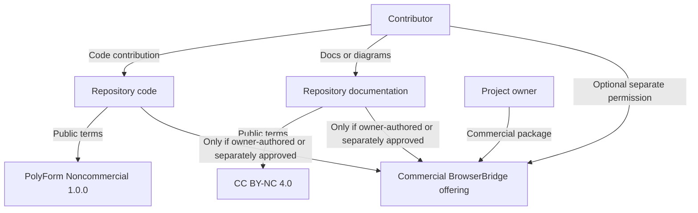
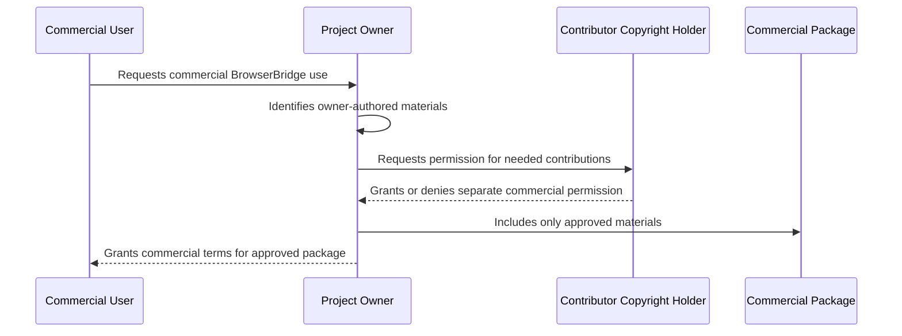

# ADR 0018: Source-Available Non-Commercial License Policy

## Status

Accepted

## Date

2026-05-25

## Context

BrowserBridge is currently licensed as AGPL-3.0-only. That is a strong
network-copyleft open-source license, but it still permits commercial use by
anyone who complies with the license.

The project goal has changed. BrowserBridge should remain publicly readable,
forkable, and collaborative, but free only for non-commercial use. Commercial
use should require separate written permission from the relevant copyright
holder or holders.

The project owner also wants to offer commercial BrowserBridge packages,
including a cloud-hosted WebSocket server and cloud-hosted MCP server.

## Decision

Adopt a source-available, non-commercial repository policy:

- Source code is licensed under PolyForm Noncommercial License 1.0.0.
- Documentation, diagrams, and other non-code written materials are licensed
  under Creative Commons Attribution-NonCommercial 4.0 International unless a
  file says otherwise.
- Names, logos, and branding remain outside those public content licenses unless
  a future brand policy grants specific rights.
- Contributions use an inbound-equals-outbound model.
- Commercial use requires separate written permission from the relevant
  copyright holder or holders.

## Contribution Flow

## Commercial Permission Flow

## Consequences

BrowserBridge should no longer describe itself as OSI open source. The accurate
positioning is source-available and free for non-commercial use.

Contributors keep copyright in their contributions. The project owner does not
receive automatic commercial relicensing rights for contributor-owned work.
Commercial BrowserBridge packages can include contributor-owned work only when
the contributor separately grants commercial permission.

Package metadata should use the SPDX license identifier
`PolyForm-Noncommercial-1.0.0` for code packages. Repository documentation
should separately document the CC BY-NC 4.0 terms for documentation and
non-code written materials.

## Non-Goals

- Do not introduce a contributor license agreement.
- Do not require copyright assignment.
- Do not design commercial pricing or hosted-service terms.
- Do not change runtime browser, WebSocket, or MCP behavior.

## Verification

Add repository tooling tests that fail while AGPL metadata or AGPL README
language remains and pass once the new license policy files and package metadata
are in place.
