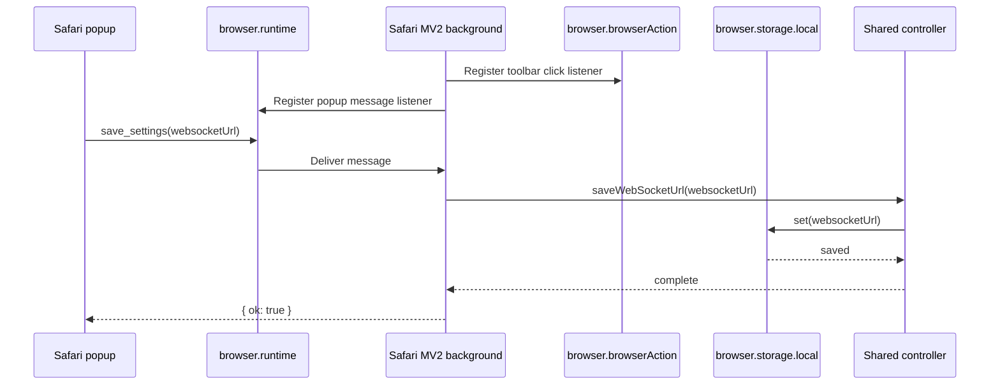

# ADR 0020: Safari MV2 Browser Action Wiring

## Status

Accepted

## Date

2026-05-27

## Context

The Safari extension currently installs and opens its popup, but the Save and
Connect buttons do not work. The popup sends messages to the background script
with `browser.runtime.sendMessage()`, and the background script is expected to
register a `browser.runtime.onMessage` listener.

The Safari manifest is Manifest V2 and declares its toolbar entry with
`browser_action`:

```json
{
  "manifest_version": 2,
  "browser_action": {
    "default_popup": "popup.html"
  }
}
```

The background entry point currently initializes the shared controller with
`browser.action` and registers `browser.action.onClicked`. In a Manifest V2
extension using `browser_action`, the matching WebExtension API is
`browser.browserAction`. If `browser.action` is undefined, the background script
throws during startup before it registers popup message handlers.

The Safari manifest also omits permissions used by the background script:

- `storage`, required for `browser.storage.local`.
- `tabs`, used for active-tab querying and tab messaging.

## Decision

Keep the Safari extension on Manifest V2 for this milestone, but align the
background wiring and manifest permissions with that API surface.

1. Use `browser.browserAction` in the Safari background entry point and adapter
   types.
2. Keep the existing `browser_action.default_popup` manifest shape.
3. Add missing `storage` and `tabs` permissions to the Safari manifest.
4. Add a regression test that loads the Safari background entry with a
   Manifest V2-shaped `browser.browserAction` mock and verifies it registers the
   runtime message listener.
5. Keep the change limited to Safari wiring and manifest permissions.

## Flow



## Consequences

- The background script can initialize in Safari's MV2 extension environment.
- Popup Save and Connect messages can reach the registered background listener.
- WebSocket URL persistence uses an explicitly declared `storage` permission.
- Active-tab reads and content-script messaging use an explicitly declared
  `tabs` permission.
- This does not migrate Safari to Manifest V3 or change the broader extension
  behavior.

## Verification

The implementation must be verified with:

```sh
pnpm --filter @browserbridge/safari-extension test
pnpm --filter @browserbridge/safari-extension build
```

If available, rebuild the native Safari wrapper with:

```sh
make safari
```
