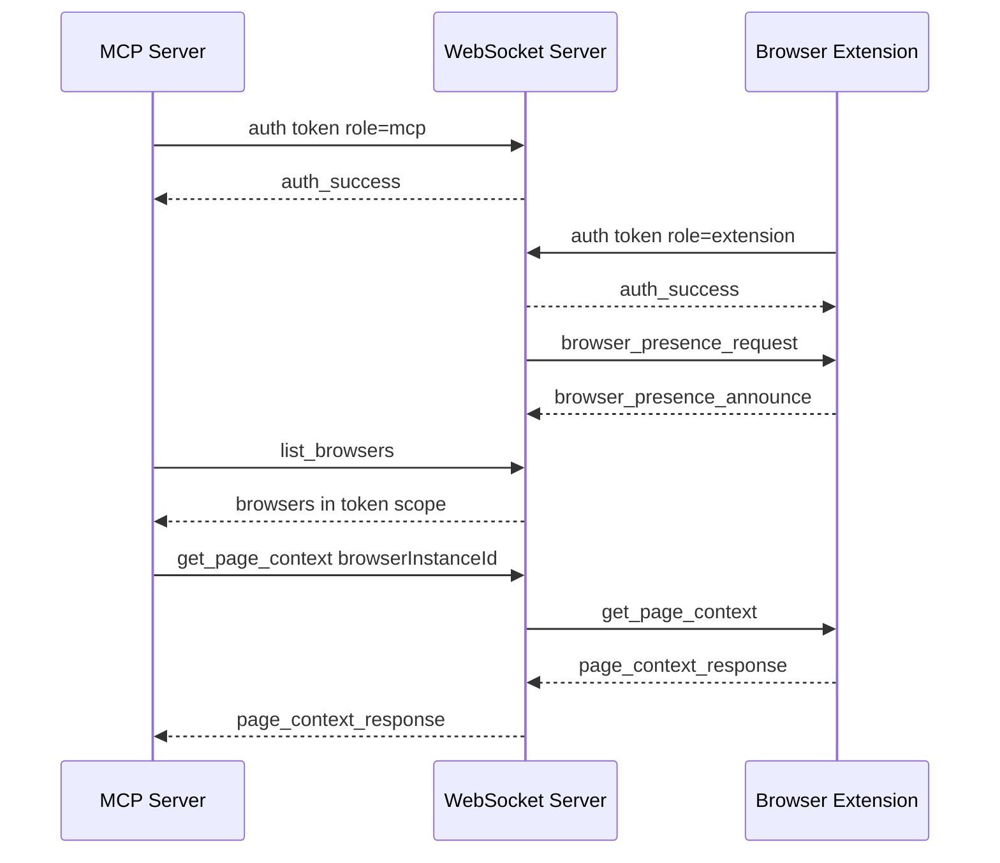

# ADR 0021: Local Pairing Presence Routing

## Status

Proposed

## Date

2026-05-25

## Context

BrowserBridge currently uses a local peer-forwarding WebSocket transport. It can
forward MCP-originated browser requests to a connected extension, but it does
not authenticate connections, track browser instance presence, isolate private
request delivery by token scope, or let MCP target a specific browser when more
than one browser is online.

BrowserBridge needs a local-first security foundation before adding more
browser power. The local foundation should match the future cloud concepts while
remaining small: a pairing token defines the private routing scope, browser
instances announce runtime presence, and MCP routes requests only inside the
authenticated scope.

## Decision

Implement local pairing, browser presence, and targeted routing.

- Add a local token generator command.
- Use one high-entropy pairing token as the local private routing scope.
- Authenticate MCP and extension WebSocket connections before routing messages.
- Derive an internal scope key from the token and avoid exposing raw tokens in
  logs, responses, or presence state.
- Store runtime browser presence in WebSocket server memory only.
- Have extensions announce presence after authentication and in response to
  server presence requests.
- Add MCP browser discovery with `list_browsers`.
- Let browser tools accept optional `browserInstanceId`.
- Route automatically only when exactly one browser is online in the
  authenticated scope.
- Return structured errors for no browser, ambiguous target, invalid target,
  auth failure, invalid messages, unsupported actions, and timeouts.

## Flow

## Scope

In scope:

- Token generation.
- Local token configuration for WebSocket, MCP, and Chrome extension.
- WebSocket authentication and in-memory presence registry.
- Extension identity configuration and presence announcements.
- MCP browser discovery and optional targeted routing.
- Documentation and tests for the local-first flow.

Out of scope:

- Cloud token issuance.
- Hosted identity or accounts.
- Durable server-side presence storage.
- New browser capabilities beyond routing and discovery.
- Storing page content, URL, title, selected text, or DOM state as presence.
- Explicit channel IDs.

## Consequences

The local runtime will stop being an open peer-forwarding channel. MCP and
extension clients must authenticate before participating in routing. Multi-browser
users get deterministic discovery and target selection. Future cloud work can
replace local token issuance and in-memory presence without changing the main
conceptual model.

## Verification

Implementation must verify:

- `node --test scripts/browserbridge-token.test.mjs`
- `pnpm --filter @browserbridge/shared test`
- `pnpm --filter @browserbridge/websocket test`
- `pnpm --filter @browserbridge/mcp test`
- `pnpm --filter @browserbridge/chrome-extension test`
- `pnpm --filter @browserbridge/chrome-extension build`
- `pnpm lint:ts`
- `pnpm lint:md`
- `pnpm test`
