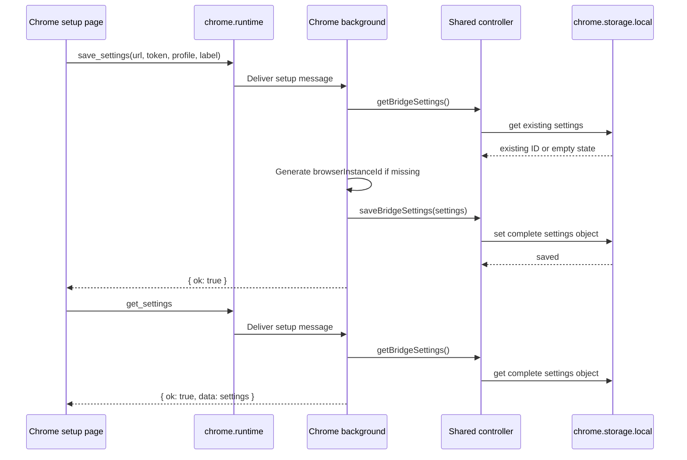

# ADR 0022: Chrome Extension Settings Persistence

## Status

Accepted

## Date

2026-05-27

## Context

The Chrome setup page lets the user configure the local WebSocket URL, pairing
token, profile name, and browser label. These values define whether the
extension can authenticate to the local WebSocket server and how the browser
appears in MCP browser discovery.

The current source and built setup page include fields for all four user-facing
settings, and the background script has a `save_settings` message path. However,
the behavior needs Chrome-specific regression coverage because the user-facing
configuration is currently not reliably preserving the pairing token, profile
name, and browser label.

The storage contract should be explicit:

- Saving from the setup page persists the WebSocket URL, pairing token, profile
  name, browser label, browser name, and stable browser instance ID.
- Loading the setup page reads the same persisted values back into the form.
- The browser instance ID is generated once when missing and remains stable
  across later settings saves.
- Empty required values are rejected with clear setup-page errors.
- The pairing token is treated as configuration only and is not logged or shown
  in documentation examples.

## Decision

Fix Chrome settings persistence through the existing setup-to-background message
path instead of introducing a new settings store.

1. Add Chrome extension tests for the setup/background settings flow.
2. Verify that `save_settings` stores pairing token, profile name, and browser
   label along with the WebSocket URL.
3. Verify that a later `get_settings` response returns those exact values.
4. Verify that repeated saves preserve an existing browser instance ID unless a
   caller explicitly provides a replacement ID.
5. Keep storage in `chrome.storage.local` and keep protocol definitions in
   shared TypeScript types where they cross package boundaries.

## Flow



## Scope

In scope:

- Chrome extension setup-page settings persistence.
- Regression tests for save and load behavior.
- Rebuilding Chrome extension output if implementation changes affect `dist`.
- Updating Chrome extension documentation if the user-facing behavior changes.

Out of scope:

- New pairing-token issuance behavior.
- Cloud account, user, or channel configuration.
- Changing the WebSocket authentication protocol.
- Persisting page content, page context, or browser activity.
- Safari or Firefox settings changes.

## Consequences

Chrome users can configure the extension once, reload the setup page, and see the
same pairing token, profile name, and browser label still present. MCP browser
discovery will receive stable browser identity metadata from the extension after
the user manually starts the bridge.

The change keeps the extension reactive and user-controlled. It does not add
background monitoring, continuous browser state streaming, or any server-side
storage of page data.

## Verification

The implementation must be verified with:

```sh
pnpm --filter @browserbridge/chrome-extension test
pnpm --filter @browserbridge/chrome-extension build
```

If shared controller behavior changes, also run:

```sh
pnpm --filter @browserbridge/shared test
```
