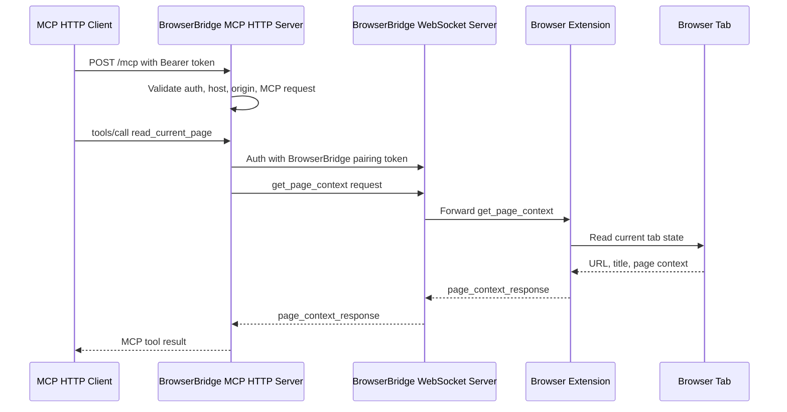
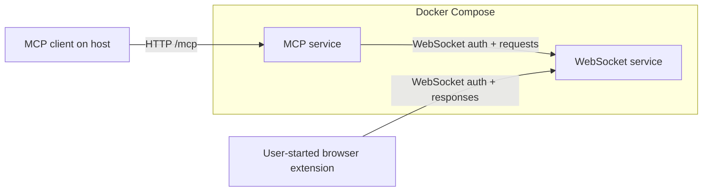

# ADR 0023: HTTP MCP Server Transport

## Status

Accepted

## Date

2026-05-27

## Context

The MCP server currently runs over stdio. That works for local clients that
spawn the MCP server process directly, but it does not fit the Docker Compose
runtime well because stdio is tied to a single parent process instead of a
network endpoint. It also makes the future cloud deployment model less direct:
the MCP server should be able to run as an independent service behind normal
HTTP routing.

BrowserBridge already has a WebSocket server that can run as a service in
Docker Compose. The MCP server should match that shape so local development can
start both services together and agents can connect to the MCP server over a
stable HTTP endpoint.

Exposing MCP over HTTP changes the threat model. The server exposes tools that
can read page context and perform browser actions when a user-controlled
extension is connected. A network listener therefore needs explicit MCP client
authentication, host and origin validation, and conservative bind defaults.

The current MCP tool and resource behavior should remain unchanged. This ADR is
about the MCP client transport into `servers/mcp`, not the WebSocket protocol
between the MCP server and the BrowserBridge WebSocket server.

## Decision

Expose the MCP server through MCP Streamable HTTP and make it the default
runtime for `servers/mcp`.

1. Refactor MCP server construction into a transport-neutral factory that
   registers the existing resources and tools once.
2. Replace the default stdio entrypoint with an HTTP runtime that serves one MCP
   endpoint, `/mcp` by default.
3. Use the official MCP SDK Streamable HTTP server transport rather than a
   custom JSON-RPC-over-HTTP protocol.
4. Keep the browser-facing WebSocket client behavior unchanged: each MCP tool or
   resource request still sends explicit WebSocket requests to the connected
   extension and waits for a structured response.
5. Require bearer-token authentication for HTTP MCP clients. The MCP HTTP token
   is separate from the BrowserBridge pairing token used between MCP,
   WebSocket, and extension.
6. Validate `Host` and `Origin` headers for HTTP MCP requests to reduce DNS
   rebinding risk, with localhost-oriented defaults for local development and
   configurable allow-lists for Docker and cloud deployment.
7. Bind the HTTP server to `127.0.0.1` by default outside containers. Docker
   Compose may bind inside the container to `0.0.0.0`, but must publish only the
   configured MCP HTTP port and must use explicit allowed host configuration.
8. Start with stateless HTTP MCP handling. Do not add resumability, server-side
   MCP session persistence, or durable request logs until a later approved ADR
   requires them.
9. Do not store page content, page context, URLs, selected text, form values, or
   action results in the MCP HTTP layer.

The HTTP runtime will use these environment variables:

- `MCP_HTTP_HOST`: bind host, default `127.0.0.1`.
- `MCP_HTTP_PORT`: bind port, default `8788`.
- `MCP_HTTP_PATH`: MCP endpoint path, default `/mcp`.
- `MCP_HTTP_AUTH_TOKEN`: bearer token required from MCP HTTP clients.
- `MCP_HTTP_ALLOWED_HOSTS`: comma-separated allowed HTTP host values.
- `MCP_HTTP_ALLOWED_ORIGINS`: comma-separated allowed origins for clients that
  send an `Origin` header.
- Existing BrowserBridge variables such as `BROWSERBRIDGE_WEBSOCKET_URL`,
  `BROWSERBRIDGE_PAIRING_TOKEN`, `BROWSERBRIDGE_REQUEST_TIMEOUT_MS`, and
  `BROWSERBRIDGE_BROWSER_INSTANCE_ID` continue to control MCP-to-WebSocket
  routing.

## Flow



## Docker Runtime



Docker Compose will expose both local services:

- WebSocket server on `WEBSOCKET_PORT`, default `8787`.
- MCP HTTP server on `MCP_HTTP_PORT`, default `8788`.

The Compose runtime must pass both tokens explicitly:

- `BROWSERBRIDGE_PAIRING_TOKEN` for private MCP-to-WebSocket routing.
- `MCP_HTTP_AUTH_TOKEN` for MCP client access to the HTTP endpoint.

## Scope

In scope:

- HTTP MCP transport for `servers/mcp`.
- Transport-neutral MCP server construction.
- Authentication, host validation, origin validation, and clear HTTP errors.
- Docker Compose updates for the MCP HTTP port and environment variables.
- Tests for HTTP MCP initialization, tool discovery, bearer auth rejection,
  host/origin rejection, and at least one browser-routed tool call.
- README updates for local HTTP MCP use and Docker Compose use.
- Documentation artifact after implementation is complete.

Out of scope:

- Changing BrowserBridge WebSocket protocol messages.
- Changing extension behavior.
- Cloud account management or hosted identity.
- OAuth for MCP clients.
- Durable MCP session storage, resumability, or replay.
- Continuous browser state streaming.
- Server-side storage of page content or action history.
- Adding new browser tools or resources.

## Consequences

Local development can run the WebSocket server and MCP server as normal
services through Docker Compose. MCP clients can connect to
`http://127.0.0.1:8788/mcp` instead of spawning a stdio process.

The MCP server becomes easier to move behind cloud HTTP infrastructure because
its inbound transport is no longer tied to a parent process. The initial design
keeps the server stateless so future horizontal scaling remains possible.

The change adds a security-critical HTTP boundary. Implementation must reject
unauthenticated requests before they can reach MCP tool handling, validate host
and origin headers, avoid logging secrets, and keep browser data reactive and
request-scoped.

Existing stdio-focused tests will need to move to HTTP transport coverage or be
split so tool registration can still be tested without depending on the runtime
transport.

## Verification

The implementation must be verified with:

```sh
pnpm --filter @browserbridge/mcp test
pnpm --filter @browserbridge/mcp build
pnpm lint:ts
pnpm lint:md
```

After Docker Compose is updated, also verify:

```sh
docker compose --profile runtime config
docker compose --profile runtime up --build
```

The Docker runtime check must confirm that:

- The WebSocket service listens on the configured WebSocket port.
- The MCP service listens on the configured HTTP port.
- Unauthenticated MCP HTTP requests are rejected.
- Authenticated MCP HTTP clients can initialize and discover tools.
