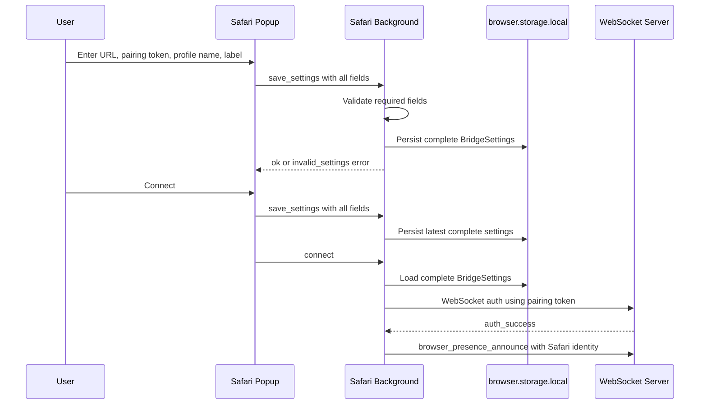

# ADR 0024: Safari Pairing Settings Fields

## Status

Proposed

## Date

2026-05-27

## Context

ADR 0021 introduced local pairing, browser presence, and targeted routing. The
shared extension controller now requires complete `BridgeSettings` before a
browser extension can connect:

- WebSocket URL
- Pairing token
- Browser instance ID
- Browser name
- Profile name
- Browser label

The Chrome setup page already exposes pairing token, profile name, and browser
label fields and sends them through the `save_settings` runtime message. The
Safari popup currently exposes only the WebSocket URL. Its background adapter can
store complete settings, but the runtime message path only saves the URL and
preserves existing pairing fields. On a fresh Safari install there are no
existing pairing fields, so saving from the popup can leave the extension without
usable settings and prevent authenticated connection.

Safari needs to implement the same user-configurable pairing fields as Chrome
while keeping Safari-specific behavior from ADR 0019: popup-based setup,
`browser.*` APIs, required host permissions, and text-only badge state.

## Decision

Add the missing pairing settings fields to the Safari extension popup and handle
them with the same validation and persistence semantics as Chrome.

The Safari popup will include:

- `Pairing token`
- `Profile name`
- `Browser label`

The Safari runtime message contract for `save_settings` will require:

- `websocketUrl`
- `pairingToken`
- `profileName`
- `label`

The background script will:

- Return the full stored `BridgeSettings` object from `get_settings`, not only
  `websocketUrl`.
- Validate all required user-provided values before saving.
- Return a structured `invalid_settings` error when a required value is blank.
- Preserve an existing `browserInstanceId` when present.
- Generate a new stable `safari-${crypto.randomUUID()}` browser instance ID
  when saving settings for the first time.
- Keep `browserName` as `Safari` unless a valid existing value is already
  stored.
- Store the normalized settings through `SafariStorageAdapter`.

The popup script will:

- Populate the WebSocket URL, pairing token, profile name, and browser label from
  `get_settings`.
- Send all required fields on Save and before Connect.
- Surface structured validation errors in the popup status element.

The default browser identity remains:

| Field               | Default                |
| ------------------- | ---------------------- |
| `browserName`       | `Safari`               |
| `profileName`       | User-provided field    |
| `label`             | User-provided field    |
| `browserInstanceId` | `safari-${randomUUID}` |

No new browser capabilities are added by this ADR. The change only completes the
Safari configuration path required by the existing authenticated pairing model.

## Flow

## Scope

In scope:

- Safari popup HTML fields for pairing token, profile name, and browser label.
- Safari popup helper updates for complete settings messages and response
  parsing.
- Safari popup DOM wiring updates.
- Safari background runtime message validation and full settings persistence.
- Safari tests for message creation, settings parsing, validation errors, and
  persistence behavior.
- Safari README updates for the pairing setup flow.

Out of scope:

- Changes to Chrome setup behavior.
- Changes to the shared `BridgeSettings` shape.
- Changes to WebSocket authentication or MCP routing.
- New Safari permissions.
- Cloud pairing, account identity, or token issuance.

## Testing

Use TDD:

1. Add failing Safari popup tests proving `createSaveSettingsMessage` includes
   `websocketUrl`, `pairingToken`, `profileName`, and `label`.
2. Add failing Safari popup response parsing tests proving all editable settings
   are read from `get_settings`.
3. Add failing Safari background-entry tests proving `save_settings` rejects
   missing or blank required values with `invalid_settings`.
4. Add failing Safari background-entry tests proving complete settings are saved,
   an existing browser instance ID is preserved, and a first-save instance ID is
   generated with the `safari-` prefix.
5. Implement the smallest changes required to pass the tests.

Verification should include:

- `pnpm --filter @browserbridge/safari-extension test`
- `pnpm --filter @browserbridge/safari-extension build`
- `pnpm lint:ts`
- `pnpm lint:md`

## Consequences

Safari users can configure the same local pairing identity fields as Chrome
users. Fresh Safari installs can produce complete `BridgeSettings`, authenticate
with the local WebSocket server, and announce browser presence with a stable
browser instance ID and user-visible label.

The Safari popup becomes slightly larger, but it remains the single Safari setup
surface and avoids introducing a separate setup page. The runtime settings path
matches Chrome closely, reducing future divergence between browser extensions.
