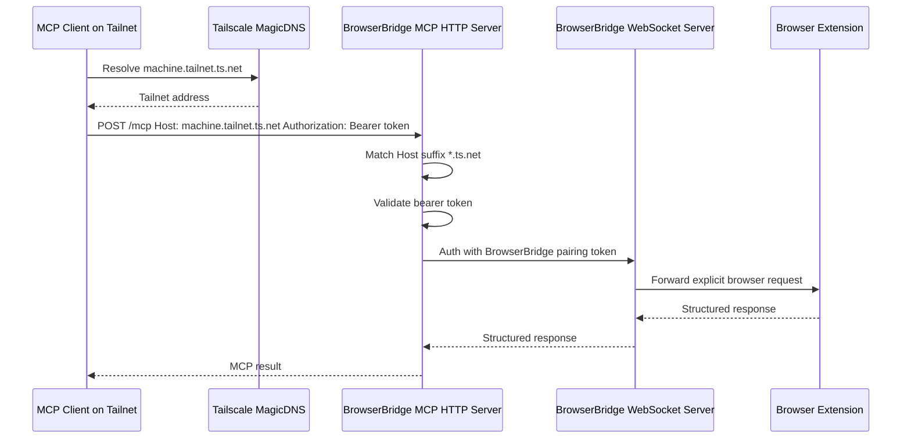
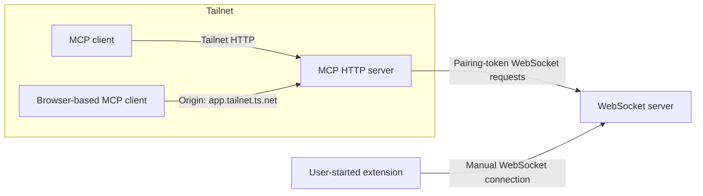

# ADR 0025: Tailscale-Friendly MCP HTTP Hosts

## Status

Accepted

## Date

2026-05-28

## Context

The MCP server now exposes Streamable HTTP on a configurable host, port, and
path. ADR 0023 requires bearer-token authentication and `Host`/`Origin`
validation because the MCP HTTP endpoint can request browser state and perform
browser actions while a user-controlled extension is connected.

Local defaults are intentionally narrow:

- `MCP_HTTP_HOST=127.0.0.1`
- `MCP_HTTP_ALLOWED_HOSTS=127.0.0.1,localhost`
- `MCP_HTTP_ALLOWED_ORIGINS=` unless explicitly configured

That works for same-machine clients, but it is awkward for Tailscale use. A
user may bind the MCP server to a Tailscale interface or `0.0.0.0` and then
reach it by a MagicDNS name such as `machine.tailnet.ts.net`. Requiring every
Tailscale hostname and origin to be enumerated manually makes private tailnet
use fragile, especially when the tailnet name or machine name changes across
development environments.

Tailscale DNS names are not a replacement for BrowserBridge authentication. A
request with a `Host` header ending in `.ts.net` is not proof that the TCP peer
arrived through Tailscale. The MCP HTTP bearer token must remain the actual
client authentication boundary.

## Decision

Make the MCP HTTP `Host` and browser `Origin` checks Tailscale-friendly by
allowing Tailscale DNS suffixes as explicit allow-list entries.

1. Continue requiring `MCP_HTTP_AUTH_TOKEN` for every MCP HTTP request.
2. Continue preserving localhost defaults for local development.
3. Extend allowed host matching so entries beginning with `*.` match DNS suffixes.
   For example, `*.ts.net` matches `device.tailnet.ts.net` and
   `device.tailnet.ts.net:8788`.
4. Extend allowed origin matching so entries beginning with `*.` match origin
   host suffixes while still checking the full URL scheme and port when those
   are configured separately.
5. Add a convenience environment variable:
   `MCP_HTTP_ALLOW_TAILSCALE_HOSTS=true`.
6. When `MCP_HTTP_ALLOW_TAILSCALE_HOSTS=true`, append `*.ts.net` to the allowed
   host suffixes and allow origins whose hostname ends in `.ts.net`.
7. Do not treat Tailscale host matching as authentication. Requests from
   Tailscale hostnames still require the MCP HTTP bearer token.
8. Do not change BrowserBridge WebSocket pairing, extension connection behavior,
   MCP tool behavior, or request/response storage.

The recommended local Tailscale configuration will be:

```sh
MCP_HTTP_HOST=0.0.0.0
MCP_HTTP_PORT=8788
MCP_HTTP_AUTH_TOKEN=replace-with-generated-mcp-token
MCP_HTTP_ALLOW_TAILSCALE_HOSTS=true
```

Existing explicit allow-list variables remain supported:

```sh
MCP_HTTP_ALLOWED_HOSTS=127.0.0.1,localhost,*.ts.net
MCP_HTTP_ALLOWED_ORIGINS=http://localhost:3000,*.ts.net
```

## Flow





## Scope

In scope:

- MCP HTTP host suffix matching for Tailscale MagicDNS names.
- MCP HTTP origin suffix matching for browser clients served from Tailscale
  domains.
- Environment parsing for `MCP_HTTP_ALLOW_TAILSCALE_HOSTS`.
- Tests for exact host matching, wildcard suffix host matching, Tailscale
  convenience behavior, rejected non-Tailscale hosts, and bearer-token
  enforcement.
- README and `.env.example` updates documenting Tailscale use.
- Documentation artifact after implementation is complete.

Out of scope:

- Replacing bearer-token authentication with Tailscale identity.
- Inspecting Tailscale peer identity or ACL tags.
- TLS certificate automation.
- Changing BrowserBridge WebSocket auth, extension auth, or pairing tokens.
- Storing browser state or request history.
- Expanding MCP tools or browser actions.

## Consequences

Tailscale users can expose the MCP HTTP server on their tailnet without
hard-coding every MagicDNS hostname into `MCP_HTTP_ALLOWED_HOSTS`.

The host and origin checks become more flexible, but they remain only request
routing guardrails. They must not be documented as proof of tailnet identity.
Bearer-token authentication remains mandatory.

If the MCP HTTP server is accidentally exposed outside the tailnet, a forged
`Host: anything.ts.net` header could pass host validation when Tailscale
allowance is enabled. The bearer token is therefore still required before any
MCP tool handling, and deployment documentation must recommend firewalling or
binding to the Tailscale interface where practical.

## Verification

The implementation must be verified with:

```sh
pnpm --filter @browserbridge/mcp test
pnpm --filter @browserbridge/mcp build
pnpm lint:ts
pnpm lint:md
```

Targeted tests must confirm:

- Requests with `Host: device.tailnet.ts.net` are allowed when
  `MCP_HTTP_ALLOW_TAILSCALE_HOSTS=true`.
- Requests with `Host: device.tailnet.ts.net:8788` are allowed when
  `MCP_HTTP_ALLOW_TAILSCALE_HOSTS=true`.
- Requests with a non-Tailscale `Host` are rejected unless otherwise allowed.
- Allowed Tailscale hosts still receive `401 unauthorized` without the bearer
  token.
- Browser requests with Tailscale `Origin` headers are allowed only through the
  approved suffix behavior.
