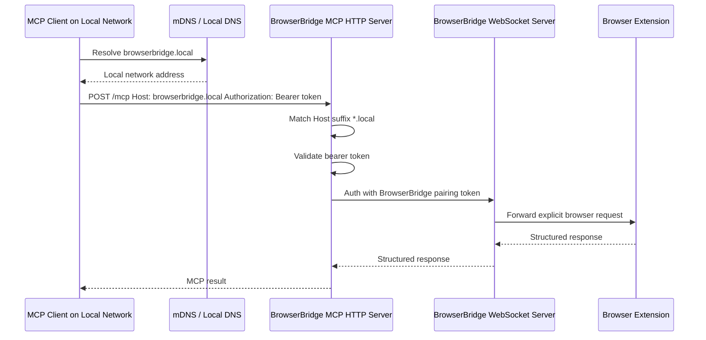
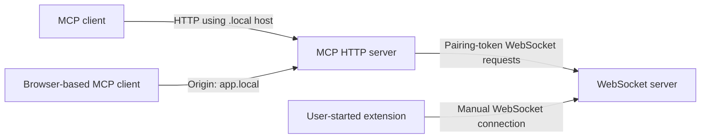

# ADR 0026: Local Domain-Friendly MCP HTTP Hosts

## Status

Accepted

## Date

2026-05-28

## Context

ADR 0025 adds opt-in Tailscale-friendly MCP HTTP host and origin validation by
allowing `.ts.net` MagicDNS names while keeping `MCP_HTTP_AUTH_TOKEN` mandatory.

The same friction exists for local network and mDNS-style development names.
Users may reach the MCP HTTP server through hostnames such as
`browserbridge.local`, `macbook.local`, or another `*.local` name instead of
`127.0.0.1` or `localhost`. Enumerating every `.local` name in
`MCP_HTTP_ALLOWED_HOSTS` and `MCP_HTTP_ALLOWED_ORIGINS` creates unnecessary
setup work for local-only development.

As with Tailscale hostnames, a `.local` host or origin is not authentication.
The MCP HTTP bearer token must remain required for every MCP request.

## Decision

Extend MCP HTTP host and origin validation to support `.local` DNS suffixes with
the same wildcard matching model used for Tailscale.

1. Continue requiring `MCP_HTTP_AUTH_TOKEN` for every MCP HTTP request.
2. Continue preserving localhost defaults for local development.
3. Allow explicit wildcard entries such as `*.local` in
   `MCP_HTTP_ALLOWED_HOSTS` and `MCP_HTTP_ALLOWED_ORIGINS`.
4. Add a convenience environment variable:
   `MCP_HTTP_ALLOW_LOCAL_HOSTS=true`.
5. When `MCP_HTTP_ALLOW_LOCAL_HOSTS=true`, append `*.local` to the allowed host
   suffixes and allow browser origins whose hostname ends in `.local`.
6. Keep `MCP_HTTP_ALLOW_TAILSCALE_HOSTS` independent so users can enable
   `.ts.net`, `.local`, both, or neither.
7. Do not treat `.local` host matching as authentication.
8. Do not change BrowserBridge WebSocket pairing, extension connection behavior,
   MCP tool behavior, or request/response storage.

Recommended local network configuration:

```sh
MCP_HTTP_HOST=0.0.0.0
MCP_HTTP_PORT=8788
MCP_HTTP_AUTH_TOKEN=replace-with-generated-mcp-token
MCP_HTTP_ALLOW_LOCAL_HOSTS=true
```

Explicit allow-list configuration remains supported:

```sh
MCP_HTTP_ALLOWED_HOSTS=127.0.0.1,localhost,*.local
MCP_HTTP_ALLOWED_ORIGINS=*.local
```

## Flow





## Scope

In scope:

- MCP HTTP host suffix matching for `.local` names.
- MCP HTTP origin suffix matching for browser clients served from `.local`
  domains.
- Environment parsing for `MCP_HTTP_ALLOW_LOCAL_HOSTS`.
- Tests for explicit `*.local` entries, local convenience behavior, rejected
  non-local hosts, combined local and Tailscale allowances, and bearer-token
  enforcement.
- README, `.env.example`, Docker Compose, and documentation artifact updates.

Out of scope:

- Replacing bearer-token authentication with local network trust.
- TLS certificate automation.
- mDNS service advertisement or discovery.
- Changing BrowserBridge WebSocket auth, extension auth, or pairing tokens.
- Storing browser state or request history.
- Expanding MCP tools or browser actions.

## Consequences

Local network development becomes easier for clients that use mDNS or local DNS
names to reach the MCP HTTP server.

The host and origin checks become more flexible, but they remain only request
routing guardrails. A forged `Host: anything.local` header could pass validation
when local allowance is enabled if the server is reachable by an unintended
network path. Bearer-token authentication remains mandatory before MCP handling,
and documentation must recommend binding or firewalling the server to the
intended local network.

## Verification

The implementation must be verified with:

```sh
pnpm --filter @browserbridge/mcp test
pnpm --filter @browserbridge/mcp build
pnpm lint:ts
pnpm lint:md
docker compose --profile runtime config --quiet
```

Targeted tests must confirm:

- Requests with `Host: browserbridge.local` are allowed when
  `MCP_HTTP_ALLOW_LOCAL_HOSTS=true`.
- Requests with `Host: browserbridge.local:8788` are allowed when
  `MCP_HTTP_ALLOW_LOCAL_HOSTS=true`.
- Requests with a non-local `Host` are rejected unless otherwise allowed.
- Allowed `.local` hosts still receive `401 unauthorized` without the bearer
  token.
- Browser requests with `.local` `Origin` headers are allowed only through the
  approved suffix behavior.
- `MCP_HTTP_ALLOW_LOCAL_HOSTS` and `MCP_HTTP_ALLOW_TAILSCALE_HOSTS` can be used
  together.
