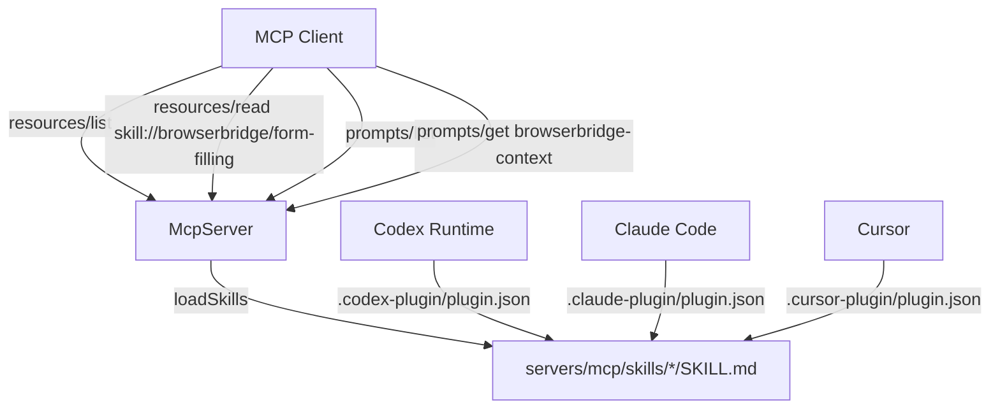

# ADR 0027: Skill System for BrowserBridge MCP Server

## Status

Accepted

## Date

2026-05-28

## Context

BrowserBridge provides MCP tools for interacting with real browser sessions
(`click_element`, `fill_input`, `submit_form`, `read_current_page`, etc.), but
agents often misuse these tools because they lack domain-specific workflow
knowledge. Common mistakes include attempting to fill password fields (which
return `browser_error`), clicking elements with stale short-lived IDs after
navigation, and auto-submitting forms without user confirmation.

The Superpowers project (obra/superpowers) demonstrates a pattern for exposing
skill knowledge to AI agents: each skill is a directory containing `SKILL.md`
with YAML frontmatter (name, description) and markdown body (instructions,
pitfalls, workflows). This format is consumed differently by different agent
runtimes:

- **Codex**: `plugin.json` declares `"skills": "./skills/"`, the runtime
  discovers `SKILL.md` directories, reads frontmatter for metadata, and loads
  the body as executable agent instructions.
- **Claude Code**: Uses a similar `plugin.json` with `marketplace.json`.
- **Cursor**: Uses `plugin.json` with `"skills": "./servers/mcp/skills/"`.

BrowserBridge also runs an MCP server with `McpServer` from
`@modelcontextprotocol/sdk`, which already supports `resources/list`,
`resources/read`, and `prompts/list`. Skills can be surfaced as MCP resources
and prompts so that any MCP client benefits, not just plugin-aware runtimes.

## Decision

Implement a tiered skill system with three exposure layers:

### 1. Skill Files (Superpowers Format)

Skills live in `servers/mcp/skills/{name}/SKILL.md` with YAML frontmatter:

```yaml
---
name: form-filling
description: "Complete forms on authenticated pages..."
---
# Smart Form Filling

...instructions and pitfalls...
```

Each skill directory can later hold companion files (reference docs, templates,
scripts) following the Superpowers convention.

### 2. MCP Resources and Prompts

The MCP server exposes:

- **Resources**: Each skill is a readable resource at
  `skill://browserbridge/{name}`, discoverable via `resources/list` and
  readable via `resources/read`. The resource URI is deterministic so agents
  can construct it from a skill name.
- **Prompts**: A `browserbridge-context` prompt that injects a summary of all
  available skills (name, title, description) plus key pitfalls into the
  session. This follows the Superpowers `session-start` prompt pattern.

### 3. Plugin Manifests

Three plugin manifests at the repository root enable native skill discovery
by agent runtimes:

- `.codex-plugin/plugin.json` — Codex plugin with `interface` metadata and
  `defaultPrompt` seeds.
- `.claude-plugin/plugin.json` + `marketplace.json` — Claude Code plugin.
- `.cursor-plugin/plugin.json` — Cursor plugin.

All three reference `./servers/mcp/skills/` as the skills directory.

### Tier 1 Skills

| Skill             | Purpose                                            |
| ----------------- | -------------------------------------------------- |
| `form-filling`    | Multi-step form completion on authenticated pages  |
| `data-extraction` | Structured data extraction from pages behind login |
| `web-qa`          | Exploratory testing and QA on authenticated pages  |

### Implementation

Add `servers/mcp/src/skills.ts` with:

- `loadSkills(skillsDir)` — reads `SKILL.md` directories, parses YAML
  frontmatter, returns sorted `BrowserBridgeSkill[]`.
- `skillResourceUri(name)` — builds `skill://browserbridge/{name}` URIs.
- `buildContextMessage(summaries)` — assembles pitfalls and skill descriptions
  for the `browserbridge-context` prompt.
- `resolveSkillsDir()` — resolves the skills directory relative to the module.

In `mcp-server.ts`, register each skill as a resource and the context prompt
during server initialization. The factory function becomes async to accommodate
file-system skill loading.



## Consequences

### Positive

- **Single source of truth**: Skill knowledge lives in `SKILL.md` files, served
  identically via MCP resources and plugin discovery.
- **Universal access**: Any MCP client gets the guides via resources/prompts,
  not just plugin-aware runtimes.
- **Extensible**: New skills are `mkdir + SKILL.md` — no code changes needed.
- **Companion files**: Skill directories can later hold reference docs, scripts,
  or templates following the Superpowers pattern.
- **Consistent pitfalls**: The `browserbridge-context` prompt ensures every
  session starts with the same critical warnings regardless of client.

### Negative

- **Async initialization**: `createBrowserBridgeMcpServer` is now async because
  it reads skill files from disk. This affects the HTTP server bootstrap.
- **Runtime file access**: Skills are loaded at server startup from the
  filesystem. Changes to skill files require a server restart.
- **Duplication risk**: Plugin manifests and MCP resources expose the same
  content through different mechanisms. Keeping them in sync requires
  discipline, but since they read from the same `SKILL.md` files, drift is
  limited to the manifest metadata (description, keywords).

### Neutral

- Skills are a separate concern from tools and resources. Adding skills does
  not change any existing tool or resource behavior.
