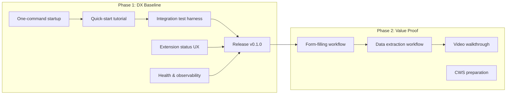

# ADR 0028: BrowserBridge MVP Approach

## Status

Proposed

## Date

2026-05-29

## Context

BrowserBridge has solid infrastructure working end-to-end:

- **WebSocket relay** with pairing token auth, session routing, local presence
- **MCP server** with HTTP transport, 9 tools, skill resources/prompts, plugin manifests
- **Chrome + Safari extensions** with full feature parity (page context, form actions)
- **10 skill definitions** (SKILL.md knowledge files across 3 tiers)
- **Docker Compose** for local WS + MCP
- **27 ADRs** documenting every architectural decision

But the project cannot yet be considered a viable MVP because:

1. **No easy onboarding** — Setting up requires `pnpm install`, `.env` configuration, token generation, loading unpacked extensions, and manual WebSocket URL entry. A new user needs 30+ minutes and deep README study.
2. **No packaging** — Extensions must be loaded as unpacked developer builds. No CRX, no Chrome Web Store listing, no distribution path.
3. **No integration testing** — The system has unit tests for the MCP skill system but no automated integration tests that spin up the full stack and exercise real tool calls end-to-end.
4. **No status UX** — Extension popup shows basic connection state but provides poor feedback on errors, reconnects, or auth failures.
5. **No release process** — No versioning, no CHANGELOG, no tagged releases, no release automation.
6. **No health/observability** — No `/health` endpoints, no structured logging, no metrics.
7. **Firefox is a placeholder** — README lists three browser targets but only two work.
8. **No quick-start proof** — No tutorial or demo that proves the value proposition in under 5 minutes.

## Decision

Implement a two-phase MVP approach: **Phase 1 (DX Baseline)** first, then **Phase 2 (Value Proof)**.

### Phase 1: Developer Experience Baseline

Make BrowserBridge something a solo developer can try, trust, and adopt in under 15 minutes.

**P1-1: One-command startup**

- `pnpm dev` starts WS server + MCP server + test page
- Auto-generates a pairing token and prints it + MCP URL to stdout
- `pnpm token` still available for manual override

**P1-2: Quick-start tutorial**

- `docs/quickstart.md` — 5-minute walkthrough from clone to first tool call
- Covers: install deps → start servers → pair extension → call a tool from CLI
- Includes expected output at each step

**P1-3: Extension status improvements**

- Popup shows: connection state (connected/disconnected/reconnecting), auth state, last error message
- Auto-reconnect on WebSocket drop with exponential backoff
- Visual feedback for in-flight requests (spinner or status text)

**P1-4: Health and observability**

- `GET /health` endpoint on MCP server (returns version, uptime, WS connection count)
- `GET /health` endpoint on WS server (returns version, uptime, connected extensions)
- Structured JSON logging for both servers

**P1-5: Integration test harness**

- Automated test suite that starts WS + MCP, makes real tool calls, verifies responses
- Covers: auth, list_browsers, read_current_page, click_element, fill_input, form lifecycle
- Runs in CI via `docker compose --profile test`

**P1-6: Release v0.1.0**

- Semantic versioning across packages (`@browserbridge/shared`, `@browserbridge/websocket`, `@browserbridge/mcp`)
- CHANGELOG.md with changes from ADR 0001 to present
- GitHub release workflow (`tag-and-release` GitHub Action)
- Git tag `v0.1.0`

### Phase 2: Value Proof

Build one killer demo that proves BrowserBridge is uniquely valuable — an AI agent can interact with a real authenticated browser session in ways no other tool allows.

**P2-1: Agent-driven form-filling workflow**

- The `form-filling` skill evolves from a static doc to a live workflow
- An agent can: read a page → identify form fields → fill them → review with user → submit
- Prove with the existing `test.html` form page in the repo

**P2-2: Agent-driven data extraction workflow**

- The `data-extraction` skill becomes actionable
- An agent can: navigate to a page → extract structured data → paginate through results
- Prove with a paginated content test page

**P2-3: Video walkthrough**

- 3-minute screen recording: "Watch an AI agent fill out a form on a page you're logged into"
- Hosted on README or linked from it

**P2-4: Chrome Web Store preparation**

- Production CRX build with proper manifest (icons, description, permissions justification)
- Privacy policy page (required by CWS)
- Submission-ready package (not submitted yet — just ready)

### What We Are Explicitly NOT Building for MVP

- **Firefox extension** — placeholder stays; real implementation post-MVP
- **Cloud deployment** — local-only for MVP
- **SaaS / multi-tenant** — single-user local scenarios only
- **Mobile app** — `clients/apps` stays as placeholder
- **Paid plan / billing** — not needed for developer MVP
- **Continuous monitoring skill** — Tier 3, post-MVP

## Consequences

### Positive

- **Fast time to value** — Phase 1 gets someone from clone to working tool call in 15 minutes
- **Confidence in reliability** — Integration tests prove the system works before claiming it does
- **Clear milestone** — `v0.1.0` is a tangible, shippable target
- **Value proof** — Phase 2 demonstrates the unique capability (auth'ed browser interaction) that no other tool offers

### Negative

- **Firefox stays incomplete** — README claims three browser targets but users will find Firefox doesn't work. The README should note this clearly.
- **No distribution yet** — Extensions are still loaded as unpacked developer builds; Chrome Web Store submission is prepared but not shipped in Phase 1.

### Neutral

- Phase 1 and Phase 2 are sequential but Phase 2 tasks can overlap with late Phase 1 work.
- The quickstart tutorial will need updating when Phase 2 workflows land.

## Mermaid Diagram

