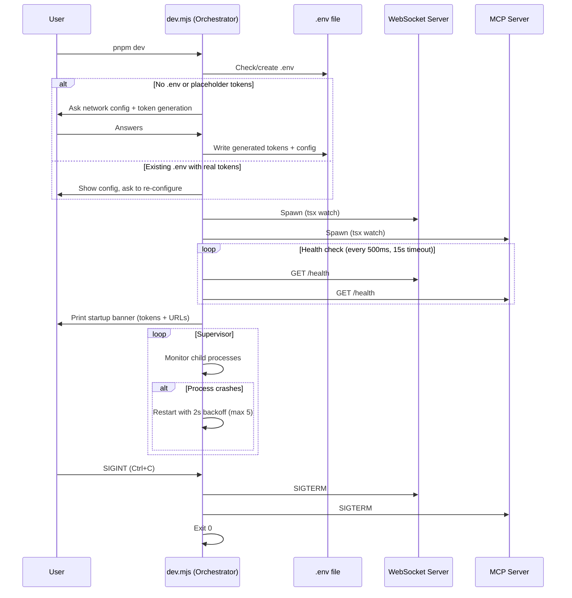
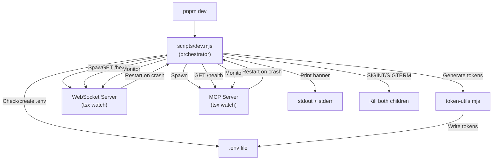

# ADR 0029: One-Command Startup

## Status

Proposed

## Date

2026-05-29

## Context

BrowserBridge requires 5+ manual steps to get started (copy `.env.example` → `.env`, run `pnpm token`, paste tokens, set `MCP_HTTP_AUTH_TOKEN`, run `pnpm dev`). Both servers crash immediately if `BROWSERBRIDGE_PAIRING_TOKEN` is missing. This creates a poor developer experience — a new contributor needs 30+ minutes and deep README study before making their first tool call.

ADR 0028 defines **P1-1: One-command startup** as the first priority for Phase 1 (DX Baseline): `pnpm dev` should start WS server + MCP server, auto-generate tokens, and print connection info — all with zero manual configuration.

Currently:

- `pnpm dev` runs `pnpm -r --parallel dev` — it starts both server packages in parallel with `tsx watch` but requires `.env` to be fully configured first
- `pnpm token` generates a pairing token but doesn't write it anywhere
- `MCP_HTTP_AUTH_TOKEN` has no generator at all
- No orchestrator coordinates startup, health checks, or shutdown
- The test page only runs in Docker (nginx), not in dev mode
- Network configuration (`ALLOW_LOCAL_HOSTS`, `ALLOW_TAILSCALE_HOSTS`) requires manual `.env` editing

## Decision

Implement a Node.js orchestrator script (`scripts/dev.mjs`) that manages the full lifecycle of starting BrowserBridge for local development. The orchestrator:

1. **Interactively configures `.env`** — asks about network access and generates tokens
2. **Spawns WS + MCP servers** as child processes with `tsx watch`
3. **Waits for health checks** — polls `/health` on both servers before printing readiness
4. **Supervises processes** — restarts on crash with backoff
5. **Manages graceful shutdown** — SIGINT/SIGTERM propagates to all children

### Interactive `.env` Setup

When `pnpm dev` runs, the orchestrator checks for `.env`:

**Fresh clone (no `.env`):**

- Creates `.env` from `.env.example`
- Generates `BROWSERBRIDGE_PAIRING_TOKEN` and `MCP_HTTP_AUTH_TOKEN`
- Asks network questions:
  - "Allow local network connections (\*.local)?" → `MCP_HTTP_ALLOW_LOCAL_HOSTS`
  - "Allow Tailscale connections?" → `MCP_HTTP_ALLOW_TAILSCALE_HOSTS`
- Derives `WEBSOCKET_HOST` and `MCP_HTTP_HOST` from network answers:
  - Local only (`false, false`) → `127.0.0.1`
  - Local network (`true`) → `0.0.0.0`
  - Tailscale (`true`) → `0.0.0.0` + Tailscale hostname in `ALLOWED_HOSTS`
- Writes all values to `.env`

**Existing `.env` with placeholder tokens:**

- Shows current configuration
- Asks whether to re-generate tokens
- Generates if confirmed, preserves if declined

**Existing `.env` with real tokens:**

- Shows current configuration (tokens masked)
- Asks whether to re-configure

**Non-interactive mode:** `pnpm dev --yes` (or `CI=true`) skips all prompts, uses defaults (localhost-only, auto-generated tokens). Required for Docker Compose and CI.

### Network Access Derivation

| `ALLOW_LOCAL_HOSTS` | `ALLOW_TAILSCALE_HOSTS` | `WEBSOCKET_HOST` | `MCP_HTTP_HOST` | `ALLOWED_HOSTS`                                   |
| ------------------- | ----------------------- | ---------------- | --------------- | ------------------------------------------------- |
| false               | false                   | 127.0.0.1        | 127.0.0.1       | 127.0.0.1,localhost                               |
| true                | false                   | 0.0.0.0          | 0.0.0.0         | 127.0.0.1,localhost,\*.local                      |
| false               | true                    | 0.0.0.0          | 0.0.0.0         | 127.0.0.1,localhost,<tailscale-hostname>          |
| true                | true                    | 0.0.0.0          | 0.0.0.0         | 127.0.0.1,localhost,\*.local,<tailscale-hostname> |

### Minimal `/health` Endpoints

Add `GET /health` to both servers returning `{ "status": "ok" }`. These are the minimum needed for the orchestrator to confirm servers are ready. P1-4 will extend these to include version, uptime, and connection counts.

**WS server** (`servers/websocket/src/server.ts`):

```typescript
httpServer.on("request", (req, res) => {
  if (req.url === "/health") {
    res.writeHead(200, { "Content-Type": "application/json" });
    res.end(JSON.stringify({ status: "ok" }));
  }
});
```

**MCP server** (`servers/mcp/src/index.ts`):

```typescript
if (req.url === "/health" && req.method === "GET") {
  res.writeHead(200, { "Content-Type": "application/json" });
  res.end(JSON.stringify({ status: "ok" }));
}
```

### Token Generation

Extract `generatePairingToken()` from `scripts/browserbridge-token.mjs` into a shared `scripts/token-utils.mjs` module. Add `generateAuthToken()` alongside it. Both use `crypto.randomBytes(32).toString('base64url')`.

The orchestrator imports from `token-utils.mjs`. `pnpm token` still works via `browserbridge-token.mjs` importing the same shared function.

### Orchestrator Lifecycle



### Startup Banner

Printed to both stdout and stderr:

```
🚀 BrowserBridge dev servers ready!

  WebSocket:    ws://127.0.0.1:8787
  MCP:         http://127.0.0.1:8788/mcp

  Pairing Token:    <token>
  MCP Auth Token:   <token>

  Connect your browser extension using the Pairing Token above.
  Configure your MCP client with the MCP URL and Auth Token.

  Press Ctrl+C to stop all servers.
```

### Package Script Changes

```json
{
  "dev": "node scripts/dev.mjs",
  "dev:ws": "tsx watch servers/websocket/src/index.ts",
  "dev:mcp": "tsx watch servers/mcp/src/index.ts",
  "token": "node scripts/browserbridge-token.mjs"
}
```

- `pnpm dev` becomes the orchestrator entry point
- `pnpm dev:ws` and `pnpm dev:mcp` remain for targeted development (bypass orchestrator)
- `pnpm token` unchanged — still available for manual token generation
- `pnpm -r --parallel dev` is removed (no longer needed)

### Non-Interactive / CI Mode

`pnpm dev --yes` or `CI=true pnpm dev`:

- Skips all prompts
- Generates tokens automatically
- Uses defaults: `ALLOW_LOCAL_HOSTS=false`, `ALLOW_TAILSCALE_HOSTS=false`
- Writes to `.env` if missing, uses existing if present

Docker Compose continues to work: it reads from `.env` file, which the orchestrator maintains. The `docker compose` profile doesn't use `pnpm dev` — it uses its own Dockerfiles.

### Test Page

The ADR 0028 P1-1 spec mentions "WS server + MCP server + test page" but the test page only exists in Docker (`docker-compose.yml` nginx service). For local dev, including a test page would add a third process to coordinate. The test page stays Docker-only for P1-1. Developers can use `docker compose --profile test up test-page` for the test page, or navigate to any local HTTP page.

## Consequences

### Positive

- **Zero-config startup** — `pnpm dev` works from a fresh clone with no manual `.env` editing
- **Guided network setup** — developers answer two yes/no questions instead of editing `.env` by hand
- **Health checks** — orchestrator waits for servers to be ready before printing URLs
- **Crash recovery** — supervisor restarts crashed processes with backoff
- **Graceful shutdown** — Ctrl+C cleanly stops both servers
- **Minimal `/health` endpoints** — laid groundwork for P1-4 observability
- **Backward compatible** — `pnpm dev:ws`, `pnpm dev:mcp`, and `pnpm token` still work

### Negative

- **Interactive prompts** — `pnpm dev` is no longer a simple parallel process runner; it now requires user interaction on first run (mitigated by `--yes` flag and `CI=true`)
- **`.env` mutation** — the orchestrator writes to `.env`, which some developers may find surprising (mitigated by showing current values and asking confirmation)
- **Orchestrator complexity** — ~150-200 lines of process management code that must be tested and maintained
- **Two new `/health` endpoints** — minimal for P1-1, but creates an API contract that P1-4 will extend

### Neutral

- `pnpm -r --parallel dev` is removed from root `package.json` — replaced by the orchestrator
- Docker Compose is unaffected (uses its own Dockerfiles, reads `.env` as before)
- The test page remains Docker-only — not started by `pnpm dev`

## Mermaid Diagram


