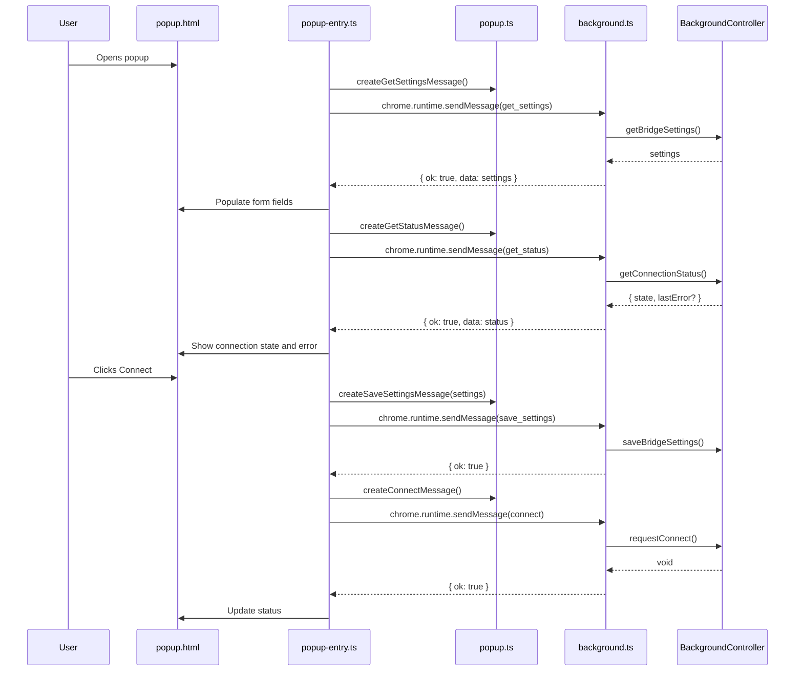
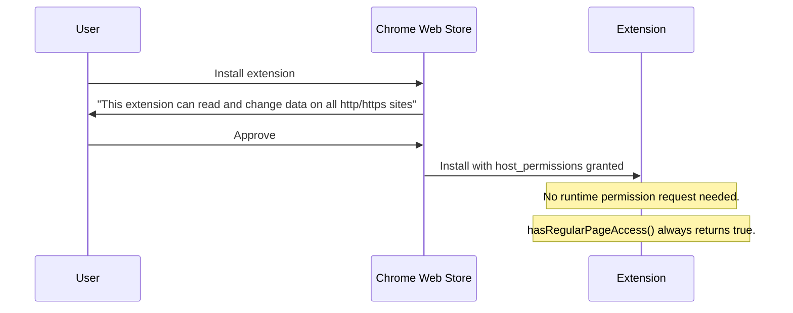

# ADR 0030: Chrome Popup Configuration

## Status

Proposed

## Date

2026-05-29

## Context

The Chrome extension currently has no popup. Clicking the extension icon toggles connect/disconnect via `chrome.action.onClicked`. Configuration (WebSocket URL, pairing token, profile name, browser label) lives in a separate full-tab page (`setup.html`) that the user must navigate to manually or that opens automatically when no settings are stored.

This creates several usability problems (identified in ADR 0028 P1-3):

- **Settings are hidden** — There is no way to edit configuration from the toolbar icon. The user must know about the internal setup page URL.
- **No status feedback** — The badge shows `OFF`/`...`/`ON`/`ERR` but provides no detail about connection state, auth status, or error messages.
- **No connect/disconnect controls in a visible UI** — The click-to-toggle behavior is not discoverable and provides no confirmation before acting.
- **Permission complexity** — Regular page access requires an explicit `chrome.permissions.request()` call from the setup page, adding a configuration step that Safari does not require.

The Safari extension (ADR 0019) already solves these problems with a popup overlay (`popup.html`) that combines settings, connect/disconnect buttons, and status display in a single compact view.

## Decision

Replace the Chrome extension's click-to-toggle behavior and full-tab setup page with a popup overlay, matching the Safari extension's UI pattern.

### Add a Popup With Settings, Controls, and Status

Add `default_popup: "popup.html"` to the Chrome manifest. The popup will contain:

- Settings form (WebSocket URL, pairing token, profile name, browser label)
- Connect and Disconnect buttons
- Status display showing connection state and error messages

### Switch to Required Host Permissions

Move `http://*/*` and `https://*/*` from `optional_host_permissions` to `host_permissions` (required at install time). This eliminates the "Enable Regular Page Access" button and the `chrome.permissions.request()` flow, matching Safari's simpler permission model.

### Remove Full-Tab Setup Page

Delete `setup.html` and `setup.ts`. The popup handles all configuration. There is no longer a need for a separate full-tab settings page.

### Remove Click-to-Toggle Listener

Remove the `chrome.action.onClicked` listener from `background.ts`. The popup replaces its connect/disconnect functionality.

### Add Connection Status Query

Add a `getConnectionStatus()` method to the shared `BrowserBridgeBackgroundController` that returns rich status:

```typescript
interface ConnectionStatus {
  state: 'disconnected' | 'connecting' | 'connected' | 'error'
  lastError?: string
}
```

The popup queries this status on open and displays it to the user.

### Add Message Handlers for Connect/Disconnect/Status

The Chrome background script currently handles `get_settings` and `save_settings` messages. Add handlers for:

- `get_status` — returns `{ ok: true, data: ConnectionStatus }`
- `connect` — calls `controller.requestConnect()`, returns `{ ok: true }` or `{ ok: false, error: { message: string } }`
- `disconnect` — calls `controller.requestDisconnect()`, returns `{ ok: true }` or `{ ok: false, error: { message: string } }`

### Simplify Permissions Module

Update `permissions.ts` to always return `true` for `hasRegularPageAccess()`. Remove `requestRegularPageAccess()` and the `ChromePermissionsApi` interface. This mirrors Safari's `permissions.ts` behavior.

## File Structure

```
clients/extensions/chrome/src/
  popup.ts           # Message creation and response parsing helpers
  popup-entry.ts     # DOM wiring for popup.html
  popup.html         # Popup UI with dark theme
  popup.test.ts      # Tests for message helpers and response parsers
  popup-entry.test.ts # Tests for DOM wiring
  background.ts      # Remove onClicked, add get_status/connect/disconnect handlers
  background.test.ts # Add tests for new message handlers
  permissions.ts     # Simplified: always-has-access model
  permissions.test.ts # Updated tests
  setup.ts           # Deleted
  setup.html         # Deleted
  content-script-entry.ts  # Unchanged
  content.test.ts          # Unchanged
```

## Popup Architecture



## Permission Flow (After Change)



## Manifest Changes

Before:

```json
{
  "action": { "default_title": "BrowserBridge" },
  "permissions": ["activeTab", "scripting", "storage", "tabs"],
  "optional_host_permissions": ["http://*/*", "https://*/*"]
}
```

After:

```json
{
  "action": { "default_popup": "popup.html", "default_title": "BrowserBridge" },
  "permissions": ["activeTab", "scripting", "storage", "tabs"],
  "host_permissions": ["http://*/*", "https://*/*"]
}
```

## Considered Approaches

### Option 1: Popup With Settings, Controls, and Status (Selected)

Replace click-to-toggle with a popup that combines everything: settings form, Connect/Disconnect buttons, connection state, and error display.

This matches Safari's proven pattern and directly addresses all ADR 0028 P1-3 requirements.

### Option 2: Popup With Status Only, Keep Click-to-Toggle

Add a popup showing status and a link to the setup page, but keep the icon click for connect/disconnect.

This preserves the click-to-toggle behavior but creates an awkward two-path UX: click the icon to connect, then click again to open a popup that only shows status. The connect action is hidden and undiscoverable.

### Option 3: Move Setup Page to Options Page

Keep a popup for status and connect/disconnect, but move settings to `chrome.runtime.openOptionsPage()` (the standard Chrome "Options" page).

This adds another configuration surface and still does not address the visibility problem. The user must know about the options page. It also keeps the permission prompt complexity.

## Scope

In scope:

- Create `popup.ts`, `popup-entry.ts`, `popup.html` for Chrome extension
- Create `popup.test.ts` and `popup-entry.test.ts`
- Add `getConnectionStatus()` to `BrowserBridgeBackgroundController`
- Add `get_status`, `connect`, `disconnect` message handlers to Chrome `background.ts`
- Update `manifest.json`: add `default_popup`, move host permissions to required
- Simplify `permissions.ts`: always-true model
- Delete `setup.ts` and `setup.html`
- Remove `chrome.action.onClicked` listener
- Update build script to copy `popup.html` instead of `setup.html`
- Update Chrome extension README

Out of scope:

- Auto-reconnect with exponential backoff (ADR 0028 P1-3, separate ADR)
- Visual feedback for in-flight requests (ADR 0028 P1-3, separate ADR)
- Safari extension changes (Safari already has popup)
- Shared popup module in `@browserbridge/shared` (two consumers do not justify shared extraction)
- Firefox extension changes (placeholder)

## Testing

Use TDD:

1. Add failing tests for popup message helpers (`popup.test.ts`)
2. Add failing tests for popup DOM wiring (`popup-entry.test.ts`)
3. Add failing tests for `getConnectionStatus()` in shared controller
4. Add failing tests for `get_status`, `connect`, `disconnect` message handlers in `background.ts`
5. Add failing tests for simplified permissions (`permissions.test.ts`)
6. Implement each feature to pass its tests
7. Verify with `pnpm --filter @browserbridge/chrome-extension test`
8. Verify with `pnpm --filter @browserbridge/shared test`
9. Verify build: `pnpm --filter @browserbridge/chrome-extension build`
10. Verify lint: `pnpm lint:ts` and `pnpm lint:md`

## Consequences

### Positive

- **Settings are immediately accessible** from the toolbar icon — no hidden pages
- **Connection state is visible** — users see at a glance whether they are connected, connecting, or have an error
- **Safari parity** — both extensions use the same UI pattern, reducing mental model overhead
- **Simpler permissions** — no runtime permission request flow, one fewer configuration step
- **Fewer files** — `setup.ts` and `setup.html` are deleted

### Negative

- **Larger install-time permission surface** — required `host_permissions` means Chrome shows "can read and change data on all sites" at install. This may deter some users compared to the optional permission model.
- **Behavior change for existing users** — icon click now opens popup instead of toggling connection. Users who relied on quick toggle must now use the popup's Connect/Disconnect buttons.

### Neutral

- Safari's popup tests can be used as a reference pattern for Chrome's.
- The `permissions.ts` simplification reduces Chrome's permissions module to match Safari's, but the Chrome-specific `ChromePermissionsApi` interface is removed.