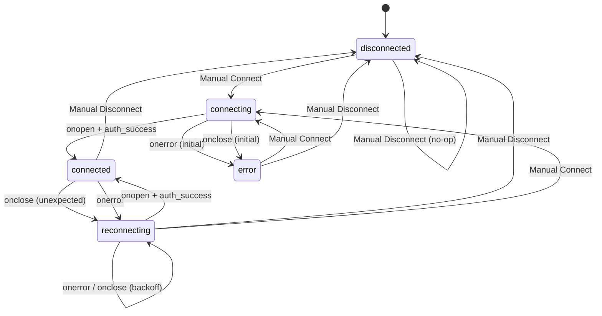
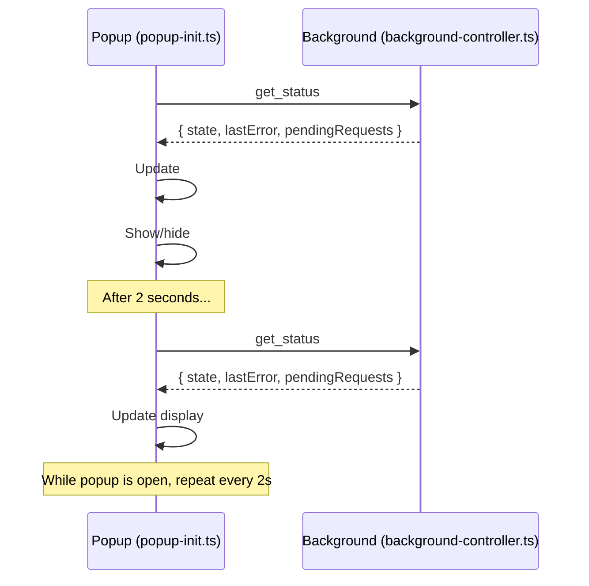
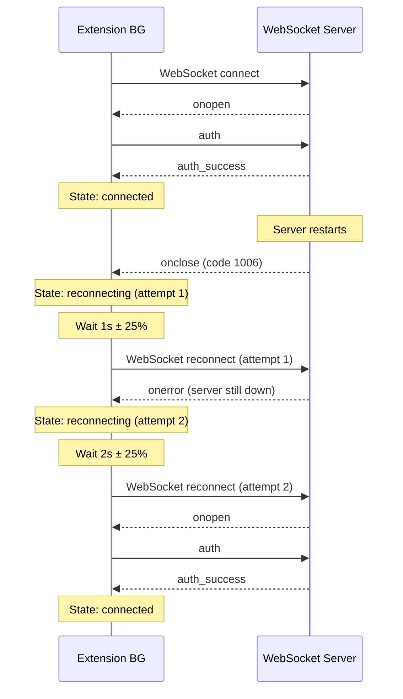

# ADR 0032: Extension Status UX — Last Error, Auto-Reconnect, and In-Flight Spinner

## Status

Accepted

## Context

P1-3 requires the BrowserBridge extension popup to provide clear, actionable connection state feedback. Currently:

1. **Last error display** — The `ConnectionStatus` type has a `lastError?` field and the popup already renders it as `Status: Error — {lastError}`, but the `onerror` handler in `background-controller.ts` always sets a generic `"BrowserBridge connection error"` string instead of capturing the real WebSocket close reason or error details.

2. **Auto-reconnect** — When `onclose` or `onerror` fires, the controller transitions to `disconnected`/`error` and stays there. The user must manually click Connect again. Network drops and temporary server restarts cause unnecessary friction.

3. **In-flight request indicator** — The popup shows no visual feedback while the background is processing a request. The user has no way to tell if the extension is actively doing something or idle.

## Decision

### 1. Enrich error messages from WebSocket events

- In `onclose`, capture the `CloseEvent.code` and `CloseEvent.reason` to produce descriptive error messages (e.g., `"Connection closed (code 1006): abnormal closure"`, `"Server rejected authentication (code 4001)"`).
- In `onerror`, set a descriptive message based on context: `"Failed to connect to WebSocket server"` during initial connection, or `"Connection lost unexpectedly"` if the error occurs on an established connection.
- Store the enriched message in `lastErrorMessage` so `getConnectionStatus()` returns it and the popup displays it.

### 2. Auto-reconnect with exponential backoff

- Add `reconnecting` as a new connection state (full set: `disconnected`, `connecting`, `reconnecting`, `connected`, `error`).
- When `onclose` fires unexpectedly (not triggered by `disconnect()`), transition to `reconnecting` and schedule a reconnect attempt with exponential backoff.
- Backoff parameters: initial delay 1 second, maximum delay 30 seconds, multiplier 2×, jitter ±25% to avoid thundering herd.
- Maximum reconnect attempts: unlimited (the user manually disconnected), but cap at 30-second intervals.
- When `onerror` fires during an established connection, also transition to `reconnecting`.
- Badge state for `reconnecting`: text `RCY`, colour `#f59e0b` (same amber as `connecting`), title `"BrowserBridge reconnecting (attempt N)"`.
- If the user clicks Disconnect during reconnecting, cancel the pending reconnect timer and transition to `disconnected`.
- A manual Connect click during `reconnecting` also cancels the timer and starts a fresh connection.
- Store a `manualDisconnect: boolean` flag. `requestDisconnect()` sets it to `true`. `connect()` and the auto-reconnect logic clear it to `false`. Only auto-reconnect when `manualDisconnect` is `false`.

### 3. In-flight request spinner in the popup

- Track in-flight request count in the `BrowserBridgeBackgroundController` via a `pendingRequests` counter incremented on incoming `get_page_context` / `get_page_content` / `perform_action` messages and decremented when responses are sent.
- Extend `ConnectionStatus` to include `pendingRequests: number` (0 when idle).
- Add a CSS spinner animation and a `#spinner` element in the popup HTML. The spinner is shown when `pendingRequests > 0` and hidden when `pendingRequests === 0`.
- The popup polls `get_status` every 2 seconds while open to update both connection state and spinner visibility. This replaces the one-shot status read on popup open.
- Use `chrome.alarms` or `setInterval` in the popup for the 2-second poll. Since MV3 popups have short lifetimes, `setInterval` (already in use for `pollConnectionStatus`) is appropriate.

### 4. Visual status styling

- Add state-dependent CSS classes to the `#status` div:
  - `.status-connected`: green left border, text `"● Connected"`
  - `.status-connecting`: amber left border, text `"◌ Connecting..."`, spinner shown
  - `.status-reconnecting`: amber left border, text `"◌ Reconnecting (attempt N)..."`, spinner shown
  - `.status-disconnected`: gray left border, text `"○ Disconnected"`
  - `.status-error`: red left border, text `"✕ Error — {lastError}"` or `"✕ Error"`

## Consequences

**Positive:**

- Users see the actual error reason (auth rejected vs. server unreachable vs. abnormal close) instead of a generic message.
- Automatic recovery from transient network issues — no manual re-click needed.
- Visual spinner gives confidence that the extension is actively processing requests.

**Negative:**

- `reconnecting` is a new state that both Chrome and Safari extension code must handle. The popup logic and badge logic gain a new branch.
- 2-second polling in the popup adds marginal overhead, but since the popup is open only briefly, the impact is negligible.
- Auto-reconnect could cause confusion if the server is intentionally down. The badge title includes attempt count so the user can see what's happening.

## Mermaid Diagrams

### Connection State Machine

### Popup Status Polling Flow

### Auto-Reconnect Timing

