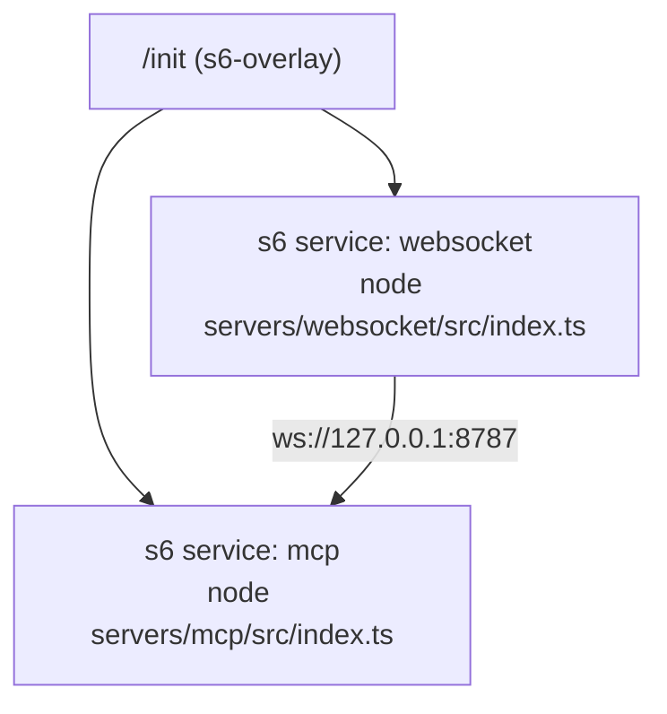
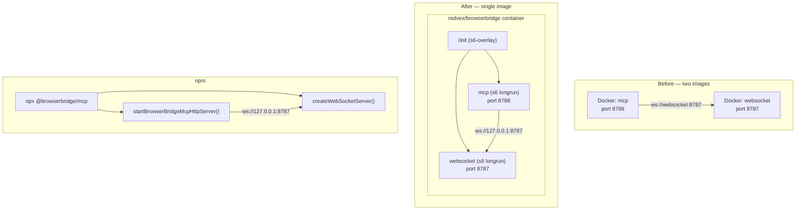

# ADR-0035: Combined Docker image and npm package

## Status

Proposed

## Context

BrowserBridge currently ships as two separate runtime packages:

- `@browserbridge/websocket` — WebSocket companion server (port 8787)
- `@browserbridge/mcp` — MCP server (port 8788, Streamable HTTP transport)

Both are marked `"private": true` in their `package.json`, which prevents npm publishing. Docker Compose runs them as two separate containers (`websocket` and `mcp`), each with its own Dockerfile. The MCP container depends on the WebSocket container and connects to it via `ws://websocket:8787`.

This split creates friction at every distribution point:

1. **Docker Hub** — two images to build, tag, push, and version. Users must run `docker compose` to start both.
2. **npm** — `@browserbridge/mcp` cannot be discovered. MCP directory listings (Glama, MCP.so, awesome-mcp-servers) auto-scrape npm, so `"private": true` blocks the primary discovery channel.
3. **MCP directories** — most require a single URL: `npx @browserbridge/mcp` or `docker run redvex/browserbridge`. Two commands, two packages, or two containers weakens the pitch.
4. **Local development** — `pnpm dev` already starts both via the orchestrator. The split is an operational detail, not a user-facing choice.

### Key observation

The WebSocket companion is not a standalone product. It only exists to relay messages between the MCP server and browser extensions. No user would ever run the WebSocket server without the MCP server. Publishing it as a separate package would be misleading — it would look like an independent utility when it's really an internal transport layer.

## Decision

### 1. Single npm package: `@browserbridge/mcp`

Remove `"private": true` from `servers/mcp/package.json`. Keep `"private": true` on `@browserbridge/websocket` and `@browserbridge/shared`.

Add a `bin` field to `@browserbridge/mcp` pointing to a new entry script (`bin/browserbridge.mjs`) that:

- Starts the WebSocket companion server on port 8787
- Starts the MCP server on port 8788
- Manages both processes (graceful shutdown on SIGINT/SIGTERM)
- Delegates to `createWebSocketServer()` and `startBrowserBridgeMcpHttpServer()` — no code duplication

```json
{
  "name": "@browserbridge/mcp",
  "version": "0.1.0",
  "private": false,
  "bin": {
    "browserbridge": "./bin/browserbridge.mjs"
  }
}
```

Running `npx @browserbridge/mcp` or installing globally (`npm i -g @browserbridge/mcp && browserbridge`) starts both services. The MCP server connects to `ws://127.0.0.1:8787` (its own loopback, same process).

The `@browserbridge/websocket` package remains in the monorepo as a workspace dependency. It's imported at runtime by the combined entry point. It just won't be published to npm independently.

### 2. Single Docker image: `redvex/browserbridge`

Replace the two Dockerfiles (`servers/mcp/Dockerfile` and `servers/websocket/Dockerfile`) with one `Dockerfile` at the repo root that builds and runs both services in a single container using s6-overlay for process supervision.



**s6-overlay service definitions:**

```
docker/s6-rc.d/
├── websocket/
│   ├── type        (longrun)
│   ├── run         (#!/command/with-contenv sh → exec node servers/websocket/src/index.ts)
│   └── dependencies.d/
│       └── base
└── mcp/
    ├── type        (longrun)
    ├── run         (#!/command/with-contenv sh → exec node servers/mcp/src/index.ts)
    └── dependencies.d/
        └── base
```

Both services join the s6 user bundle so they start automatically when s6-overlay initializes.

**Docker image layers:**

```
Build stage:
  - pnpm install (production + dev for build)
  - pnpm -r build (TypeScript → JS)

Runtime stage:
  - s6-overlay v3.2+
  - pnpm install --prod
  - Copy built output from build stage
  - COPY docker/s6-rc.d/ /etc/s6-overlay/s6-rc.d/
  - EXPOSE 8787 8788
  - ENTRYPOINT ["/init"]
```

**Docker Compose simplifies to:**

```yaml
services:
  browserbridge:
    image: redvex/browserbridge:0.1.0
    ports:
      - "8787:8787" # WebSocket
      - "8788:8788" # MCP
    environment:
      BROWSERBRIDGE_PAIRING_TOKEN: ${BROWSERBRIDGE_PAIRING_TOKEN}
      MCP_HTTP_AUTH_TOKEN: ${MCP_HTTP_AUTH_TOKEN}
      BROWSERBRIDGE_REQUEST_TIMEOUT_MS: ${BROWSERBRIDGE_REQUEST_TIMEOUT_MS:-5000}
```

One `docker pull`, one container, both ports. The `runtime` profile is no longer needed since there's only one service.

### 3. Combined entry script

Create `bin/browserbridge.mjs` as the npm `bin` entry point:

```javascript
#!/usr/bin/env node
import { createWebSocketServer } from "@browserbridge/websocket/server";
import {
  startBrowserBridgeMcpHttpServer,
  getMcpHttpServerOptionsFromEnv,
} from "../servers/mcp/src/http-server.js";

const ws = await createWebSocketServer({ host, port, pairingToken });
const mcp = await startBrowserBridgeMcpHttpServer(options);
// Log startup banner
// SIGINT/SIGTERM → graceful shutdown both
```

For Docker, the s6 `run` scripts invoke each server directly — no Node.js orchestrator needed inside the container. The `bin/browserbridge.mjs` orchestrator is for `npx` / bare `node` usage only.

### 4. Remove old Dockerfiles

Delete `servers/mcp/Dockerfile` and `servers/websocket/Dockerfile`. They are superseded by the combined root `Dockerfile`. The `Dockerfile.test` at the repo root remains unchanged.

### 5. MCP server WebSocket URL default change

Currently the MCP server reads `BROWSERBRIDGE_WEBSOCKET_URL` from env (defaulting to `ws://127.0.0.1:8787` for local dev, `ws://websocket:8787` for Docker). In the combined image, the MCP server always connects to `ws://127.0.0.1:8787` because both processes share the same network namespace. No Docker Compose hostname resolution needed.

The `BROWSERBRIDGE_WEBSOCKET_URL` env var remains available for advanced use cases (separate deployment, remote relay), but the default becomes `ws://127.0.0.1:8787` in all contexts.

### 6. Zero-config defaults for local-single-machine use

The primary use case is **agent + MCP server + WebSocket companion + browser extension all on the same machine**. Today this requires at minimum two manually-set tokens (`MCP_HTTP_AUTH_TOKEN` and `BROWSERBRIDGE_PAIRING_TOKEN`) — the MCP server even throws if `MCP_HTTP_AUTH_TOKEN` is empty. This blocks the `npx`-just-works experience.

**Auto-generate tokens when not provided.** Both the `bin/browserbridge.mjs` entry point and the s6 `run` scripts should:

- If `MCP_HTTP_AUTH_TOKEN` is unset or empty → generate `crypto.randomBytes(32).toString('base64url')`
- If `BROWSERBRIDGE_PAIRING_TOKEN` is unset or empty → generate `crypto.randomBytes(32).toString('base64url')`
- Print both tokens to stdout at startup alongside the URLs, so the user can copy them into their MCP client config and browser extension

This means **`npx @browserbridge/mcp` and `docker run redvex/browserbridge` work with zero env vars**. For the local-single-machine case, sensible defaults cover everything:

| Variable                           | Default               | Rationale                                       |
| ---------------------------------- | --------------------- | ----------------------------------------------- |
| `WEBSOCKET_HOST`                   | `127.0.0.1`           | Loopback only; all on same machine              |
| `WEBSOCKET_PORT`                   | `8787`                | Unlikely to conflict                            |
| `BROWSERBRIDGE_PAIRING_TOKEN`      | **auto-generated**    | Printed to stdout at startup                    |
| `BROWSERBRIDGE_WEBSOCKET_URL`      | `ws://127.0.0.1:8787` | Same process namespace                          |
| `MCP_HTTP_HOST`                    | `0.0.0.0`             | Bind all interfaces; reachable on LAN/Tailscale |
| `MCP_HTTP_PORT`                    | `8788`                | Unlikely to conflict                            |
| `MCP_HTTP_PATH`                    | `/mcp`                | Standard MCP path                               |
| `MCP_HTTP_AUTH_TOKEN`              | **auto-generated**    | Printed to stdout at startup                    |
| `MCP_HTTP_ALLOWED_ORIGINS`         | (empty)               | No CORS restriction by default                  |
| `BROWSERBRIDGE_REQUEST_TIMEOUT_MS` | `5000`                | 5 seconds                                       |

**Remove `MCP_HTTP_ALLOWED_HOSTS`, `MCP_HTTP_ALLOW_TAILSCALE_HOSTS`, and `MCP_HTTP_ALLOW_LOCAL_HOSTS`.** Network-level reachability is the user's responsibility — firewalls, VPNs, and NAT handle it. BrowserBridge authenticates requests via `MCP_HTTP_AUTH_TOKEN` (and `BROWSERBRIDGE_PAIRING_TOKEN` for WebSocket). Host-whitelisting was redundant security theatre that complicated every deployment mode. If a request presents a valid auth token, it's authorised regardless of which interface it arrived on.

**Default bind address is `0.0.0.0` everywhere** — local dev, Docker, Tailscale, all the same. This matches real-world usage: the Mac Mini is not exposed to the internet, reachable via LAN and Tailscale, and that's secure enough. An internet-facing deployment wants `0.0.0.0` too — the firewall handles network-level access.

**Where `127.0.0.1` binding still makes sense:** a user who wants strictly local-only access can set `MCP_HTTP_HOST=127.0.0.1` and `WEBSOCKET_HOST=127.0.0.1`. This works for `npx` / bare `node` usage where the agent and BrowserBridge share the same machine. **This does not work with Docker** — inside a container, `127.0.0.1` binds only to the container's loopback, which is unreachable from the host even with `-p` port mapping. Users running Docker must use the default `0.0.0.0` and rely on auth tokens for security, or not expose the ports at all (`docker run --network=host` with `127.0.0.1` binding on the host network namespace).

**Token persistence.** Auto-generated tokens are ephemeral — new ones on every restart. For stable tokens across restarts, users set the env vars explicitly (in `.env`, Docker Compose, or systemd). The startup banner clearly labels auto-generated tokens as `[auto-generated]` and reminds the user that they change on restart.

The README must include a **"Persisting Tokens"** section with copy-paste commands for each deployment method:

```bash
# npx — create .env in working directory
echo "BROWSERBRIDGE_PAIRING_TOKEN=$(openssl rand -base64 32)" >> .env
echo "MCP_HTTP_AUTH_TOKEN=$(openssl rand -base64 32)" >> .env
npx @browserbridge/mcp

# Docker — pass tokens via -e flags
docker run -p 8787:8787 -p 8788:8788 \
  -e BROWSERBRIDGE_PAIRING_TOKEN=$(openssl rand -base64 32) \
  -e MCP_HTTP_AUTH_TOKEN=$(openssl rand -base64 32) \
  redvex/browserbridge

# Docker Compose — set in .env file next to docker-compose.yml
# (container auto-generates on first run; persist the printed tokens)
```

The README should also explain that the `bin/browserbridge.mjs` entry point reads from `.env` in the current working directory (or `BROWSERBRIDGE_ENV_FILE` override), mirroring the `pnpm dev` orchestrator pattern.

**Startup banner (npx and Docker):**

```
🚀 BrowserBridge ready!

  WebSocket:    ws://127.0.0.1:8787
  MCP:         http://127.0.0.1:8788/mcp

  Pairing Token:    aBcDeFgHiJkLmNoPqRsTuVwXyZ0123456789abcdefghijklmnopqrstu  [auto-generated]
  MCP Auth Token:   vUwXyZ0123456789AbCdEfGhIjKlMnOpQrStUvWxYz0123456789abcd  [auto-generated]

  ⚠ Auto-generated tokens change on restart. Set BROWSERBRIDGE_PAIRING_TOKEN and
    MCP_HTTP_AUTH_TOKEN environment variables for persistent tokens.

  Connect your browser extension using the Pairing Token above.
  Configure your MCP client with the MCP URL and Auth Token.
```

## Consequences

### Positive

- **Single `npx` command** — `npx @browserbridge/mcp` is the standard MCP directory pattern. Works immediately.
- **Zero-config startup** — `npx @browserbridge/mcp` or `docker run redvex/browserbridge` with no env vars. Tokens auto-generate, hosts default to loopback (or `0.0.0.0` in Docker), ports are sensible. The user only needs to copy the printed tokens into their MCP client config and browser extension.
- **Single Docker image** — `docker run redvex/browserbridge` starts everything. No Compose needed for basic usage.
- **npm discovery** — Glama, MCP.so, and awesome-mcp-servers auto-scrape npm. Publishing `@browserbridge/mcp` unlocks those listings.
- **s6-overlay** — proper process supervision: auto-restart on crash, graceful shutdown, structured logging. No `&` backgrounding hacks.
- **Simpler Docker Compose** — one service instead of two with `depends_on`.
- **Less user confusion** — one package to install, one image to pull, one command to run.

### Negative

- **Single point of failure in Docker** — if either process crashes, s6-overlay restarts it independently, but a container-level failure (OOM kill, node runtime crash) takes both down. This is acceptable because in production you'd run multiple replicas anyway, and the WebSocket companion is meaningless without the MCP server.
- **`@browserbridge/websocket` not independently installable** — users who want just the WebSocket server cannot `npm install @browserbridge/websocket`. This is intentional: it's not a standalone product.
- **Image size** — both servers are in the same image. Mitigated by multi-stage build (dev deps excluded from runtime) and the fact that both are small Node.js packages sharing the same `node_modules`.
- **s6-overlay adds ~10MB** — minimal overhead for proper supervision. Alternative was simple shell entrypoint (`websocket & exec node mcp`), but that provides no crash recovery or signal handling.
- **Migration** — existing Docker Compose users need to update from two services to one. The old Dockerfiles remain in git history.
- **Ephemeral tokens** — auto-generated tokens change on every restart, which can be surprising. Mitigated by the `[auto-generated]` label and the reminder in the startup banner. Users who want stable tokens set env vars explicitly — this matches how databases, message queues, and other infra tools handle bootstrap credentials.
- **`127.0.0.1` binding doesn't work with Docker port mapping** — users who want strictly local-only access must use `npx` (not Docker) or `docker run --network=host`. This is documented in the ADR and README. Default of `0.0.0.0` is correct for the common case.
- **Breaking change: removing `MCP_HTTP_ALLOWED_HOSTS`, `MCP_HTTP_ALLOW_TAILSCALE_HOSTS`, `MCP_HTTP_ALLOW_LOCAL_HOSTS`** — existing `.env` files and Docker Compose configs that set these will have them silently ignored. The `pnpm dev` orchestrator prompts for local/Tailscale host allowances — those prompts should be removed alongside this change.

### Neutral

- The monorepo structure (`packages/shared`, `servers/mcp`, `servers/websocket`) is unchanged. pnpm workspace still manages all three packages.
- `pnpm dev` (local orchestrator) is unchanged — it already starts both processes.
- `pnpm dev:ws` and `pnpm dev:mcp` still work for targeted development.
- The `Dockerfile.test` for CI is unchanged — it still installs all packages and runs `pnpm test`.

## Mermaid diagram


