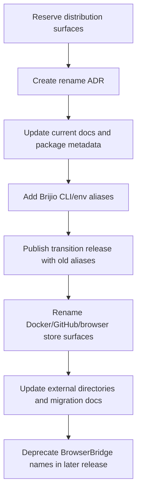

# ADR-0037: Rename BrowserBridge to Brijio

## Status

Proposed

## Context

The project started as **BrowserBridge**, a literal name for a user-controlled bridge between browser extensions and AI agents. That name served the MVP well, but it is crowded and descriptive rather than ownable.

The project now needs a brand that can support:

- open-source distribution through npm, Docker Hub, GitHub, and browser extension stores;
- a developer-tool identity that still feels product-grade;
- future commercial/enterprise positioning;
- a concise name that can survive beyond the initial “browser bridge” implementation detail.

After exploring literal `*Port`, `*Dock`, `*Relay`, and `*IO` options, the project lead selected **Brijio**.

The name keeps useful associations without being literal:

- **Bridge** recall — continuity with BrowserBridge without keeping a crowded descriptive phrase.
- **I/O** recall — agents send actions in and receive browser context/results out.
- **Craft / precision / brio** associations — useful secondary brand meaning around skilled, controlled browser work.

Initial reservation state:

- npm organisation `@brijio` has been created.
- Docker Hub account/namespace `brijio` has been created.
- npm package names under `@brijio` need to be migrated/reserved.
- Docker images under `brijio/*` need to be migrated/reserved.
- `brijio.com` is a GoDaddy premium-domain placeholder listed for roughly £4,000, so the `.com` is available only at a high acquisition cost.
- Other Brijio domain extensions are widely available and should be considered for the canonical website.
- GitHub repository has been renamed to `redvex/brijio`; the local repository remote should point to `git@github.com:redvex/brijio.git`.
- GitHub user/org `brijio` exists, so a separate Brijio-owned GitHub org strategy must use an alternate handle unless acquisition becomes possible.

## Decision

Rename the project and public product from **BrowserBridge** to **Brijio**.

Use **Brijio** as the public brand and product name.

Use descriptive language such as **browser port**, **controlled browser access**, and **browser I/O for agents** in taglines, docs, and technical explanations rather than making them the product name.

Recommended positioning:

> Brijio gives AI agents a controlled, user-approved way to read, act, and verify through the real browser.

Recommended technical description:

> Brijio is a browser port for AI agents — a controlled way to read, act, and verify through the user’s real session.

## Scope of the rename

The rename has three distinct layers:

1. **Brand rename** — user-facing docs, extension store copy, website copy, repository metadata, package descriptions.
2. **Distribution rename** — npm package names, Docker image names, GitHub repository/org names, browser extension store listings.
3. **Code/API rename** — internal package names, binaries, environment variables, protocol identifiers, local config paths, skill names, and backwards-compatible aliases.

The rename should be implemented in phases. Do not do a blind global search-and-replace.

Historical ADRs should remain historically accurate. They may mention BrowserBridge because that was the project name when those decisions were made. Do not rewrite old ADR decision text just to rename the project.

## Transition strategy

Keep backwards compatibility for at least one minor release after the public rename.

The user-facing brand should switch to Brijio immediately in current documentation, package descriptions, and extension listings.

The runtime should continue to accept the existing BrowserBridge names where users may already depend on them:

- existing `browserbridge` CLI command;
- existing `BROWSERBRIDGE_*` environment variables;
- existing local config/cache paths where applicable;
- existing MCP skill names or aliases where users may have configured them;
- existing Docker image references during the deprecation window.

Introduce Brijio names alongside aliases:

- preferred CLI command: `brijio`;
- backwards-compatible CLI alias: `browserbridge`;
- preferred npm package scope: `@brijio`;
- preferred Docker image namespace: `brijio`;
- preferred docs/product name: `Brijio`.

Deprecation messaging should be explicit but not noisy:

- Print a deprecation notice only for commands that use old names.
- Document old-to-new mappings in README, QUICKSTART, CHANGELOG, and migration notes.
- Do not break existing local development, Docker, or npm workflows in the rename PR.

## Implementation checklist

### Phase 0 — Pre-flight checks

- [ ] Confirm target GitHub organisation/repository naming strategy.
  - Preferred if available/acquirable: `brijio/brijio`.
  - Practical alternatives: `brijio-ai/brijio`, `brijiohq/brijio`, `getbrijio/brijio`, or keep `redvex/browser-bridge` temporarily.
- [ ] Confirm npm publishing ownership for `@brijio`.
- [ ] Confirm Docker Hub publishing ownership for `brijio`.
- [ ] Check whether Chrome Web Store, Firefox Add-ons, and Safari extension listing names are available as `Brijio`.
- [ ] Decide whether to acquire `brijio.com` or use an alternate domain such as `brijio.dev`, `brijio.ai`, `getbrijio.com`, or `brijio.io`.
- [ ] Run a trademark search before a major public launch.

### Phase 1 — Documentation rename, excluding historical ADRs

Update current/non-historical documentation from BrowserBridge to Brijio:

- [ ] `README.md`
- [ ] `QUICKSTART.md`
- [ ] `FAQ.md`
- [ ] `SECURITY.md`
- [ ] `TRADEMARKS.md`
- [ ] `LICENSING.md`
- [ ] `LICENSE-FAQ.md`
- [ ] `COMMERCIAL-LICENSING.md`
- [ ] `CONTRIBUTING.md`
- [ ] `GOVERNANCE.md`
- [ ] `CODE_OF_CONDUCT.md` if it mentions the project by name
- [ ] `CHANGELOG.md` with a rename entry and backwards-compatibility note
- [ ] `docs/project/POSITIONING.md`
- [ ] `docs/project/ROADMAP.md`
- [ ] `docs/project/CAPABILITY_MATRIX.md`
- [ ] `docs/architecture/ARCHITECTURE.md`
- [ ] `docs/security/*`
- [ ] `docs/artifacts/*` only where they are current user-facing docs, not immutable historical artifacts
- [ ] package-level READMEs under `packages/*`, `servers/*`, and `clients/*`
- [ ] MCP skills under `servers/mcp/skills/*` that users will load after the rename
- [ ] browser extension store materials such as `clients/extensions/chrome/STORE-LISTING.md`
- [ ] browser extension privacy policy text if it names the product

Do not rewrite old ADRs merely for branding. If a current doc links to old ADRs, keep the links and historical names intact.

### Phase 2 — Package and workspace metadata

Update package metadata carefully:

- [ ] Root `package.json` name/description if present.
- [ ] Workspace package descriptions.
- [ ] Publishable package names from old scope/name to `@brijio/*`.
- [ ] Non-publishable internal packages can either move to `@brijio/*` or keep internal names during the transition, but descriptions should say Brijio.
- [ ] README badges, repository URLs, homepage URLs, bugs URLs, and funding/sponsor metadata.
- [ ] `pnpm-lock.yaml` after package name changes.
- [ ] Any release scripts that derive names from package metadata.

Expected public npm target:

```json
{
  "name": "@brijio/mcp",
  "bin": {
    "brijio": "./bin/browserbridge.mjs",
    "browserbridge": "./bin/browserbridge.mjs"
  }
}
```

If the project keeps the package name closer to the current MCP distribution, use `@brijio/mcp` instead, but prefer a package name that represents the combined runtime rather than only the MCP layer.

### Phase 3 — CLI and binary names

- [ ] Add preferred `brijio` binary.
- [ ] Keep `browserbridge` binary as an alias for at least one minor release.
- [ ] Update CLI help text to say Brijio.
- [ ] Add a deprecation note when the old `browserbridge` binary is invoked directly, if technically practical.
- [ ] Update examples from `npx @redvex/browserbridge` or `npx @browserbridge/*` to the new `npx @brijio/*` command.
- [ ] Update daemon install/service examples.
- [ ] Keep old install/uninstall/status behaviour working during the transition.

### Phase 4 — Environment variables and local config

Introduce Brijio-prefixed environment variables, but preserve old variables as aliases.

Recommended mapping:

- `BROWSERBRIDGE_PAIRING_TOKEN` → `BRIJIO_PAIRING_TOKEN`
- `BROWSERBRIDGE_REQUEST_TIMEOUT_MS` → `BRIJIO_REQUEST_TIMEOUT_MS`
- `BROWSERBRIDGE_MCP_URL` → `BRIJIO_MCP_URL` if present
- `BROWSERBRIDGE_WS_URL` → `BRIJIO_WS_URL` if present
- `MCP_HTTP_AUTH_TOKEN` remains unchanged because it is protocol/transport-specific rather than brand-specific.

Resolution order:

1. Prefer `BRIJIO_*` variables.
2. Fall back to `BROWSERBRIDGE_*` variables.
3. If both are set and differ, prefer `BRIJIO_*` and log a clear warning.

Local state paths should also migrate safely:

- [ ] Decide whether `~/.browserbridge` becomes `~/.brijio`.
- [ ] If migrated, read both paths and prefer `~/.brijio`.
- [ ] Do not delete existing `~/.browserbridge` automatically.
- [ ] Document manual cleanup after successful migration.

### Phase 5 — Docker rename

- [ ] Publish new image under `brijio/brijio` or another agreed Brijio namespace.
- [ ] Keep `redvex/browserbridge` available during the deprecation window if possible.
- [ ] Update `docker-compose.yml` image references and service names.
- [ ] Update Docker labels, image descriptions, README examples, and Docker Hub overview text.
- [ ] Update release scripts and CI workflows that build/push Docker images.
- [ ] Tag both old and new images for the transition release if the registry credentials allow it.

Recommended mapping:

```text
redvex/browserbridge -> brijio/brijio
browserbridge service -> brijio service
```

### Phase 6 — Browser extensions

Update extension metadata and user-facing copy:

- [ ] Chrome `manifest.json` name and description.
- [ ] Chrome `package.json` name and description.
- [ ] Chrome popup UI labels.
- [ ] Chrome Store listing copy and screenshots.
- [ ] Privacy policy references.
- [ ] Safari extension bundle/display names when Safari packaging is active.
- [ ] Firefox placeholder/docs if kept in repo.

Do not change browser extension IDs casually. Store identifiers should be treated as distribution assets and migrated according to each store’s rules.

### Phase 7 — GitHub rename

Repository/org migration depends on handle availability.

If using a new GitHub org:

- [ ] Create or choose the GitHub org/owner.
- [ ] Transfer/rename repository to the new owner/name.
- [ ] Update repository description to use Brijio.
- [ ] Update repository topics.
- [ ] Update branch protection rules.
- [ ] Update repository secrets and environment variables.
- [ ] Update GitHub Actions references to package/image names.
- [ ] Update README badges and links.
- [ ] Update external docs/directory submissions.
- [ ] Verify old GitHub redirects from `redvex/browser-bridge` keep working.

If staying under `redvex` for now:

- [x] Rename the repository from `browser-bridge` to `brijio`.
- [x] Update the local `origin` remote to `git@github.com:redvex/brijio.git`.
- [ ] Keep README migration notes for old clone URLs.
- [ ] Update all repository URLs in package metadata.

### Phase 8 — Code identifiers and protocol names

Avoid changing protocol identifiers unless necessary. Public wire protocol names should change only if there is a clear compatibility plan.

Safe to update:

- [ ] log messages;
- [ ] UI labels;
- [ ] package descriptions;
- [ ] class/function names that are purely internal and not exported;
- [ ] comments that describe current branding.

Change cautiously or leave as aliases:

- [ ] environment variable names;
- [ ] persisted config keys;
- [ ] protocol message names;
- [ ] MCP tool/resource names;
- [ ] extension storage keys;
- [ ] local daemon service identifiers;
- [ ] browser native messaging host IDs if introduced.

Recommended approach:

- Keep protocol identifiers stable unless users see them directly.
- Add Brijio aliases to user-facing names.
- Update internal code identifiers only after tests cover compatibility.

### Phase 9 — Directory and discovery surfaces

- [ ] Update MCP directory submissions.
- [ ] Update Glama/MCP.so/awesome-mcp-server entries if present.
- [ ] Update npm package README and keywords.
- [ ] Update Docker Hub overview and categories.
- [ ] Update Chrome Web Store listing.
- [ ] Update project screenshots and hero images if they include old text.
- [ ] Update social/account profiles if created.
- [ ] Update Obsidian project notes and roadmap references for current planning docs.

### Phase 10 — Verification

Before merging the rename PR:

- [ ] `pnpm install --frozen-lockfile` passes.
- [ ] `pnpm test` passes.
- [ ] `pnpm lint` or project lint command passes.
- [ ] Docker test profile passes: `docker compose --profile test up --build --abort-on-container-exit`.
- [ ] New CLI works: `brijio --help`.
- [ ] Old CLI alias still works: `browserbridge --help`.
- [ ] New env vars work.
- [ ] Old env vars still work.
- [ ] Docker Compose starts with new image/service names.
- [ ] Existing docs links resolve.
- [ ] No current user-facing docs still present BrowserBridge as the active brand, except explicit migration notes.
- [ ] Historical ADRs are not rewritten just for branding.

## Mermaid rename flow



## Consequences

### Positive

- Brijio is more ownable and brandable than BrowserBridge.
- The brand can grow beyond the literal implementation detail.
- The name still preserves bridge/I/O associations.
- `@brijio` and Docker Hub `brijio` are already reserved by Gianni.

### Negative / risks

- Existing `brijio.com` and GitHub `brijio` handle reduce perfect brand ownership.
- Rename touches many docs, package metadata, examples, CI workflows, and distribution surfaces.
- A careless global replace could break protocol compatibility, environment variables, or user installs.
- Existing users may be confused if BrowserBridge names disappear too quickly.

### Mitigations

- Keep backwards-compatible aliases for at least one minor release.
- Keep old ADRs historically accurate rather than rewriting them.
- Use a migration note and explicit old-to-new mapping.
- Verify both old and new commands/env vars before release.
- Treat wire protocol and persisted identifiers as compatibility surfaces, not branding text.

## Open questions

- What GitHub owner/repository should host the renamed project if `brijio` is unavailable?
- Which public npm package name should be canonical: `@brijio/browser`, `@brijio/mcp`, `@brijio/cli`, or another name?
- Should the local config directory migrate from `~/.browserbridge` to `~/.brijio` in the first rename release or a later release?
- Should the old Docker image `redvex/browserbridge` keep receiving tags indefinitely or only during a transition window?
- Which available domain extension should be the canonical website if `brijio.com` is not worth the premium acquisition cost?
