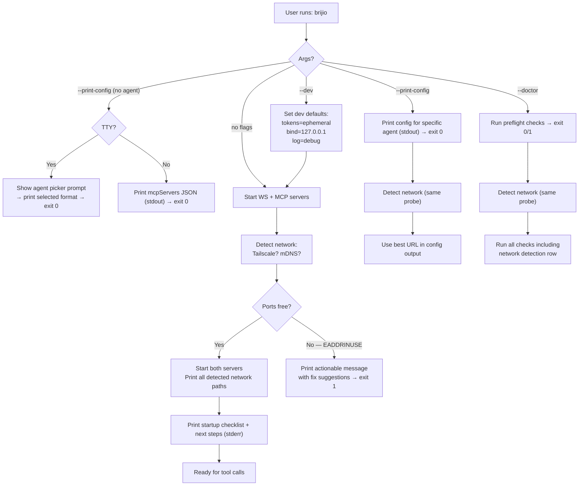

# ADR-0038: One-command local runtime polish

## Status

Proposed

## Context

Brijio's `npx @brijio/mcp` story already works — ADR-0035 created the combined binary that starts both servers, auto-generates tokens, and prints a startup banner. But the first-run experience still has friction:

1. **No startup checklist.** The banner prints URLs and tokens, but there is no guided path from "I see the banner" to "my MCP client makes a successful tool call." Users must read external docs to learn what to do with the pairing token vs. the MCP auth token, how to configure their MCP client, and how to verify the browser extension is connected.

2. **No `--print-config` mode.** Users who just want a ready-to-copy MCP JSON block for their Claude Desktop or Cursor config have to assemble it by hand from the startup banner output. This is error-prone — wrong URL, missing auth header, wrong transport type.

3. **No `--dev` mode.** Today, `pnpm dev` (the orchestrator in `scripts/dev.mjs`) is the only way to get ephemeral tokens and interactive `.env` setup. But `npx @brijio/mcp` also auto-generates ephemeral tokens with no way to signal "I'm in development, use throwaway defaults." The binary treats every run the same way.

4. **No `--doctor` command.** If something goes wrong — port 8787 or 8788 already in use, the WS server isn't reachable, the MCP auth token is missing, a browser extension can't connect — the user sees a stack trace or a cryptic error. There is no preflight check that validates the full runtime dependency chain.

5. **Port conflicts produce stack traces.** When ports 8787 or 8788 are already bound, Node.js throws an `EADDRINUSE` error with a full stack trace. This is not actionable for a new user.

6. **README quickstart drift.** The README documents a setup flow that can lag behind what the CLI actually prints. There's no mechanism to keep them in sync.

The P0.1 ticket in the Brijio roadmap captures all of these as acceptance criteria.

## Decision

### 1. Startup checklist in the CLI banner

After both servers start, the combined binary (`bin/brijio.mjs`) prints a structured checklist instead of a flat list of URLs and tokens.

```
✓ Brijio ready

  WebSocket   ws://127.0.0.1:8787
  MCP         http://127.0.0.1:8788/mcp

  Pairing token   <value>  [auto-generated]
  MCP auth token  <value>  [auto-generated]

Next steps:
  1. Open the browser extension and paste the pairing token.
  2. Configure your MCP client — run `brijio --print-config` for a ready-to-copy block.
  3. Make your first tool call from your MCP client.

⚠  Auto-generated tokens change on restart. Set BRIJIO_PAIRING_TOKEN and
    MCP_HTTP_AUTH_TOKEN environment variables for persistent tokens.
```

The "Next steps" section is static text derived from the runtime state (it only appears when both servers are healthy). The checklist replaces the current banner entirely — no separate `console.log` calls for individual values.

### 2. `--print-config` flag

`--print-config [agent]` prints a ready-to-copy MCP client configuration block to stdout and exits immediately (no server startup).

The `[agent]` positional argument selects the output format for a specific agent. If omitted, an interactive prompt asks the user to choose.

Supported agents:

| Agent | `--print-config <agent>` | Config location / method |
|-------|--------------------------|---------------------------|
| `claude-desktop` | `--print-config claude-desktop` | `~/Library/Application Support/Claude/claude_desktop_config.json` |
| `cursor` | `--print-config cursor` | `.cursor/mcp.json` or `~/.cursor/mcp.json` |
| `vscode` | `--print-config vscode` | `.vscode/mcp.json` |
| `cline` | `--print-config cline` | Cline settings UI |
| `codex` | `--print-config codex` | `codex mcp add` shell command |
| `hermes` | `--print-config hermes` | `~/.hermes/config.yaml` |
| `claude-code` | `--print-config claude-code` | `claude mcp add` shell command |
| `gemini` | `--print-config gemini` | `gemini mcp add` shell command |
| `windsurf` | `--print-config windsurf` | `~/.codeium/windsurf/mcp_config.json` |
| `zed` | `--print-config zed` | `.zed/settings.json` `context_servers` key |
| `continue` | `--print-config continue` | `.continue/mcpServers/` YAML file |
| `goose` | `--print-config goose` | `~/.config/goose/config.yaml` `extensions` key |

Aliases are accepted: `claude` → `claude-desktop`, `cur` → `cursor`, `vs` → `vscode`, `code` → `claude-code`.

The token and URL values are resolved from the same config pipeline as the runtime: `$BRIJIO_ENV_FILE` → `$CWD/.env` → `~/.brijio/.env` → environment → auto-generated (ephemeral).

If `--dev` is also passed, tokens are clearly marked `[ephemeral — change on restart]` and the URL uses `http://127.0.0.1:8788/mcp` explicitly. Otherwise, if an env var provides the token, it uses that value.

The output goes to **stdout** so it can be piped or redirected. The startup banner goes to **stderr** so `brijio --print-config` does not mix informational messages with the config block.

#### Interactive prompt (no agent specified)

When the user runs `brijio --print-config` without an agent argument, the CLI prints a numbered list and prompts:

```
$ brijio --print-config

Which agent are you configuring?

  1. claude-desktop   Claude Desktop app
  2. cursor           Cursor IDE
  3. vscode           VS Code + GitHub Copilot
  4. cline            Cline (VS Code extension)
  5. codex            OpenAI Codex CLI
  6. hermes           Hermes Agent
  7. claude-code      Claude Code CLI
  8. gemini           Gemini CLI
  9. windsurf         Windsurf (Codeium)
 10. zed              Zed editor
 11. continue         Continue (VS Code/JetBrains)
 12. goose            Goose AI agent

Enter a number [1-12]:
```

The prompt reads from stdin (so it works in interactive terminals). If stdin is not a TTY (piped, redirected, or CI environment), the prompt is skipped and the default JSON format (widest-compatible `mcpServers` envelope) is printed instead, so `brijio --print-config > config.json` still works without interaction.

#### `claude-desktop`, `cursor`, `cline` format (JSON mcpServers envelope)

Outputs the standard `mcpServers` envelope used by Claude Desktop, Cursor, Cline, and most MCP clients:

```json
{
  "mcpServers": {
    "brijio": {
      "url": "http://127.0.0.1:8788/mcp",
      "headers": {
        "Authorization": "Bearer <MCP_HTTP_AUTH_TOKEN>"
      }
    }
  }
}
```

After the JSON block, print a short hint to stderr indicating where to paste it:

```
# Paste this into your claude_desktop_config.json (macOS: ~/Library/Application Support/Claude/)
```

The hint text varies per agent (Cursor → `.cursor/mcp.json`, Cline → Cline settings UI, etc.).

#### `vscode` format

VS Code `.vscode/mcp.json` uses `servers` (not `mcpServers`) as the top-level key and requires `"type": "http"`:

```json
{
  "servers": {
    "brijio": {
      "type": "http",
      "url": "http://127.0.0.1:8788/mcp",
      "headers": {
        "Authorization": "Bearer <MCP_HTTP_AUTH_TOKEN>"
      }
    }
  }
}
```

#### `codex` format (shell command)

OpenAI Codex CLI adds MCP servers via `codex mcp add`, not a config file. Rather than outputting TOML, `--print-config codex` prints the exact shell command to run:

```bash
# Add Brijio to Codex:
codex mcp add brijio --url http://127.0.0.1:8788/mcp --bearer-token-env-var BRIJIO_MCP_AUTH_TOKEN
```

The `--bearer-token-env-var` flag references the env var name rather than embedding the token value, respecting Codex's security convention. The user must ensure `BRIJIO_MCP_AUTH_TOKEN` is set in their shell environment for the command to work at runtime.

#### `hermes` format (YAML)

Outputs Hermes Agent config format for `~/.hermes/config.yaml`:

```yaml
# Brijio MCP server — add to ~/.hermes/config.yaml
mcp_servers:
  brijio:
    url: "http://127.0.0.1:8788/mcp"
    headers:
      Authorization: "Bearer <MCP_HTTP_AUTH_TOKEN>"
```

#### `claude-code` format (shell command)

Claude Code (the CLI) adds MCP servers via `claude mcp add`, not a config file. Rather than outputting JSON, `--print-config claude-code` prints the exact shell command to run:

```bash
# Add Brijio to Claude Code:
claude mcp add brijio --transport http --url http://127.0.0.1:8788/mcp --header "Authorization: Bearer <MCP_HTTP_AUTH_TOKEN>"
```

The actual token value is embedded in the command. The output includes a note that this adds the server to the user's Claude Code MCP config immediately.

#### `gemini` format (shell command)

Google Gemini CLI adds MCP servers via `gemini mcp add`, not a config file. Rather than outputting JSON, `--print-config gemini` prints the exact shell command to run:

```bash
# Add Brijio to Gemini CLI:
gemini mcp add --transport http brijio http://127.0.0.1:8788/mcp --header "Authorization: Bearer <MCP_HTTP_AUTH_TOKEN>"
```

Gemini CLI supports `--transport http` for streamable HTTP servers and `--header` for auth headers. The `--scope` flag (`user` or `project`) is omitted — users can append it if needed.

#### `windsurf` format (JSON mcpServers envelope with `serverUrl`)

Windsurf uses the `mcpServers` envelope like Claude Desktop, but uses `serverUrl` instead of `url` for remote HTTP servers and supports `${env:VAR_NAME}` interpolation in config values:

```json
{
  "mcpServers": {
    "brijio": {
      "serverUrl": "http://127.0.0.1:8788/mcp",
      "headers": {
        "Authorization": "Bearer ${env:MCP_HTTP_AUTH_TOKEN}"
      }
    }
  }
}
```

The `serverUrl` key is Windsurf-specific (equivalent to `url` in other clients). The `${env:MCP_HTTP_AUTH_TOKEN}` interpolation means Windsurf resolves the token from the shell environment at load time — no literal token is embedded in the config file. Stderr hint: `# Paste into ~/.codeium/windsurf/mcp_config.json`

#### `zed` format (JSON `context_servers` key)

Zed uses `context_servers` (not `mcpServers`) in its settings JSON, and remote servers use a `"url"` key with an optional `"headers"` object:

```json
{
  "context_servers": {
    "brijio": {
      "url": "http://127.0.0.1:8788/mcp",
      "headers": {
        "Authorization": "Bearer <MCP_HTTP_AUTH_TOKEN>"
      }
    }
  }
}
```

Stderr hint: `# Add to .zed/settings.json (project) or ~/.config/zed/settings.json (global)`

#### `continue` format (YAML)

Continue uses YAML config files in `.continue/mcpServers/` (project) or `~/.continue/config.yaml` (global). The YAML format includes metadata fields (`name`, `version`, `schema`) alongside the `mcpServers` list:

```yaml
name: Brijio MCP Server
version: 0.0.1
schema: v1
mcpServers:
  - name: brijio
    type: streamable-http
    url: http://127.0.0.1:8788/mcp
    headers:
      Authorization: "Bearer <MCP_HTTP_AUTH_TOKEN>"
```

If `--dev` is set, add `description: "[dev/ephemeral] Brijio — tokens change on restart"`. Stderr hint: `# Save as .continue/mcpServers/brijio.yaml in your project`

#### `goose` format (instructional — not supported)

Goose only supports `stdio` extensions (local subprocesses), not remote HTTP MCP servers. Brijio is HTTP-only and does not plan to support stdio transport (ADR-0023). `--print-config goose` prints a clear message:

```
⚠  Goose only supports stdio-based MCP servers. Brijio runs as an HTTP server.
   
   No direct configuration is possible. If Goose adds HTTP transport support,
   this output will be updated to provide a working config.
   
   In the meantime, you can use a stdio-to-HTTP bridge (e.g. mcp-proxy)
   as a manual workaround — see https://github.com/nicholasgasior/mcp-proxy
```

This is honest about the limitation. We don't write config that won't work.

#### Design rationale

- **Agent name, not format name.** `--print-config codex` is more discoverable than `--print-config --format toml`. Users know which agent they're configuring; they don't know (or care) what config format it uses. The positional argument removes the indirection.
- **Interactive fallback.** When the user can't remember the agent name or wants to explore, running `--print-config` with no argument prompts with a numbered list. This is the same UX pattern as `npx` package selectors and `git stash` interactive mode.
- **Non-interactive safety.** If stdin is not a TTY, the default widens to the most-compatible JSON format rather than blocking on input. This makes `brijio --print-config > config.json` safe in scripts and CI.
- **Token values, not placeholders.** The output contains real token values resolved from the config pipeline, not `<placeholder>` syntax. This lets users copy-paste directly. If tokens are auto-generated (ephemeral), the output includes a comment/annotation noting they change on restart.
- **Codex uses `codex mcp add`, not a config file.** Codex has its own CLI for adding MCP servers, just like Claude Code. Rather than outputting TOML, we output the `codex mcp add` command with `--bearer-token-env-var` to reference the env var name — matching Codex's security convention of never embedding secrets in config.
- **Claude Code is a CLI, not a config file.** Rather than inventing an intermediate format, we output the `claude mcp add` command the user would run.
- **Gemini CLI is also a CLI.** Same pattern as Claude Code and Codex — `gemini mcp add` with `--transport http` and `--header` flags. Three CLI-based agents (Codex, Claude Code, Gemini) now output shell commands instead of config files.
- **Windsurf uses `serverUrl` and env interpolation.** Windsurf's config uses `serverUrl` instead of `url` and supports `${env:VAR}` syntax for secrets, so token values never appear in the config file. We match this convention.
- **Zed uses `context_servers`, not `mcpServers`.** A different top-level key with the same `url` + `headers` structure. We output the correct envelope rather than making the user rename keys.
- **Continue uses YAML with metadata.** Continue requires `name`, `version`, `schema` fields alongside `mcpServers`. We output the complete valid YAML file rather than a fragment the user has to wrap.
- **Goose only supports stdio, and Brijio is HTTP-only.** Rather than outputting a config that references a nonexistent stdio mode, `--print-config goose` prints a clear "not supported" message. We don't build stdio transport (ADR-0023) — the end goal is cloud-hosted HTTP. The mcp-proxy workaround is mentioned but not prescribed.
- **VS Code uses a different key.** We could have merged this into the `mcpServers` format, but VS Code requires `"type": "http"` and uses `servers` — mixing would break one client or the other. A dedicated `vscode` agent name is clearer than a `--format` flag.

### 3. `--dev` flag

`--dev` sets ephemeral, local-only defaults and signals development mode:

- Auto-generates both tokens every run (same as current behaviour, but **explicitly** tagged in logs as `[dev/ephemeral]`).
- Binds both servers to `127.0.0.1` only (not `0.0.0.0`), overriding any `MCP_HTTP_HOST` / `WEBSOCKET_HOST` env vars unless they are also explicitly `127.0.0.1`.
- Logs at `debug` level to stderr (structured JSON, consistent with ADR-0033).
- Prints a warning: `⚠  Running in dev mode. Tokens are ephemeral and bind addresses are localhost only.`

Without `--dev`, the binary uses the full config pipeline (env vars, `.env` files, defaults) exactly as today. `--dev` is a convenience shortcut for local development, not a separate runtime mode.

### 4. `--doctor` command

`brijio --doctor` runs a series of preflight checks, prints pass/fail status for each, and exits with code 0 (all pass) or 1 (any fail). It does **not** start any servers.

Checks:

| Check | What it validates |
|-------|-------------------|
| **Config load** | At least one of `$BRIJIO_ENV_FILE`, `$CWD/.env`, `~/.brijio/.env` exists and is parseable. |
| **Tokens present** | `BRIJIO_PAIRING_TOKEN` and `MCP_HTTP_AUTH_TOKEN` are set (from env or `.env`). Fail if empty or placeholder (`replace-with-*`). |
| **Ports free** | Ports 8787 and 8788 (or configured ports) are not already bound. Uses a brief `net.createServer` probe on each port. |
| **WS reachable** | If a WS server is already running on the configured port, attempt a brief WebSocket handshake to confirm it responds. |
| **MCP reachable** | If an MCP server is already running, `GET /health` on the configured port/path returns `{ "status": "ok" }`. |
| **Extension connected** | If the WS server is reachable, `GET /health` on the WS port checks `extensions.count > 0`. |
| **Network detection** | Detects Tailscale and/or mDNS availability. Checks: (1) `tailscale status --json` exits 0 → Tailscale is running; extract `TailscaleIPs[0]` as reachable address. (2) `os.networkInterfaces()` contains a `100.x.x.x` address → Tailscale IP available even if `tailscale` CLI not in PATH. (3) `dns.resolve('<hostname>.local')` succeeds → mDNS reachable on LAN. Prints detected addresses for use in `--print-config` URLs. |

Output format:

```
Running Brijio doctor...

  ✓ Config load          .env found at ~/.brijio/.env
  ✓ Tokens present       pairing token set, MCP auth token set
  ✓ Port 8787 free       no listener detected
  ✓ Port 8788 free       no listener detected
  ✗ WS reachable        connection refused on ws://127.0.0.1:8787
  — MCP reachable        skipped (WS not running)
  — Extension connected  skipped (WS not running)

3 passed, 1 failed, 2 skipped.
Run `brijio` to start the runtime.
```

`--doctor` exits with code 0 if all non-skipped checks pass, code 1 if any fail. Skipped checks do not affect the exit code.

### 5. Port conflict detection and actionable messages

When `EADDRINUSE` occurs during server startup, catch the error and print an actionable message instead of a stack trace:

```
✗ Failed to start WebSocket server on port 8787.

  Port 8787 is already in use. Choose one of:
    • Set WEBSOCKET_PORT=8789 in your .env or environment.
    • Stop the process using port 8787: lsof -i :8787
    • Run `brijio --doctor` to check all runtime dependencies.

```

This applies to both the WS server (port 8787) and MCP server (port 8788) startup paths. The error handler checks `error.code === 'EADDRINUSE'` and formats the message accordingly. All other errors still produce the full stack trace for debugging.

### 6. README quickstart matches CLI output exactly

The README quickstart section is updated to reflect the new banner output character-for-character. This is verified by a test that regex-matches the banner output against the README snippet, ensuring they cannot drift.

The test lives in `servers/mcp/tests/banner-test.mjs` and runs as part of `pnpm test`. It reads the quickstart section from `README.md`, extracts the expected banner block, and asserts that the actual `formatStartupBanner()` output matches.

### 7. Network detection (Tailscale, mDNS, local IPs)

`--print-config` and the startup banner detect available network paths and adjust URLs accordingly. This matters because users on the same Tailscale network or LAN need reachable addresses, not just `127.0.0.1`.

#### Detection strategy

The runtime probes three network signals on startup and in `--doctor`:

1. **Tailscale CLI** — Run `tailscale status --json` (2-second timeout). If it exits 0, parse the JSON and extract `TailscaleIPs[0]` (the `100.x.x.x` address). This is the most reliable signal: it confirms Tailscale is running *and* authenticated.

2. **Tailscale interface fallback** — If the CLI is not in PATH but `os.networkInterfaces()` contains a `100.64.0.0/10` address, the machine has a Tailscale IP. Use this address but don't assume Tailscale is fully connected (could be in a partial state).

3. **mDNS / `.local` hostname** — Resolve `<hostname>.local` via `dns.resolve()`. If it succeeds, the machine is reachable on the LAN via mDNS. Print `http://<hostname>.local:8788/mcp` alongside the IP address.

#### URL priority in `--print-config`

| Condition | URL printed in config | URL in startup banner |
|-----------|---------------------|----------------------|
| `--dev` mode | `http://127.0.0.1:8788/mcp` | `ws://127.0.0.1:8787` / `http://127.0.0.1:8788/mcp` |
| Tailscale detected | `http://100.x.x.x:8788/mcp` | `ws://100.x.x.x:8787` / `http://100.x.x.x:8788/mcp` |
| mDNS detected (no Tailscale) | `http://<hostname>.local:8788/mcp` | Same |
| Neither | `http://127.0.0.1:8788/mcp` | Same |
| `MCP_HTTP_HOST` env var set | Uses that host (user override) | Uses that host |

When multiple paths are available (Tailscale + mDNS + localhost), the banner lists all reachable addresses. `--print-config <agent>` uses the best address (Tailscale > mDNS > localhost) but the config is still copy-pasteable — the user can edit the URL after paste.

The startup banner lists all detected paths:

```
✓ Brijio ready

  WebSocket   ws://127.0.0.1:8787
  MCP         http://127.0.0.1:8788/mcp

  🌐 Network paths:
    Tailscale   ws://100.64.0.42:8787  /  http://100.64.0.42:8788/mcp
    mDNS        ws://brijio.local:8787  /  http://brijio.local:8788/mcp

  Pairing token   <value>  [auto-generated]
  MCP auth token  <value>  [auto-generated]

Next steps:
  1. Open the browser extension and paste the pairing token.
  2. Configure your MCP client — run `brijio --print-config` for a ready-to-copy block.
  3. Make your first tool call from your MCP client.
```

#### Why not just use `0.0.0.0`?

Binding to `0.0.0.0` (the current default) listens on all interfaces but doesn't tell the user *which* address to use. Detection prints the specific reachable addresses so the user can pick the right one for their network topology. `--dev` overrides this to `127.0.0.1` only.

## Mermaid diagram



## Consequences

### Positive

- **Agent name, not format name.** `--print-config codex` is more discoverable than `--print-config --format toml`. Users know which agent they're configuring; they don't know (or care) what config format it uses. The positional argument removes the indirection.
- **Interactive fallback.** When the user can't remember the agent name or wants to explore, running `--print-config` with no argument prompts with a numbered list. This is the same UX pattern as `npx` package selectors and `git stash` interactive mode.
- **Non-interactive safety.** If stdin is not a TTY, the default widens to the most-compatible JSON format rather than blocking on input. This makes `brijio --print-config > config.json` safe in scripts and CI.
- **Token values, not placeholders.** The output contains real token values resolved from the config pipeline, not `<placeholder>` syntax. This lets users copy-paste directly. If tokens are auto-generated (ephemeral), the output includes a comment/annotation noting they change on restart.
- **Codex uses `codex mcp add`, not a config file.** Codex has its own CLI for adding MCP servers, just like Claude Code. Rather than outputting TOML, we output the `codex mcp add` command with `--bearer-token-env-var` to reference the env var name — matching Codex's security convention of never embedding secrets in config.
- **New user zero-readme experience.** The startup checklist tells the user exactly what to do next. `--print-config` gives them a copy-paste MCP config block for their specific agent. The README quickstart is mechanically verified to match.
- **`--doctor` eliminates "it doesn't work" mysticism.** Users can run a single command to validate their entire runtime environment before asking for help. Failures are specific, actionable, and exit with code 1 so CI can catch them.
- **`--dev` removes accidental-exposure risk.** Binding to `127.0.0.1` and generating ephemeral tokens makes it clear this is a local-only session. No accidental `0.0.0.0` binding during development.
- **Port conflict messages are actionable.** Instead of a Node.js stack trace, the user sees the conflicting port, a suggested fix, and a pointer to `--doctor`.
- **README can't drift from the CLI.** The banner test ensures the documented quickstart and the actual output stay in sync.
- **Network detection removes guesswork.** Users on Tailscale or LAN don't need to figure out which IP to configure — the runtime detects it and prints the right URL. Priority is explicit: Tailscale > mDNS > localhost.
- **No stdio transport.** Brijio is HTTP-only (ADR-0023) because the end goal is cloud-hosted. Adding stdio would create a divergent local path that we'd have to support forever. Goose's limitation is Goose's, not ours.

### Negative

- **`--print-config` reveals tokens on stdout.** Any process on the same machine can read `/proc/<pid>/fd/1` or pipe the output. This is acceptable because: (a) the tokens are already printed in the startup banner, (b) the command is intended for interactive local use, and (c) the tokens are either auto-generated ephemeral or set by the user in their own `.env`. For CI/Docker contexts where stdout is logged, users should pass `--print-config <agent>` with explicit env vars and pipe to a config file, not log it.
- **Interactive prompt TTY detection.** Checking `process.stdin.isTTY` is generally reliable but edge cases exist (e.g., `echo 1 | brijio --print-config`). The fallback to widest-compatible JSON is conservative — if in doubt, the user gets a usable config block rather than a broken prompt.
- **Twelve agent aliases to maintain.** `claude-desktop`, `cursor`, `vscode`, `cline`, `codex`, `hermes`, `claude-code`, `gemini`, `windsurf`, `zed`, `continue`, `goose` plus their aliases. Each is a small formatter function, but new MCP clients require a code change. Mitigated by the formatter being a pure data-to-template transformation.
- **`--doctor` adds a slow path.** Port probes and health checks take 1-2 seconds. Users who just want to start the runtime and know it works won't need `--doctor`. It's an opt-in diagnostic, not a startup gate.
- **`--dev` is a convenience, not a sandbox.** Development mode sets convenient defaults but does not enforce security boundaries. It's documented as "local-only ephemeral defaults" — not a sandbox, not a test harness, not a substitute for proper token management in production.
- **Banner test couples README to code.** If the banner format changes, the test must be updated. This is intentional — it's the coupling that keeps docs honest.
- **Network detection adds ~2s startup latency when Tailscale CLI is installed.** The `tailscale status --json` probe has a 2-second timeout. On machines without Tailscale CLI, it fails fast (ENOENT). On machines with Tailscale running, it resolves in <100ms. The mDNS check is a single DNS query and is similarly fast.
- **mDNS detection is platform-dependent.** `dns.resolve('<hostname>.local')` works natively on macOS but may not work on all Linux distros without `avahi-daemon` or `systemd-resolved` mDNS support. The check degrades gracefully: if resolution fails, we fall back to localhost.

## Acceptance criteria

- [ ] A new user can start the runtime and get a valid MCP config without reading docs.
- [ ] `brijio --doctor` reports pass/fail status for runtime dependencies.
- [ ] Port conflicts produce actionable messages, not stack traces.
- [ ] `brijio --print-config claude-desktop` outputs `mcpServers` JSON for Claude Desktop.
- [ ] `brijio --print-config cursor` outputs `mcpServers` JSON for Cursor with file-path hint.
- [ ] `brijio --print-config vscode` outputs `servers` JSON with `type: "http"` for VS Code.
- [ ] `brijio --print-config cline` outputs `mcpServers` JSON for Cline with settings-UI hint.
- [ ] `brijio --print-config codex` outputs a `codex mcp add` shell command with `--bearer-token-env-var`.
- [ ] `brijio --print-config hermes` outputs YAML for Hermes Agent config.
- [ ] `brijio --print-config claude-code` outputs a `claude mcp add` shell command.
- [ ] `brijio --print-config gemini` outputs a `gemini mcp add` shell command with `--transport http` and `--header`.
- [ ] `brijio --print-config windsurf` outputs `mcpServers` JSON with `serverUrl` key and `${env:}` token interpolation.
- [ ] `brijio --print-config zed` outputs JSON with `context_servers` key and `url` + `headers`.
- [ ] `brijio --print-config continue` outputs a complete YAML file with `name`, `version`, `schema`, and `mcpServers` list.
- [ ] `brijio --print-config goose` outputs a clear "not supported" message explaining Goose's stdio-only limitation and mentioning `mcp-proxy` as a manual workaround.
- [ ] `brijio --print-config` (no agent) shows an interactive prompt with numbered agent list; falls back to `mcpServers` JSON when stdin is not a TTY.
- [ ] `brijio --dev` sets localhost-only bind addresses and ephemeral tokens.
- [ ] README quickstart matches the CLI output exactly (verified by test).
- [ ] Network detection probes Tailscale CLI (`tailscale status --json`, 2s timeout), falls back to `os.networkInterfaces()` for `100.64.0.0/10` range, and resolves `<hostname>.local` for mDNS.
- [ ] `--doctor` includes a "Network detection" row showing detected Tailscale IP, mDNS hostname, or "localhost only".
- [ ] Startup banner lists all detected network paths (Tailscale, mDNS, localhost) with WS and MCP URLs.
- [ ] `--print-config` URLs use Tailscale address when detected, mDNS hostname when mDNS-only, and `127.0.0.1` when neither is available.
- [ ] `--dev` mode always uses `127.0.0.1` regardless of detected network paths.
- [ ] Brijio does not implement stdio transport — HTTP-only per ADR-0023. Goose outputs "not supported" rather than invalid config.