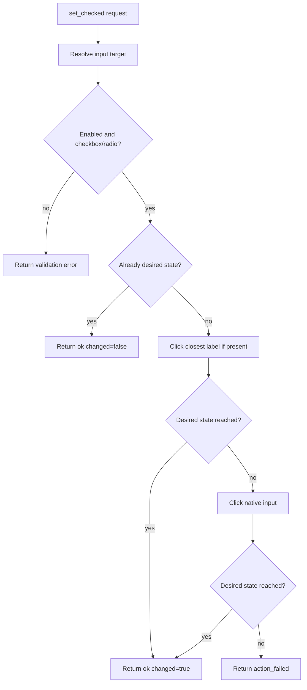

# ADR 0040: Click-driven checkable controls

## Status

Accepted

## Context

Brijio exposes a `set_checked` browser action for checkboxes and radio buttons. The current content-script implementation resolves the target input and mutates the native DOM property directly:

```js
input.checked = true;
input.dispatchEvent(new Event("input", { bubbles: true }));
input.dispatchEvent(new Event("change", { bubbles: true }));
```

That works for simple uncontrolled HTML controls, but controlled UI frameworks such as React and Material UI often attach behavior to the user interaction path around a wrapper `<label>` or custom checkbox component. A real-world Toptal/MUI checkbox demonstrated this failure mode:

- `document.getElementById('understand').checked` returned `true` after Brijio attempted to check it.
- The visible checkbox still appeared unchecked.
- `document.getElementById('understand').closest('label').click()` updated the visible checkbox correctly.

This means direct property mutation can desynchronise the native input property from the framework-controlled visual state. Brijio should prefer browser-native user interaction semantics when changing checkable controls.

## Decision

`set_checked` will use a click-driven algorithm for checkboxes and radio buttons:

1. Resolve the target native input as today.
2. Validate that it is enabled and checkable.
3. If the current checked state already matches the requested state, return success with `changed: false`.
4. If the state differs, click the nearest wrapping `<label>` first when one exists.
5. Re-read the native checked state.
6. If the desired state was not reached, click the native input itself as a fallback.
7. Re-read the native checked state again.
8. Return success only if the final state matches the requested state; otherwise return `action_failed`.

The implementation must avoid unconditional double-clicking because that can toggle the control back to its original state.



## Consequences

- Brijio behaves more like a human user for controlled checkboxes and radios.
- React/MUI-style visual state is more likely to stay in sync with the native control state.
- Plain HTML checkboxes continue to work because clicking the wrapping label or input toggles the same control.
- The result's `changed` value reflects whether the final state differs from the state observed before Brijio acted.
- Tests should cover a wrapper-label checkbox where direct `.checked` assignment would not update a framework-like visual marker.

## Alternatives Considered

### Continue direct property mutation

Rejected. It is simple but can produce a misleading success where `.checked` is true and the visible UI remains unchecked.

### Always click the native input

Rejected as the only path. Some design-system checkboxes route the relevant interaction through a wrapping label or custom component, and the observed real-world workaround was `closest('label').click()`.

### Click both label and input every time

Rejected. Unconditional double-clicking can toggle the control twice and leave it unchanged.
