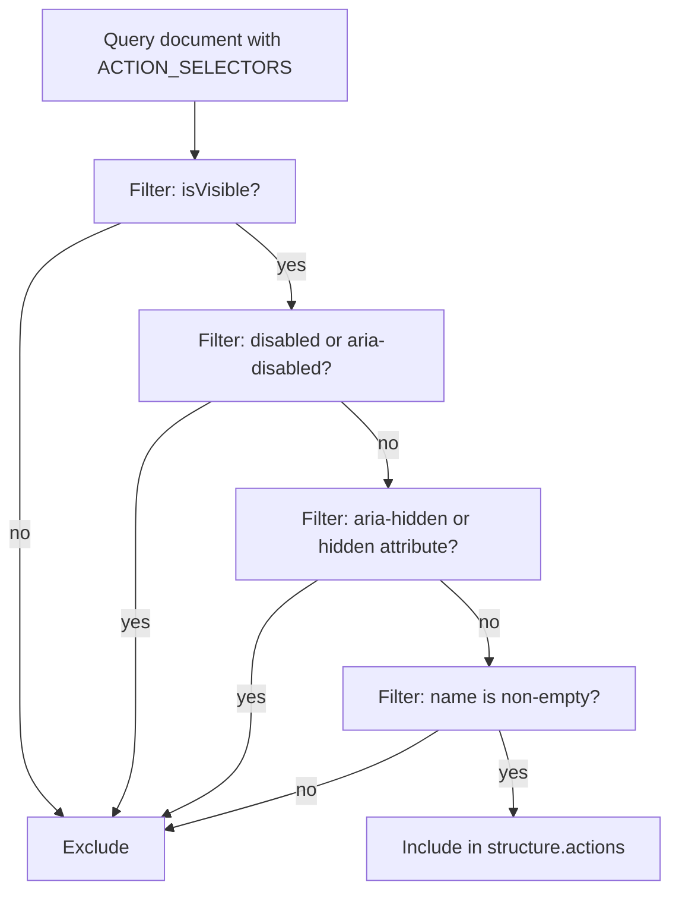

# 0042 — Improved click/action model

- **Status:** Accepted
  **Date:** 2026-06-10
  **Supersedes:** ADR 0012 (extension click actions), ADR 0013 (MCP click element tool)
  **Prerequisite:** ADR 0041 (reliable target identity and stale-target handling)

## Problem Context

Brijio's current action discovery surface is narrow. `read_current_page` returns a `structure.actions` array that only includes:

```ts
// Current selector in extractActions()
'button, [role="button"], input[type="button"], input[type="submit"], input[type="reset"]';
```

This misses many common interactive elements that real web apps rely on:

| Element                                           | Example                | Currently discoverable?           |
| ------------------------------------------------- | ---------------------- | --------------------------------- |
| `<button>`                                        | Submit, Cancel         | ✅ Yes                            |
| `[role="button"]`                                 | Custom button          | ✅ Yes                            |
| `input[type="submit"]`                            | Form submit            | ✅ Yes                            |
| Menu items (`[role="menuitem"]`)                  | Dropdown menu entries  | ❌ No                             |
| Tabs (`[role="tab"]`)                             | Tab bar controls       | ❌ No                             |
| Disclosure/summary (`<details>/<summary>`)        | Expandable sections    | ❌ No                             |
| Tree items (`[role="treeitem"]`)                  | Sidebar navigation     | ❌ No                             |
| Links with click handlers but no `href`           | SPA navigation anchors | ❌ No (only `a[href]` in `links`) |
| Elements with `[role]` and visible click behavior | Custom widgets         | ❌ No (partial)                   |

Additionally, the `PageAction` type provides minimal metadata:

```ts
export interface PageAction {
  id: string;
  role: string;
  name: string;
  enabled: boolean;
}
```

Agents lack the information they need to decide whether an action is appropriate. There is no visible text description beyond `name`, no disabled/hidden state detail, no element type or bounding box hint, and no way to tell a menu item from a tab from a disclosure toggle.

The acceptance criteria from the P1.3 ticket are:

1. Common SPA controls appear in page context as actions.
2. Disabled or hidden controls are not offered as actionable targets.
3. Tool responses report what was attempted and what changed where detectable.

## Decision

### 1. Expand action discovery selectors

Replace the current narrow selector with a comprehensive list that covers common interactive roles and elements:

```ts
const ACTION_SELECTORS = [
  // Native interactive elements
  "button",
  'input[type="button"]',
  'input[type="submit"]',
  'input[type="reset"]',
  'input[type="image"]',
  "summary",

  // ARIA role-based interactive elements
  '[role="button"]',
  '[role="menuitem"]',
  '[role="menuitemcheckbox"]',
  '[role="menuitemradio"]',
  '[role="tab"]',
  '[role="switch"]',
  '[role="treeitem"]',
  '[role="option"]',
  '[role="link"]', // links without href — SPA navigation triggers
].join(",");
```

The `summary` element is included because it is the standard disclosure trigger for `<details>` — clicking `<summary>` toggles the open/closed state natively.

Elements with `role="link"` but no `href` are interactive anchors (SPA navigation triggers) that would not appear in `structure.links`. Including them in `actions` gives agents a way to click them.

### 2. Enrich `PageAction` with actionable metadata

Extend the `PageAction` type in `protocol.ts`:

```ts
export interface PageAction {
  id: string;
  role: string;
  name: string;
  enabled: boolean;
  /** Element type tag, e.g. 'button', 'summary', 'input' */
  tagName?: string;
  /** Accessible description beyond the name, from aria-describedby or title */
  description?: string;
  /** Whether the element is currently hidden (aria-hidden="true" or hidden attribute) */
  hidden?: boolean;
}
```

Fields:

- **`tagName`**: The HTML tag name of the element (lowercase). Agents can use this to distinguish a `<summary>` (disclosure) from a `<button>` (action) from a `[role="tab"]` (tab control).
- **`description`**: Additional accessible description from `aria-describedby` or `title` attribute. Provides context the `name` alone doesn't convey (e.g., a button named "Delete" might have a description "Remove this item from the list").
- **`hidden`**: Whether the element has `aria-hidden="true"` or the HTML `hidden` attribute. Separated from `enabled` because hidden elements should be excluded from the actions list entirely (see section 3), but `hidden` is still useful for agents who receive stale context.

### 3. Filter disabled and hidden actions from discovery

Currently `extractActions` only filters by `isVisible()` (CSS visibility) and excludes actions with `name === ''`. The function will additionally:

1. **Exclude elements with `disabled` attribute or `aria-disabled="true"`** — these already set `enabled: false` but should not appear in the list at all per the acceptance criteria ("disabled or hidden controls are not offered as actionable targets").
2. **Exclude elements with `aria-hidden="true"` or the `hidden` attribute** — these are not interactive and should not be offered.
3. **Keep the `name !== ''` filter** — nameless actions are not useful targets.

The `enabled` field remains on `PageAction` for backward compatibility, but will always be `true` for items that pass the filter. This preserves the type signature while ensuring agents never see disabled actions they cannot click.



### 4. Expand click target resolution to match new selectors

The `findClickTarget` function in `content-handler.ts` currently resolves `kind: "action"` targets against:

```ts
'button, [role="button"], input[type="button"], input[type="submit"]';
```

This must be updated to use the same expanded selector list as `extractActions`. If the selectors diverge, an action that appears in `structure.actions` cannot be clicked, breaking the core contract.

The implementation will extract `ACTION_SELECTORS` into a shared constant in `page-context.ts` (or a shared utility) so both `extractActions` and `findClickTarget` use the identical list.

### 5. Report what changed after click

When a click succeeds, the action result will include observable side-effect information:

```ts
export interface ClickActionResultData extends ActionResultData {
  action: "click";
  target: ClickActionTarget;
  /** What was detectable about the page after the click */
  observed?: {
    /** Whether a navigation appears to have started (URL changed) */
    navigationStarted?: boolean;
    /** If a disclosure/summary was clicked, its new open state */
    detailsOpen?: boolean;
  };
}
```

The content script can detect limited side effects synchronously after `element.click()`:

- **Navigation started**: Check `document.URL` or `window.location.href` before and after the click. If the URL has changed, set `navigationStarted: true`. This is a best-effort check — some navigations are asynchronous.
- **Details open state**: If the clicked element is a `<summary>` or inside a `<details>`, check its parent `<details>` element's `open` attribute after the click.

This is intentionally narrow — we cannot reliably detect all DOM mutations synchronously. The `observed` field provides what is cheaply detectable without MutationObserver overhead. Agents that need full context after an action should call `read_current_page` again (which will include a fresh `pageContextId`).

### 6. No double-click action

The P1.3 ticket says "Add double-click only if there is a clear product need; default should remain simple click." This ADR does **not** introduce a double-click action. Double-click is uncommon in web UIs outside of desktop-like apps (file managers, text editors), and those contexts are better handled by future tools. The single `click` action remains the default.

## Protocol Changes

### `PageAction` (in `packages/shared/src/protocol.ts`)

```ts
export interface PageAction {
  id: string;
  role: string;
  name: string;
  enabled: boolean;
  tagName?: string;
  description?: string;
  hidden?: boolean;
}
```

### `ActionResultData` (click variant)

The existing `ActionResultData` for clicks becomes:

```ts
export interface ActionResultData {
  action: "click";
  target: ClickActionTarget;
  observed?: {
    navigationStarted?: boolean;
    detailsOpen?: boolean;
  };
}
```

All other action result types remain unchanged.

### `ActionDiscoverySelectors` constant

A new shared constant `ACTION_SELECTORS` in `page-context.ts` that both `extractActions` and `findClickTarget` reference. This ensures discovery and resolution stay in sync.

## Content Script Changes

### `extractActions` (in `packages/shared/src/page-context.ts`)

1. Replace the current inline selector string with the `ACTION_SELECTORS` constant.
2. Add `tagName`, `description`, and `hidden` fields to the mapped output.
3. Filter out elements that are `disabled`, `aria-disabled="true"`, `aria-hidden="true"`, or have the `hidden` attribute.
4. Keep existing `isVisible()` and `name !== ''` filters.

### `findClickTarget` (in `packages/shared/src/content-handler.ts`)

1. Replace the current inline selector for `kind: "action"` with `ACTION_SELECTORS`.
2. No other changes — existing stale-context validation and error handling remain.

### `performClick` (in `packages/shared/src/content-handler.ts`)

1. After a successful `element.click()`, detect side effects:
   - Compare `document.URL` before and after click. If changed, set `observed.navigationStarted = true`.
   - If the clicked element is a `<summary>` or is inside a `<details>`, check `detailsElement.open` after click and set `observed.detailsOpen`.
2. Include `observed` in the success response.

## MCP Server Changes

### `click_element` tool

The MCP tool output schema gains an `observed` field matching the protocol change. No input changes — agents still pass `kind`, `id`, and optional validation fields.

The tool description should be updated to mention that the response now includes observable side-effect hints.

### `read_current_page` tool

The `structure.actions` items in the response now include `tagName`, `description`, and `hidden` fields. This is backward compatible — existing MCP clients that ignore unknown fields will continue to work.

## Alternatives Considered

### A. Include bounding boxes in action metadata

Add `boundingBox: { x, y, width, height }` to `PageAction`. **Rejected for now**: bounding boxes require `getBoundingClientRect()` calls on every discovered action, adding computation cost. They also leak layout information that changes with viewport resizing and isn't useful for positional clicking (Brijio uses element IDs, not coordinates). Can be added in a future iteration if agents need it for spatial reasoning.

### B. Include `inputType` or `elementType` classification

Add a semantic classification field like `type: "disclosure" | "tab" | "menuitem" | ...`. **Rejected**: `role` and `tagName` together provide enough classification. A derived `type` field would be redundant and would need constant updating as new ARIA roles are added. Agents can infer semantics from `role` + `tagName`.

### C. Keep disabled/hidden actions in the list but marked

Leave disabled and hidden actions in `structure.actions` with `enabled: false` or `hidden: true`. **Rejected per acceptance criteria**: the ticket explicitly states "disabled or hidden controls are not offered as actionable targets." Including them adds noise and tempts agents to try clicking them anyway. The `enabled` field remains `true` on all returned actions, guaranteeing that every action in the list is actually clickable.

### D. Expand `structure.links` to include `[role="link"]` elements

Add `role="link"` elements without `href` to the links array. **Rejected**: `structure.links` currently requires `href` and maps to `a[href]` elements. Adding `[role="link"]` without `href` would either require a nullable `href` field (breaking change) or a new field. The actions array is the right home for clickable elements without a navigation URL.

### E. MutationObserver for post-click change detection

Use a MutationObserver after each click to detect DOM changes and report what changed. **Rejected**: MutationObserver is asynchronous and would require timeout-based waiting (how long to observe?). It also produces noisy results (class changes, style updates, animation frames). The synchronous `observed` hints in this ADR are sufficient for the most common cases (navigation and disclosure toggles). Agents can always re-read the page for full context.

## Consequences

**Positive:**

- Menu items, tabs, disclosures, tree items, and other common SPA controls appear as actionable targets.
- Agents get richer metadata (`tagName`, `description`) to make better interaction decisions.
- Disabled and hidden elements are filtered out, reducing noise and preventing failed action attempts.
- Click results include detectable side-effect hints (navigation, disclosure toggle).
- `findClickTarget` and `extractActions` share a selector list, preventing discovery/resolution divergence.
- Fully backward compatible — new fields are optional, and clients that ignore them still work.

**Negative:**

- Slightly larger `structure.actions` payload — `tagName`, `description`, and `hidden` add modest per-item overhead.
- The `observed` field on click results is a best-effort hint, not a guarantee. Some navigations are asynchronous and won't be detected synchronously. Agents should still re-read the page after clicks that might cause navigation.
- `enabled` on `PageAction` is always `true` after this change, making the field technically redundant. It is kept for backward compatibility with existing MCP clients.

**Neutral:**

- Protocol version is unchanged — all additions are optional/backward compatible.
- No new MCP tool is introduced; the existing `click_element` and `read_current_page` tools gain richer output.

## Implementation Plan

### Phase 1: Shared selectors and protocol types

1. Add `ACTION_SELECTORS` constant to `packages/shared/src/page-context.ts`.
2. Add `tagName`, `description`, `hidden` fields to `PageAction` in `packages/shared/src/protocol.ts`.
3. Add `observed` field to `ActionResultData` in `packages/shared/src/protocol.ts`.

### Phase 2: Content script — action discovery

1. Update `extractActions` in `packages/shared/src/page-context.ts` to use `ACTION_SELECTORS`.
2. Add `tagName`, `description`, `hidden` fields to the mapped output.
3. Filter out disabled (`disabled` attribute or `aria-disabled="true"`), hidden (`aria-hidden="true"` or `hidden` attribute) elements.
4. Update `extractActions` tests in `packages/shared/src/page-context.test.ts`.

### Phase 3: Content script — click target resolution and side effects

1. Update `findClickTarget` in `packages/shared/src/content-handler.ts` to use `ACTION_SELECTORS` for `kind: "action"`.
2. Update `performClick` to detect `navigationStarted` and `detailsOpen` side effects.
3. Update `handleContentRequest` to include `observed` in click success responses.
4. Add unit tests for new selectors, metadata, filtering, and side-effect detection.

### Phase 4: MCP server — schema and tool updates

1. Add `tagName`, `description`, `hidden` fields to the `read_current_page` response schema for actions.
2. Add `observed` field to `click_element` result schema.
3. Pass `observed` through from content script responses.
4. Update `click_element` tool description.

### Phase 5: Integration tests

1. Add integration tests for expanded action discovery (menu items, tabs, disclosures).
2. Add integration tests for disabled/hidden element filtering.
3. Add integration tests for click side-effect detection.
4. Verify existing tests still pass.

### Phase 6: Documentation

1. Update ADR 0012 and ADR 0013 to reference this ADR as a superseding expansion.
2. Update MCP tool documentation for `click_element` and `read_current_page`.

## Verification

```bash
pnpm --filter @brijio/shared test
pnpm --filter @brijio/chrome-extension test
pnpm --filter @brijio/safari-extension test
pnpm --filter @brijio/mcp test
pnpm lint:ts
pnpm lint:md
pnpm test
```
