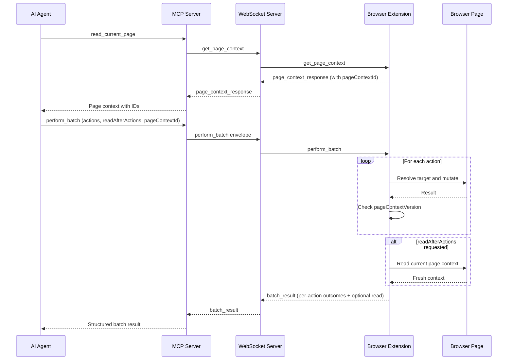

# ADR 0044: Batch Request Tool

## Status

Proposed

## Date

2026-06-11

## Context

Brijio agents execute multi-step browser workflows by making N separate MCP tool
calls in sequence. A typical form-fill workflow looks like this:

1. `read_current_page` — get context and short-lived IDs
2. `read_current_page` (with `includeContent`) — read full page content
3. `fill_input` — fill field 1
4. `fill_input` — fill field 2
5. … `fill_input` — fill field N
6. `set_checked` — check consent checkbox
7. `submit_form` — submit
8. `read_current_page` — verify result

Steps 1–2 and step 8 are reads and stay outside the batch. But steps 3–7 are
sequential actions on a stable page, each requiring a full
MCP → WS → extension → content-script round-trip. Each round-trip costs
~100–500ms of latency and returns a full JSON result that the LLM must consume
before issuing the next call.

Two problems result:

1. **Latency**: N actions × round-trip time. Filling 10 form fields takes 1–5
   seconds just in network overhead.
2. **Token cost**: Each action returns a full JSON result. The LLM processes
   each one individually, burning tokens on boilerplate before it can proceed.

ADR 0041 introduced `pageContextId` and stale-context validation for all
action tools. That per-action safety model should extend to batches: validate
once at batch start, then check for navigation between actions.

## Decision

Add a single MCP tool `perform_batch` that accepts an array of existing action
types, executes them sequentially in the extension content script, and returns
per-action results in one response.

### Batch tool shape

`perform_batch` accepts:

```json
{
  "actions": [
    {
      "type": "write_text",
      "formId": "bb-2",
      "controlId": "bb-5",
      "text": "gianni@example.com",
      "expectedLabel": "Email"
    },
    {
      "type": "write_text",
      "formId": "bb-2",
      "controlId": "bb-6",
      "text": "Gianni Mazza"
    },
    {
      "type": "set_checked",
      "formId": "bb-2",
      "controlId": "bb-20",
      "checked": true,
      "expectedLabel": "I agree"
    },
    {
      "type": "submit_form",
      "formId": "bb-2",
      "expectedLabel": "Apply"
    }
  ],
  "readAfterActions": true,
  "pageContextId": 3,
  "browserInstanceId": "abc123"
}
```

It sends a single WebSocket message:

```json
{
  "type": "message",
  "id": "req-456",
  "payload": {
    "type": "perform_batch",
    "pageContextId": 3,
    "actions": [
      {
        "type": "write_text",
        "target": { "formId": "bb-2", "controlId": "bb-5" },
        "text": "gianni@example.com"
      },
      {
        "type": "write_text",
        "target": { "formId": "bb-2", "controlId": "bb-6" },
        "text": "Gianni Mazza"
      },
      {
        "type": "set_checked",
        "target": { "formId": "bb-2", "controlId": "bb-20" },
        "checked": true
      },
      {
        "type": "submit_form",
        "target": { "formId": "bb-2" }
      }
    ],
    "readAfterActions": true
  }
}
```

The extension responds with a `batch_result`:

```json
{
  "type": "message",
  "id": "req-456",
  "payload": {
    "type": "batch_result",
    "ok": true,
    "results": [
      { "ok": true, "data": { "action": "write_text", "target": {...}, "textLength": 18 } },
      { "ok": true, "data": { "action": "write_text", "target": {...}, "textLength": 11 } },
      { "ok": true, "data": { "action": "set_checked", "target": {...}, "checked": true, "changed": true } },
      { "ok": true, "data": { "action": "submit_form", "target": {...} } },
      { "ok": true, "data": { "url": "...", "title": "...", "structure": {...} } }
    ]
  }
}
```

### Batch action types

Each action in the `actions` array is one of the existing action payloads,
without the envelope wrapper or batch-level fields (`pageContextId`,
`browserInstanceId`):

```ts
type BatchAction =
  | { type: 'click', target: ClickElementTarget }
  | { type: 'write_text', target: FillInputTarget | EditableTarget, text: string }
  | { type: 'set_checked', target: FillInputTarget, checked: boolean }
  | { type: 'select_options', target: FillInputTarget, values: string[] }
  | { type: 'submit_form', target: SubmitFormTarget }
```

### readAfterActions

When `readAfterActions: true`, after all actions complete (or the batch aborts),
the extension reads the current page context using the same logic as
`read_current_page` and appends it as the final entry in `results`.

`readAfterActions` is a batch-level flag, not a separate action type. Reads in
the middle of a batch are unreliable (DOM mutations may be in progress). The
only reliable read point is after all mutations settle.

### continueOnError

An optional boolean flag (default `false`). Controls what happens when an
individual action fails with an element-level error:

| Error type | `continueOnError: false` | `continueOnError: true` |
|---|---|---|
| `page_navigated` | Abort remaining | Abort remaining |
| `stale_context` | Abort remaining | Mark failed, continue |
| `target_not_found` | Abort remaining | Mark failed, continue |
| `browser_error` | Abort remaining | Mark failed, continue |

`page_navigated` **always aborts** regardless of `continueOnError`. After
navigation, all positional IDs from the previous page are meaningless —
continuing would be nonsensical.

### pageContextId validation

The batch carries a single `pageContextId` (from ADR 0041). It is validated once
before the first action. If it doesn't match the current `pageContextVersion`,
the entire batch returns `page_navigated` immediately with zero actions
executed.

After each action, the content script checks whether `pageContextVersion` has
changed (e.g. a `submit_form` caused navigation). If it has, remaining actions
are aborted with `aborted: true`.

### Batch size limit

Maximum 20 actions per batch. The MCP server validates this and returns a
clear error for oversized batches.

### Partial failure result shape

```ts
interface BatchActionResult {
  type: 'batch_result'
  ok: boolean          // true only if ALL entries succeeded
  results: BatchActionOutcome[]
}

type BatchActionOutcome =
  | { ok: true, data: ActionData }
  | { ok: false, error: BatchActionError }

interface BatchActionError {
  code: BrijioErrorCode
  message: string
  detail?: StaleContextDetail
  aborted: boolean    // true = not executed, skipped due to prior failure
}

// When readAfterActions is true, the final entry is:
type BatchReadOutcome =
  | { ok: true, data: PageContext }
  | { ok: false, error: BatchActionError }
```

## Message Flow



## Scope

In scope:

- Add `BatchAction` union type and `PerformBatchEnvelope` creator to
  `packages/shared/src/protocol.ts`.
- Add `BatchActionResult`, `BatchActionOutcome`, `BatchActionError` types and
  `parseBatchResultEnvelope` parser to `packages/shared/src/protocol.ts`.
- Add batch execution engine in content script: sequential processing,
  `page_navigated` abort between actions, `continueOnError` logic,
  `readAfterActions` trailing read.
- Add extension background script passthrough for `perform_batch` and
  `batch_result` message types (Chrome and Safari).
- Add WebSocket server routing for `perform_batch` message type.
- Add `perform_batch` MCP tool with Zod schema and handler.
- Batch size limit enforcement (max 20 actions).
- TDD: unit tests for protocol helpers, content script batch engine,
  integration tests for end-to-end batch execution.

Out of scope:

- Making `read_current_page` a batchable action type (use `readAfterActions`).
- `list_browsers` in a batch (it's a meta/discovery tool, not a page action).
- Conditional logic or branching within a batch (if/then — agent concern).
- Retry semantics within a batch (agent re-reads and retries on failure).
- Navigation tools in a batch (ADR P1.1 handles navigation separately).

## Testing

Use TDD:

1. Add failing protocol tests for `BatchAction` schema validation,
   `createPerformBatchEnvelope`, and `parseBatchResultEnvelope`.
2. Add failing content script tests for batch execution engine:
   - All actions succeed → `ok: true` with per-action results.
   - `page_navigated` at batch start → immediate abort, zero actions executed.
   - `page_navigated` mid-batch (after `submit_form`) → abort remaining,
     `aborted: true` on skipped entries.
   - `stale_context` with `continueOnError: false` → abort remaining.
   - `stale_context` with `continueOnError: true` → mark failed, continue.
   - `readAfterActions: true` appends page context as final entry.
   - `readAfterActions: true` after abort → still appends read result.
3. Add failing WebSocket client tests proving each batch request sends the
   expected payload and accepts only the matching batch result.
4. Add failing MCP SDK lifecycle tests proving the new tool appears in
   `tools/list` with a predictable schema and returns structured results from
   `tools/call`.
5. Add failing tests for batch size limit enforcement (>20 actions returns
   error).
6. Implement the smallest code to pass those tests.
7. Update documentation and artifact notes after the batch tool area is
   complete.

Verification should include:

- `pnpm --filter @brijio/shared test`
- `pnpm --filter @brijio/chrome-extension test`
- `pnpm --filter @brijio/safari-extension test`
- `pnpm --filter @brijio/mcp test`
- `pnpm lint:ts`
- `pnpm lint:md`
- `pnpm test`

## Consequences

Agents will be able to execute multi-step browser workflows in a single MCP tool
call instead of N sequential calls. This reduces latency (one round-trip instead
of N) and token cost (one structured response instead of N individual results).

The existing individual action tools remain unchanged and fully functional.
`perform_batch` is purely additive — agents choose whether to use it.

`continueOnError` gives agents flexibility for partial-failure recovery. On
`page_navigated`, agents should re-read the page and retry the batch. On
`stale_context` with `continueOnError`, agents can examine per-action results,
re-read, and retry only the failed actions.

The new protocol message type (`perform_batch` / `batch_result`) adds surface
area to the shared package and requires content script changes. The batch
execution engine must handle per-action error paths carefully, but each path
mirrors the existing single-action error handling.