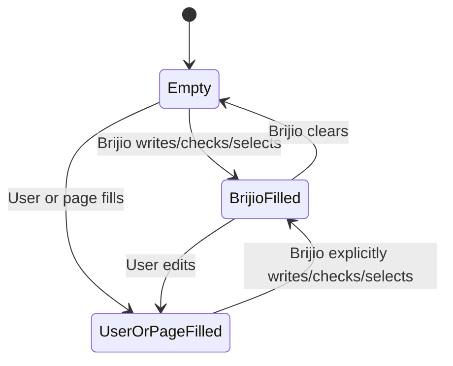
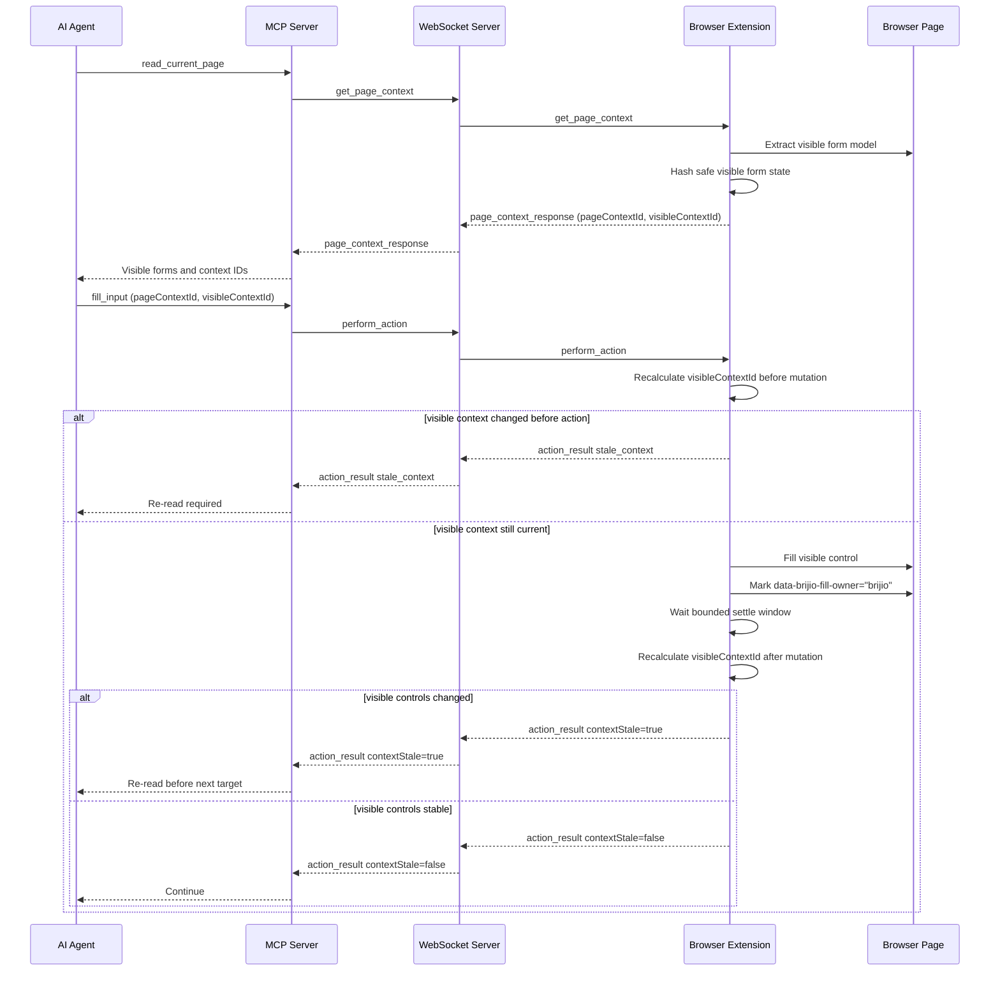

# ADR 0045: User-Visible Form State Model

## Status

Proposed

## Date

2026-06-12

## Context

Brijio already lets agents read a page, fill form controls, set checkboxes,
select options, submit forms, and batch multiple actions. The current form model
is useful for basic targeting, but it is not yet good enough for high-value form
workflows such as applications, CMS screens, account portals, and multi-step
conditional forms.

The current `read_current_page` response exposes visible forms with controls,
labels, types, required flags, checked state, select options, and sensitivity
markers. It intentionally avoids returning raw text-input values. However, three
important gaps remain.

First, agents need a safe way to know whether visible fields are empty or already
filled. Returning raw values would leak user-entered form content and credentials,
but returning only labels and types makes it hard for an agent to avoid
overwriting fields the user or page already filled.

Second, agents need to distinguish fields filled by Brijio from fields filled by
the user or page. If Brijio filled a field earlier in the workflow, the agent may
need to revise it. If the user edited a field, the agent should treat that value
as user-owned and avoid changing it unless explicitly instructed.

Third, modern forms often change shape after an input changes. Choosing a
country can reveal a region field. Selecting an account type can reveal company
fields. A React or server-backed form can reveal new visible controls after an
asynchronous delay. Brijio cannot push asynchronous stale-context messages to the
agent through the normal MCP tool-call flow, so form freshness must be expressed
through request/response data and context validation.

The guiding principle for this ADR is:

> Brijio exposes only what the user can see in the current page state, plus safe
> machine-readable state needed for reliable interaction.

## Decision

Enhance the existing page context and form action protocol with a user-visible
form state model. The model stays inside `read_current_page`; add a
separate `inspect_form` tool.

### Visible-only form controls

`read_current_page` will continue returning form summaries under
`structure.forms`, but those summaries must include only visible, user-facing
controls.

Controls are excluded when they are not visible or not user-facing, including:

- `input[type="hidden"]`.
- elements with `hidden` or `aria-hidden="true"`.
- controls inside hidden or aria-hidden ancestors.
- controls that are not currently visible to the user because a conditional
  section has not appeared yet.

If changing one field makes another field visible, the newly visible field is not
available through the old page context. The agent must call `read_current_page`
again after Brijio reports stale visible context.

### Safe fill state, not values

Add safe value-state metadata to `PageFormControl`:

```ts
type PageFormControlValueState = "empty" | "filled" | "unknown";
type PageFormControlFilledBy = "brijio" | "user_or_page";

interface PageFormControl {
  id: string;
  label: string;
  type: string;
  required: boolean;
  requiredSource?: "html" | "aria";
  disabled: boolean;
  readonly?: boolean;
  sensitive: boolean;
  valueState: PageFormControlValueState;
  filledBy?: PageFormControlFilledBy;
  checked?: boolean;
  multiple?: boolean;
  options?: PageFormControlOption[];
  validity?: PageFormControlValidity;
}
```

`valueState` describes whether the field appears empty or filled without
returning the value itself:

- `empty`: the visible control appears empty or unselected.
- `filled`: the visible control has a value, checked state, or selected option.
- `unknown`: Brijio cannot safely determine whether the control is filled.

Raw text-like values are never returned for text, email, password, tel, number,
date, textarea, or similar controls. Password fields remain identifiable as
`type: "password"` and `sensitive: true`, but password values are never returned.

For select controls, options remain visible state. P1.5 may continue exposing
option labels, values, selected state, and disabled state because those are part
of the visible control model already used by `select_options`. Sensitive selects
can be revisited in a future privacy-focused ADR if needed.

### Required-field inference

Required state is inferred from safe control metadata:

```ts
required: boolean
requiredSource?: 'html' | 'aria'
```

The initial sources are:

- `required` attribute -> `requiredSource: 'html'`.
- `aria-required="true"` -> `requiredSource: 'aria'`.

P1.5 does not infer required state from label text such as `*` or `(required)`.
That visual inference is useful, but it can create false positives and belongs in
a later refinement if needed.

### Ownership-aware Brijio fill marker

When Brijio successfully changes a form control through `fill_input`,
`set_checked`, `select_options`, or matching `perform_batch` actions, the content
script marks the control as Brijio-owned:

```html
<input data-brijio-fill-owner="brijio" />
```

When the user edits that control afterwards, Brijio ownership is cleared. The
next page context then reports the field as user/page-filled instead of
Brijio-filled.

The state transitions are:



The page context maps this to:

```json
{
  "valueState": "filled",
  "filledBy": "brijio"
}
```

or:

```json
{
  "valueState": "filled",
  "filledBy": "user_or_page"
}
```

Agents should prefer empty fields, may revise fields filled by Brijio, and should
avoid changing user/page-filled fields unless the user explicitly asks.

### Validation state and submit errors

Add safe validation metadata for visible controls:

```ts
type PageFormControlValidityReason =
  | "value_missing"
  | "type_mismatch"
  | "pattern_mismatch"
  | "too_short"
  | "too_long"
  | "range_underflow"
  | "range_overflow"
  | "step_mismatch"
  | "bad_input"
  | "custom_error";

interface PageFormControlValidity {
  valid: boolean;
  reason?: PageFormControlValidityReason;
}
```

`read_current_page` should expose machine-readable validity, not browser
`validationMessage` strings by default. Submit results may include safe messages
later, but P1.5's stable contract is the reason code.

`submit_form` should distinguish between a browser-accepted submit request and a
submit blocked by browser validation. A validation-blocked submit returns a
successful action result with `submitted: false` and visible invalid controls:

```json
{
  "action": "submit_form",
  "target": { "formId": "bb-1" },
  "submitted": false,
  "validationErrors": [
    {
      "formId": "bb-1",
      "controlId": "bb-2",
      "label": "Email",
      "reason": "value_missing"
    }
  ]
}
```

Validation errors must not expose hidden controls or sensitive field values.

### Content-derived visible context ID

Add a content-derived context identifier to the page context:

```ts
interface PageContext {
  pageContextId?: number;
  visibleContextId?: string;
}
```

`visibleContextId` is a deterministic hash of safe, visible form-interaction
state. It complements ADR 0041's `pageContextId`:

- `pageContextId` detects navigation-level invalidation.
- `visibleContextId` detects visible form state changes and conditional controls.

The hash input includes only safe visible form metadata, such as:

- visible form count and labels.
- visible control count, labels, types, and ordering.
- required, disabled, readonly, and sensitive flags.
- `valueState` and `filledBy`.
- checkbox and radio checked state.
- select option count, selected state, and disabled state.
- validation reason.
- submit controls included in the form model.

The hash input must not include:

- raw text, email, password, tel, number, date, textarea, or similar values.
- hidden or invisible controls.
- arbitrary DOM HTML.
- unrelated page preview/content text.
- timestamps.

The name is intentionally `visibleContextId`, not `visibleFormContextId`, so the
same mechanism can later cover other visible interactive surfaces. In P1.5 it is
derived from the visible form interaction model.

### Action tools carry visible context

Form action tools may carry the `visibleContextId` from the last
`read_current_page` response:

```json
{
  "formId": "bb-1",
  "controlId": "bb-2",
  "expectedLabel": "Email",
  "pageContextId": 7,
  "visibleContextId": "ctx_93de9f"
}
```

Before mutating the page, the content script recalculates the current
`visibleContextId`. If the provided ID no longer matches, the action fails before
changing the page:

```json
{
  "ok": false,
  "error": {
    "code": "stale_context",
    "message": "Visible form controls changed since the page was read. Call read_current_page before continuing.",
    "detail": {
      "previousVisibleContextId": "ctx_93de9f",
      "currentVisibleContextId": "ctx_a81c44",
      "reason": "visible_controls_changed"
    }
  }
}
```

This catches asynchronous changes that happen after an earlier action result was
already returned. The agent still sees the stale signal only on a later tool
call, but the page is protected from mutation based on an old visible context.

### Action results report stale context after mutations

After a successful form mutation, the content script waits a short bounded settle
window and recalculates the visible context. If visible form controls changed,
the action result includes:

```ts
contextStale?: boolean
contextStaleReason?: 'visible_controls_changed'
currentVisibleContextId?: string
```

Example:

```json
{
  "action": "write_text",
  "target": { "formId": "bb-1", "controlId": "bb-2" },
  "textLength": 12,
  "contextStale": true,
  "contextStaleReason": "visible_controls_changed",
  "currentVisibleContextId": "ctx_a81c44"
}
```

Agents must call `read_current_page` before choosing another form target when
`contextStale` is true.

The bounded settle window catches common SPA and conditional-field updates
without turning Brijio into a continuous observer. Late changes after the action
response are detected by comparing `visibleContextId` on the next tool call.

### Agent completion guidance

Brijio's bundled usage guidance should instruct agents to re-read the page before
returning control to the user at the end of a form workflow.

Before completing, the agent should call `read_current_page` and check for:

- newly visible required fields.
- visible empty required fields.
- visible validation errors.
- visible fields that require user-only data, credentials, files, or secrets.

The agent should continue only when the user's instruction covers the remaining
fields and no user-only data is required. Otherwise, it should report exactly
what remains.

## Message Flow



## Scope

In scope:

- Keep form summaries in `read_current_page`; do not add a separate P1.5
  `inspect_form` tool.
- Expose only visible user-facing form controls.
- Add `valueState`, `filledBy`, and `requiredSource` to form controls.
- Infer required state from native `required` and `aria-required="true"`.
- Add safe validity reason metadata for visible controls.
- Mark controls after successful Brijio writes/checks/selects.
- Clear Brijio ownership when the user edits a Brijio-owned control.
- Add `visibleContextId` derived from safe visible form state.
- Accept `visibleContextId` on form action tools and `perform_batch` form
  actions.
- Fail form actions with `stale_context` when the provided visible context no
  longer matches before mutation.
- Return `contextStale`, `contextStaleReason`, and `currentVisibleContextId`
  when a successful form action changes visible form structure.
- Return structured validation errors from browser-blocked `submit_form` calls.
- Update bundled Brijio usage guidance so agents re-read page context before
  completing form workflows.

Out of scope:

- A standalone `inspect_form` tool. That belongs to the 4.x developer and agency
  debugging surfaces.
- Returning hidden, invisible, or non-user-facing controls.
- Returning raw text-like form values.
- Returning password values under any condition.
- Inferring required state from label punctuation or free-form text.
- Continuous background streaming of form changes to the agent.
- MCP push notifications or subscriptions for stale context.
- File upload support. That remains P1.6.
- Full DOM diffing or hashing arbitrary page content.

## Testing

Use TDD:

1. Add failing page-context tests proving hidden, aria-hidden, and invisible form
   controls are excluded from `structure.forms`.
2. Add failing page-context tests for `valueState`, `filledBy`,
   `requiredSource`, and safe validity reasons.
3. Add failing tests proving raw values for text, email, tel, number, date,
   textarea, and password controls are never returned.
4. Add failing ownership tests proving Brijio actions mark controls as
   Brijio-owned and user edits clear that ownership.
5. Add failing visible-context hash tests proving `visibleContextId` changes when
   visible form controls appear, disappear, change required/disabled/readonly
   state, change filled state, or change validation reason.
6. Add failing tests proving `visibleContextId` does not include raw sensitive or
   text-like values.
7. Add failing action tests proving form actions reject stale visible contexts
   before mutating the page.
8. Add failing action tests proving successful form actions return
   `contextStale: true` and `currentVisibleContextId` when visible controls
   change after the bounded settle window.
9. Add failing submit tests proving browser validation blocks return
   `submitted: false` with visible invalid control IDs, labels, and reason codes.
10. Add failing `perform_batch` tests proving visible-context validation applies
    at batch start and stale visible controls abort remaining form actions.
11. Add MCP tool schema tests proving action tools and batch form actions accept
    optional `visibleContextId`.
12. Update bundled `using-brijio` and form-filling skill tests/docs to instruct
    agents to re-read page context before completing form workflows.
13. Implement the smallest code to pass those tests.

Verification should include:

- `pnpm --filter @brijio/shared test`
- `pnpm --filter @brijio/chrome-extension test`
- `pnpm --filter @brijio/safari-extension test`
- `pnpm --filter @brijio/mcp test`
- `pnpm lint:ts`
- `pnpm lint:md`
- `pnpm test`

## Consequences

Agents get a safer and more useful form model without seeing raw user-entered
values. They can identify visible required fields, avoid fields already filled by
the user or page, revise fields Brijio filled earlier, and recover when
conditional forms reveal new controls.

`visibleContextId` gives Brijio a request/response-compatible stale-context
mechanism for asynchronous form changes. It does not push events to the agent,
but it prevents later actions from mutating a page based on an old visible form
model.

The protocol surface grows: page context includes new control metadata and a
visible context ID, and action tools accept and return visible-context fields.
These additions are optional and backward compatible, but agents that ignore them
will not get the full safety benefit.

Ownership tracking adds content-script state and event handling. It is more
complex than a static marker, but it prevents stale ownership flags after user
edits and supports the desired policy of respecting user-filled fields.

The visible-context hash must be carefully scoped. If it includes too much page
content, it will churn and create false stale errors. If it includes too little,
it may miss conditional form changes. P1.5 deliberately hashes only safe visible
form-interaction state.
