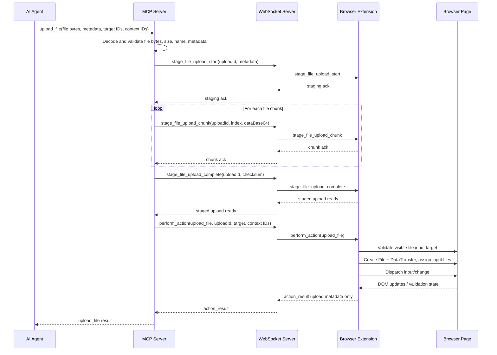

# ADR 0046: Agent-Sourced File Upload Action

## Status

Accepted

## Date

2026-06-14

## Context

Brijio can already read pages, fill visible form controls, select options,
submit forms, and batch multiple actions. P1.5 adds a safer user-visible form
state model, and P1.8 adds the `perform_batch` action pipeline. The remaining
high-value form workflow gap is file upload.

File upload unlocks real workflows such as job applications, support portals,
CMS uploads, document submission, and agent-generated artifacts. A typical job
application flow is:

1. the user gives the agent a resume PDF once.
2. the agent remembers or retrieves that file for future applications.
3. the agent fills an application form through Brijio.
4. the agent uploads the resume into a visible file input.
5. the agent submits the application after validating the page state.

The file source must be the agent side, not the user's browser filesystem or the
MCP server filesystem. The agent and MCP server may run on different machines,
so the upload contract cannot depend on an agent-local path being readable by
MCP. Instead, the agent posts the file bytes and metadata to MCP. MCP receives
only the uploaded payload, transfers it through Brijio, and the content script
materialises a browser `File` object for the target input.

The browser-side primitive is known: JavaScript cannot set
`input[type="file"].value` to a local path, but it can assign a `FileList`
created through a `DataTransfer` object, then dispatch `input` and `change`
events. That lets Brijio simulate the selected file without drag-and-drop or
opening the native file picker.

Remote deployment introduces payload-size constraints. A local WebSocket has no
practical packet-size limit for normal resume-sized files, but hosted relay
transports may impose stricter limits. For example, API Gateway-style WebSocket
or HTTP paths can reject messages above relatively small payload thresholds.
Therefore file upload must be chunked even when local development could send the
file in one message.

## Decision

Add an agent-sourced file upload capability as a dedicated Brijio action. The
feature has two layers:

1. an agent-to-MCP upload payload that carries file bytes and browser filename
   metadata instead of a file path.
2. a staging protocol that transfers received file bytes from MCP to the
   connected extension in bounded chunks.
3. an `upload_file` page action that assigns a staged file to a visible file
   input using `DataTransfer`.

The single `upload_file` action must be implemented and tested first. Batch
support is part of P1.6, but it must reuse the already-tested single action path
and be added only after the single action is stable.

### File source boundary

Files are sourced by the agent side. Supported sources are:

- a user-provided file available to the agent, such as a resume PDF for job
  applications.
- a file generated by the agent on behalf of the user, such as a cover letter,
  CSV export, report, or image.

MCP does not resolve an agent-provided path. It receives bytes and metadata from
the agent, validates that payload, and stages those bytes for the extension. The
extension and content script also do not read files from the browser user's
local filesystem. They receive staged bytes from MCP and convert those bytes into
a browser `File` object.

The intended flow is:

```text
USER — [file] —> Agent — [file bytes + metadata] —> MCP — [[chunk]] —>> WS -> content-script — [DataTransfer] —> File input
```

The privacy and deployment boundary is therefore not "can MCP read an arbitrary
agent path?" or "can the extension read an arbitrary browser-local path?" They
cannot. The relevant boundaries are:

- the agent must have explicit user intent to use the file.
- the agent posts the file payload to MCP; it does not send a path for MCP to
  dereference.
- MCP and extension logs must not contain file contents or base64 chunks.
- tool results must return metadata only, never file bytes, base64 chunks, or
  local paths.

### MCP tool shape

Expose a dedicated MCP tool named `upload_file`.

```json
{
  "formId": "bb-1",
  "controlId": "bb-3",
  "file": {
    "name": "Gianni Mazza Resume.pdf",
    "type": "application/pdf",
    "dataBase64": "JVBERi0xLjQK...",
    "sha256": "..."
  },
  "expectedLabel": "Resume",
  "pageContextId": 7,
  "visibleContextId": "ctx_93de9f",
  "browserInstanceId": "abc123"
}
```

Required fields:

- `formId`
- `controlId`
- `file.name`
- `file.dataBase64`

Optional fields:

- `file.type` supplies the browser MIME type when known.
- `file.sha256` lets MCP and the extension verify payload integrity.
- `expectedLabel` follows the existing stale-target validation model.
- `pageContextId`, `visibleContextId`, and `browserInstanceId` follow existing
  action-tool semantics.

The MCP server validates the posted file payload before staging:

- base64 decodes successfully.
- size is greater than zero.
- size is at or below the configured maximum.
- filename is present and contains no path components after sanitisation.
- optional checksum matches the decoded bytes.

Future MCP inputs may support streamed multipart uploads, named file-vault
entries, or generated artifact handles. Agent-local `filePath` inputs are out of
scope for P1.6 because they only work when the agent and MCP server share a
filesystem.

### Upload chunk configuration

Add environment-driven configuration on the MCP side:

```text
BRIJIO_UPLOAD_CHUNK_BYTES=65536
BRIJIO_UPLOAD_MAX_BYTES=10485760
```

`BRIJIO_UPLOAD_CHUNK_BYTES` controls the maximum raw file bytes per chunk before
base64 encoding. The default is 64 KiB. Remote deployments can lower this value
to keep the base64 JSON envelope comfortably below relay packet limits.

`BRIJIO_UPLOAD_MAX_BYTES` controls the maximum accepted file size. The default is
10 MiB, enough for common resume, document, and support-attachment workflows
without turning Brijio into a bulk file-transfer system.

Both values are validated at startup or first use. Invalid values fall back to
safe defaults with a warning, following the existing environment-configuration
style.

### Staging protocol

The MCP server reads the file in chunks and sends them to the extension before
executing the page action. The WebSocket server remains a transparent router.

Staging messages are distinct from page actions because they move bytes, not DOM
mutations.

```ts
interface StageFileUploadStartEnvelope {
  type: "stage_file_upload_start";
  uploadId: string;
  file: {
    name: string;
    size: number;
    type?: string;
    sha256?: string;
  };
  chunkSize: number;
  totalChunks: number;
}

interface StageFileUploadChunkEnvelope {
  type: "stage_file_upload_chunk";
  uploadId: string;
  index: number;
  dataBase64: string;
}

interface StageFileUploadCompleteEnvelope {
  type: "stage_file_upload_complete";
  uploadId: string;
  sha256?: string;
}
```

The extension stores staged bytes in memory under `uploadId`. Staged files are
short-lived and must expire after a bounded TTL. The extension must delete staged
bytes when:

- the upload action consumes them successfully.
- the upload is aborted or fails checksum validation.
- the tab/page disconnects.
- the staging TTL expires.

Chunk payloads must not be written to logs. Error details may include `uploadId`,
chunk indexes, expected sizes, and metadata, but not chunk contents.

### Upload page action

After staging succeeds, MCP sends a normal `perform_action` envelope with an
`upload_file` action.

```json
{
  "type": "perform_action",
  "pageContextId": 7,
  "visibleContextId": "ctx_93de9f",
  "action": {
    "type": "upload_file",
    "target": {
      "formId": "bb-1",
      "controlId": "bb-3"
    },
    "uploadId": "upload_01HY...",
    "expectedLabel": "Resume"
  }
}
```

The content script resolves the target using the same model as other form
actions:

- `pageContextId` rejects navigation-level stale page state.
- `visibleContextId` rejects stale visible form state.
- `expectedLabel` rejects stale or mismatched controls.
- `formId` and `controlId` must identify a currently visible control from the
  page context.
- the target must be an enabled `input[type="file"]`.
- hidden, unrelated, disabled, non-file, or missing controls return structured
  errors before mutation.

When validation passes, the content script reconstructs the staged bytes into a
browser `File`, assigns it with `DataTransfer`, and dispatches events:

```ts
const file = new File([bytes], fileName, { type: mimeType });
const transfer = new DataTransfer();
transfer.items.add(file);
input.files = transfer.files;
input.dispatchEvent(new Event("input", { bubbles: true }));
input.dispatchEvent(new Event("change", { bubbles: true }));
```

The action then waits the same bounded settle window used by other form actions
and reports visible-context staleness if the upload reveals new fields or changes
visible form structure.

### Result shape

The upload result returns metadata only.

```json
{
  "action": "upload_file",
  "target": {
    "formId": "bb-1",
    "controlId": "bb-3",
    "label": "Resume",
    "multiple": false,
    "accept": ".pdf,.doc,.docx"
  },
  "file": {
    "name": "Gianni Mazza Resume.pdf",
    "size": 48213,
    "type": "application/pdf"
  },
  "eventsDispatched": ["input", "change"],
  "contextStale": false
}
```

Do not return:

- file contents.
- base64 chunks.
- full local paths.
- filesystem metadata unrelated to browser upload behavior.

The filename returned is the browser upload filename from `file.name` after
sanitisation. It is never derived from or reported as a local path.

### Validation and errors

Validation follows the existing action-tool model: invalid input is rejected by
MCP before transport where possible; stale or target-specific failures are
returned by the extension/content script as structured action errors.

Add or reuse error codes for:

- `invalid_file_payload` — MCP cannot decode or validate the posted file bytes.
- `checksum_mismatch` — the optional checksum does not match the decoded bytes.
- `file_too_large` — file exceeds `BRIJIO_UPLOAD_MAX_BYTES`.
- `invalid_file_name` — browser filename is empty or contains path separators.
- `invalid_file_type` — file conflicts with an enforced type rule.
- `upload_staging_failed` — extension cannot stage or validate chunks.
- `upload_not_staged` — action references an unknown or expired `uploadId`.
- `target_not_file_input` — target exists but is not `input[type="file"]`.

`accept` handling should be conservative. If an input has an `accept` attribute,
Brijio should check filename extension and MIME type when possible and reject
obvious mismatches. It should not attempt deep content inspection in P1.6.

Multiple-file inputs are recognised through existing form metadata. P1.6 uploads
one file per `upload_file` action. If `multiple` is absent and the target already
contains a file, the action replaces the selected `FileList`, matching normal
single-file input behavior. Multi-file upload can be added later by extending the
action to accept multiple `uploadId` values.

### Batch support

Add `upload_file` to `BatchAction` after the single action is tested and stable.
Batch upload support is part of P1.6, but it must reuse the same content-script
handler as the single action.

The MCP server stages every file needed by a batch before sending the
`perform_batch` envelope. The batch action references staged files by `uploadId`:

```ts
type BatchAction =
  | ExistingBatchAction
  | {
      type: "upload_file";
      target: FillInputTarget;
      uploadId: string;
      expectedLabel?: string;
    };
```

Batch execution keeps the existing semantics:

- validate `pageContextId` and `visibleContextId` at batch start.
- execute actions sequentially.
- abort on `page_navigated`.
- respect `continueOnError` for element-level errors.
- append `readAfterActions` only at the end.
- return per-action upload metadata, not file contents.

If staging succeeds but the batch aborts before an upload action consumes its
file, the extension must clean up the unconsumed staged bytes.

### Page context changes

P1.6 depends on P1.5's form model exposing file controls as visible controls with
safe metadata:

```ts
interface PageFormControl {
  id: string;
  label: string;
  type: "file" | string;
  required: boolean;
  disabled: boolean;
  readonly?: boolean;
  multiple?: boolean;
  accept?: string;
  valueState: "empty" | "filled" | "unknown";
}
```

Page context should include `accept` for file inputs when present. It should not
include selected file contents, full paths, or browser fake paths.

## Message Flow



Batch mode uses the same staging messages first, then sends one `perform_batch`
message containing `upload_file` actions that reference the staged `uploadId`
values.

## Scope

In scope:

- Add agent-sourced file upload support for visible `input[type="file"]`
  controls.
- Add `upload_file` as a dedicated MCP tool and page action.
- Accept the first supported file source as an agent-posted `file` payload with
  browser filename, optional MIME type, optional checksum, and base64 bytes.
- Transfer file bytes from MCP to extension in configurable base64 chunks.
- Add upload staging message types and parsers in shared protocol code.
- Keep WebSocket server behavior transparent for upload staging and action
  messages.
- Reconstruct a browser `File` in the content script and assign it with
  `DataTransfer`.
- Dispatch `input` and `change` events after assignment.
- Validate target freshness with `pageContextId`, `visibleContextId`, and
  optional `expectedLabel`.
- Validate file payload decoding, checksum, size, browser filename, and obvious
  `accept` mismatches.
- Return upload result metadata only.
- Add `upload_file` to `perform_batch` after the single action path is tested.
- Update bundled Brijio usage guidance and docs for upload privacy boundaries.
- Add demo/test-page file input coverage for manual and automated verification.

Out of scope:

- Browser-side local filesystem selection or native file-picker automation.
- Agent-local or MCP-local `filePath` as the primary upload input.
- Drag-and-drop upload simulation.
- Multiple files in one `upload_file` action.
- Deep file content inspection or antivirus scanning.
- Persistent file vault storage.
- Returning file contents, chunks, full local paths, or selected-file fake paths
  in tool results or page context.
- Uploading files outside a visible page-context target.
- Retrying failed chunks automatically across reconnects.

## Testing

Use TDD:

1. Add failing shared protocol tests for staging envelopes, chunk bounds,
   `upload_file` action/result types, and parsers.
2. Add failing MCP tool tests for `upload_file` input validation:
   - missing file payload.
   - invalid base64 payload.
   - empty file.
   - too-large file.
   - invalid browser filename.
   - checksum mismatch.
   - valid metadata passed to the page-action layer.
3. Add failing WebSocket client/page-action tests proving MCP stages chunks in
   order, respects `BRIJIO_UPLOAD_CHUNK_BYTES`, verifies staging completion, and
   sends the final `perform_action upload_file` envelope.
4. Add failing content-script tests proving:
   - visible file input receives a `File` via `DataTransfer`.
   - `input` and `change` events fire.
   - hidden, disabled, stale, non-file, and missing targets are rejected.
   - `accept` mismatches return structured errors.
   - result metadata omits contents and paths.
   - staged bytes are cleaned up after success, failure, and expiry.
5. Add failing Chrome and Safari extension routing tests for staging messages and
   upload action dispatch.
6. Add failing integration tests for the agent -> MCP -> WS -> extension-like
   flow with a small posted fixture file payload.
7. After the single action tests pass, add failing batch tests proving
   `perform_batch` supports `upload_file` actions using staged `uploadId` values,
   preserves existing abort semantics, and cleans up unconsumed staged files.
8. Add demo/test-page coverage with a visible file input and smoke-test steps.
9. Update documentation and bundled skills after behavior is complete.
10. Implement the smallest code to pass those tests.

Verification should include:

- `pnpm --filter @brijio/shared test`
- `pnpm --filter @brijio/chrome-extension test`
- `pnpm --filter @brijio/safari-extension test`
- `pnpm --filter @brijio/mcp test`
- `pnpm lint:ts`
- `pnpm lint:md`
- `pnpm test`

## Consequences

Agents can complete real document-upload workflows such as job applications and
support submissions without asking the user to operate the browser manually.
They can also generate files and upload them on the user's behalf.

The feature preserves Brijio's user-control model. The browser extension does not
read arbitrary local files. It only receives explicit agent-sourced bytes through
Brijio's request/response protocol while the user-connected bridge is active.

The protocol surface grows beyond simple request/response actions because file
bytes need staging messages. This adds implementation complexity, memory cleanup
requirements, checksum handling, and timeout behavior. The tradeoff is necessary
to support remote relay payload limits and avoid unsafe one-message file blobs.

Batch support makes complete form workflows practical. An agent can fill fields,
upload a resume, check consent, and submit in one batch after reading the page.
However, batch upload must not introduce a separate upload implementation path.
It should reuse the single action handler so validation, events, and result
shapes stay consistent.

The extension temporarily holds file bytes in memory. That memory must be
bounded by `BRIJIO_UPLOAD_MAX_BYTES`, staging TTLs, and cleanup on success or
failure. Logs and tool results must continue to treat file contents as sensitive
transient payloads even though the browser-local filesystem is not the source.
