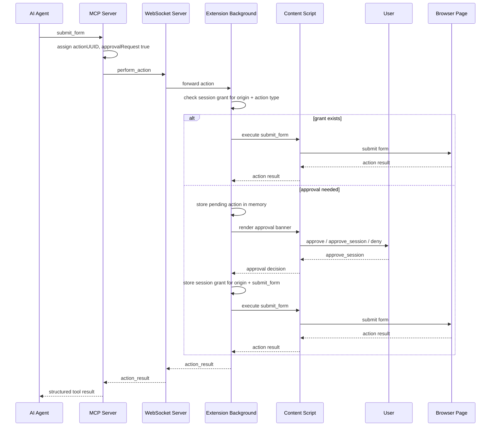
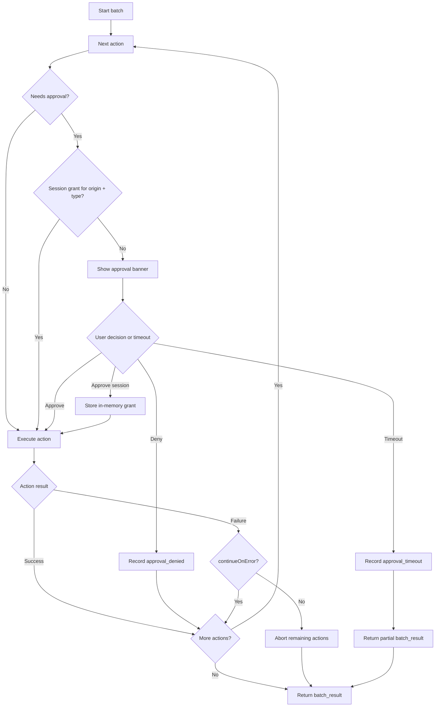

# ADR 0048: Client-Side Action Approval

**Status:** Accepted | **Date:** 2026-06-18

## Context

Brijio currently lets agents invoke browser-mutating MCP tools such as
`click_element`, `fill_input`, `set_checked`, `select_options`, `submit_form`,
`upload_file`, and `perform_batch`. These actions are explicit MCP tool calls,
but once a tool call reaches the connected extension, supported actions execute
without an additional browser-side user approval step.

Form submission is the first action that should require client-side approval.
It can send user-entered data to the current site and can trigger navigation or
server-side side effects. The approval model must preserve Brijio's core
privacy boundary: the extension is user-controlled, browser state is only
available while the bridge is connected, and agents must not gain silent
background authority.

The current MCP server is commonly instantiated per tool invocation. It should
not be the long-lived holder of approval state. The extension and WebSocket
relay are better places for continuity because they already represent the live
browser session and connection routing boundary.

## Decision

Add an approval-aware protocol for selected browser operations. The approval
system must not require approval for every action.

Every approval-gated operation will carry a unique `actionUUID`. For
`perform_batch`, every batch action will carry an `actionUUID` so approved,
denied, or timed-out actions are identifiable inside the batch. Operations that
require user approval will also carry `approvalRequest: true`.

For the first implementation:

- `submit_form` requires approval.
- `fetch_resource` requires approval.
- `download_file` requires approval.
- Other actions do not require approval.
- The approval-gated operation list is hardcoded.
- Approval state is held in memory only.
- Approval grants are cleared when the bridge disconnects, the extension reloads,
  or the browser session ends.
- `approve_session` grants future actions for the same `{ origin, actionType }`
  during the same bridge connection.
- Pending approvals time out before the local MCP HTTP request timeout and
  return a structured error to the agent.

Use extension/background memory for pending actions and approval grants. Do not
store pending actions in page `localStorage`, extension storage, IndexedDB, or
other persistent stores.

## Approval Policy Evolution

Approval policy will evolve in three stages:

1. **Hardcoded local list:** `submit_form`, `fetch_resource`, and
   `download_file` require approval. This ADR covers that stage.
2. **Configurable local policy:** future local configuration can choose which
   supported operations require approval.
3. **Enterprise policy API:** future enterprise deployments can return the
   approval-gated operation set from a policy API.

The first implementation should keep policy evaluation behind a small local
function such as `requiresApproval(operation)`. That function can return the
hardcoded list now and later delegate to local configuration or an enterprise
policy response without changing the action execution pipeline.

## Protocol Shape

Single action requests add `actionUUID` and `approvalRequest` when the action
requires approval:

```json
{
  "type": "message",
  "id": "mcp-123",
  "payload": {
    "type": "perform_action",
    "pageContextId": 12,
    "visibleContextId": "vc_abc",
    "action": {
      "type": "submit_form",
      "actionUUID": "550e8400-e29b-41d4-a716-446655440000",
      "approvalRequest": true,
      "target": {
        "formId": "bb-2",
        "expectedLabel": "Checkout"
      }
    }
  }
}
```

Batch requests add `actionUUID` to every item and `approvalRequest` to items
that require approval:

```json
{
  "type": "message",
  "id": "mcp-456",
  "payload": {
    "type": "perform_batch",
    "pageContextId": 12,
    "visibleContextId": "vc_abc",
    "actions": [
      {
        "type": "write_text",
        "actionUUID": "f9a7b8d1-9623-4a75-87fb-8f03656dc001",
        "target": { "formId": "bb-2", "controlId": "bb-5" },
        "text": "gianni@example.com"
      },
      {
        "type": "submit_form",
        "actionUUID": "f9a7b8d1-9623-4a75-87fb-8f03656dc002",
        "approvalRequest": true,
        "target": { "formId": "bb-2", "expectedLabel": "Checkout" }
      }
    ]
  }
}
```

The WebSocket envelope `id` remains the request/response identifier. The
`actionUUID` identifies the specific action within a single action request or a
batch.

Non-batch approval-gated tools such as `fetch_resource` and `download_file` also
carry an `actionUUID` and `approvalRequest: true` in their request payloads.
Their response payloads include the same `actionUUID` on approval errors.

## Approval States

Approval decisions use three user choices:

- `approve`: approve only the current action.
- `approve_session`: approve this action and future matching actions during the
  same bridge connection.
- `deny`: reject the current action.

`approve_session` is scoped to:

```ts
{
  origin: string;
  actionType: "submit_form" | "fetch_resource" | "download_file";
}
```

The origin is computed from the active tab URL at approval time. Before executing
an approved action, the extension verifies the active tab still has the same
origin and the same action type. If the origin changed, the action fails instead
of reusing the approval grant.

## Timeout Behavior

Approval-gated requests use an application-level approval timer owned by
Brijio. The timer must fire before the local MCP HTTP server request timeout, so
Brijio can return a structured approval error instead of letting the HTTP server
or client produce a generic timeout.

For the local MCP server, Brijio owns the HTTP server process and can derive the
approval timeout from the configured HTTP timeout:

```text
approvalTimeoutMs = httpRequestTimeoutMs - approvalTimeoutBufferMs
```

Example:

```text
BRIJIO_MCP_HTTP_TIMEOUT_MS=60000
BRIJIO_APPROVAL_TIMEOUT_BUFFER_MS=5000
computed approvalTimeoutMs=55000
```

The MCP server uses the same request budget for standalone approval-gated tools
and `perform_batch`. For remote or enterprise deployments behind infrastructure
Brijio does not control, timeout values must be explicitly configured below the
shortest expected client, proxy, gateway, or load-balancer timeout.

If the approval timer fires, the extension hides the banner, cancels the pending
approval, and returns a structured `approval_timeout`.

If the user does not approve or deny before `approvalTimeoutMs`, the extension
returns:

```json
{
  "type": "message",
  "id": "mcp-123",
  "payload": {
    "type": "action_result",
    "ok": false,
    "error": {
      "code": "approval_timeout",
      "message": "Timed out waiting for user approval.",
      "actionUUID": "550e8400-e29b-41d4-a716-446655440000"
    }
  }
}
```

For batches, the timed-out action returns a failed batch entry:

```json
{
  "ok": false,
  "error": {
    "code": "approval_timeout",
    "message": "Timed out waiting for user approval.",
    "actionUUID": "f9a7b8d1-9623-4a75-87fb-8f03656dc002",
    "aborted": false
  }
}
```

The user-facing default can still be described as roughly 30-60 seconds,
depending on the configured local MCP HTTP timeout. The exact runtime value is
the computed `approvalTimeoutMs`.

The agent-visible flow is:

```text
tool invoked
     |
[wait until approvalTimeoutMs]
     |
structured approval_timeout error
     |
agent reports the approval timeout to the user
```

## Runtime Flow



## Batch Flow

Approval-aware batches execute actions in order. The extension treats every
action independently:

1. If the action does not require approval, execute it normally.
2. If the action requires approval and a matching session grant exists, execute
   it normally.
3. If the action requires approval and no grant exists, show the approval banner
   for that action only.
4. Continue with the next action only after the current action succeeds, is
   denied, or times out.

This preserves ADR 0044's ordered batch semantics. For the hardcoded first
implementation, only `submit_form` is approval-gated inside `perform_batch`.
`fetch_resource` and `download_file` are standalone tools, not batch actions.

User denial inside a batch is a focused per-action outcome, not a reason to
abort the whole batch. Brijio should try its best to perform the remaining
actions because batch actions use explicit IDs, not positional selectors. A
denied action returns `approval_denied` for that action's `actionUUID`, then the
batch runner continues to the next action.

Approval timeout is request-level for the current synchronous implementation,
not multiplied per approval-gated action. If the approval timer fires while a
batch is waiting for user approval, the current action records
`approval_timeout`, the banner is hidden, and the batch returns a partial
`batch_result`. Actions already completed keep their results. The current timed
out action and remaining unexecuted actions are returned as focused failed
entries so the agent can retry them in a later tool call.

The `continueOnError` flag continues to apply to execution failures after an
action is approved, such as stale targets, unsupported controls, or browser
action errors. Page navigation remains special: if an executed action navigates
the page, remaining actions still abort because previously read page IDs may no
longer be valid.



The implementation should prefer a background-level batch runner over storing
the whole batch in the page context. The content script can render the banner and
execute individual content actions, but the background script owns:

- pending action queue;
- approval timeout timers;
- session approval grants;
- batch sequencing;
- final `action_result` or `batch_result` assembly.

This keeps policy state outside the webpage and avoids persistent storage of
action payloads.

## Error Codes

Add approval-specific action error codes:

- `approval_denied`: user denied the action.
- `approval_timeout`: user did not respond before the computed approval timeout.
- `approval_unavailable`: the extension could not render the approval UI.
- `approval_origin_changed`: the active tab origin changed before execution.

Errors include `actionUUID` when available. Batch errors include `aborted`
following existing batch result conventions.

## Future Approval Status

This ADR does not implement agent polling for approval status.

Future approval status can be added without requiring a long-lived MCP process:

- The extension sends approval/action state updates to the WebSocket server.
- The WebSocket server keeps a session-scoped in-memory status registry keyed by
  `actionUUID`.
- A future MCP tool can query status by `actionUUID`.

This keeps MCP stateless across per-invocation processes while still allowing
continuity between submit, acknowledgement, and future status polling.

## Scope

In scope:

- Shared protocol fields `actionUUID` and `approvalRequest` for action payloads.
- MCP assignment of `actionUUID` for single actions and each batch action.
- MCP marking `submit_form`, `fetch_resource`, and `download_file` with
  `approvalRequest: true`.
- Hardcoded approval policy for `submit_form`, `fetch_resource`, and
  `download_file`.
- Extension background in-memory pending-action queue and session approval
  grants.
- User approval banner rendered by the extension/content script.
- `approve`, `approve_session`, and `deny` decisions.
- Approval timeout derived from the local MCP HTTP timeout, with structured
  agent-visible errors.
- Approval-aware batch sequencing for `submit_form` items.
- Tests for protocol validation, MCP envelope creation, extension approval
  behavior, batch ordering, timeout, denial, and session grant reuse.

Out of scope:

- Persisting approvals across bridge connections or browser restarts.
- Agent polling for approval status.
- WebSocket server approval status registry.
- Approval for actions beyond `submit_form`, `fetch_resource`, and
  `download_file`.
- Local configurable approval policy.
- Enterprise policy API integration.
- Silent auto-approval based on form contents or labels.
- Storing pending actions in page `localStorage` or persistent extension
  storage.
- Cloud user/session/channel approval routing changes beyond existing routing.

## Testing

Use TDD:

1. Add failing shared protocol tests for `actionUUID`, `approvalRequest`, and
   approval error payloads.
2. Add failing MCP tests proving `submit_form`, `fetch_resource`,
   `download_file`, and batch `submit_form` actions receive unique `actionUUID`
   values and `approvalRequest: true`.
3. Add failing extension background tests for:
   - approval prompt dispatch;
   - `approve` executing one action;
   - `approve_session` reusing grant for same origin and action type;
   - denial returning `approval_denied`;

- computed approval timeout returning `approval_timeout`;
- changed origin returning `approval_origin_changed`.

4. Add failing batch tests proving approval-gated actions execute one at a time
   and preserve `continueOnError`, abort, and `readAfterActions` semantics.
   Denied approvals should return focused per-action errors while continuing
   later batch actions. Approval timeout should return a partial `batch_result`
   with focused errors for the timed-out and unexecuted actions.
5. Implement the smallest code needed to pass.

Verification should include:

- `pnpm --filter @brijio/shared test`
- `pnpm --filter @brijio/chrome-extension test`
- `pnpm --filter @brijio/mcp test`
- `pnpm lint:ts`
- `pnpm lint:md`
- `pnpm test`

## Consequences

Positive:

- Form submission, authenticated resource fetching, and browser download
  initiation become explicitly user-approved in the browser.
- Session approval is understandable: same site origin and same action type.
- Approval is not required for every action.
- The hardcoded policy has a clear migration path to configurable and
  enterprise-managed policies.
- Pending actions and grants are memory-only and cleared with the bridge session.
- MCP can remain stateless across per-tool invocations.
- Batches remain ordered and explicit, with one approval prompt at a time.
- Agents receive structured approval errors rather than ambiguous failures.

Negative:

- Approval-aware batches require more extension background orchestration than
  the current synchronous content-script batch executor.
- Approval-gated calls can wait until the computed approval timeout, increasing
  worst-case tool latency for each synchronous request.
- MCP timeout configuration must keep the approval timer below the HTTP request
  timeout with a safety buffer.
- The extension needs new user-facing UI inside pages, which requires careful
  styling, focus handling, and cleanup.

Risks:

- If the active page changes while an approval prompt is visible, the extension
  must fail closed.
- If banner injection fails on restricted pages, the extension must return
  `approval_unavailable`.
- If `approve_session` is too broad, users may approve more than intended. The
  chosen `{ origin, actionType }` scope limits that risk while reducing repeated
  prompts on the same site.
