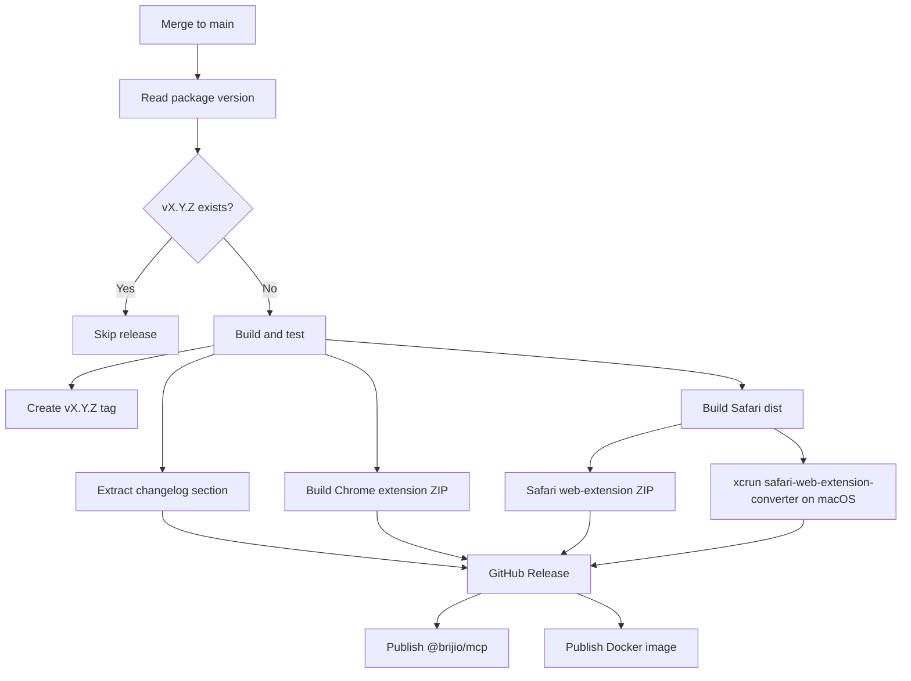

# ADR 0049: Unified Release Tag and Extension Assets

**Status:** Accepted | **Date:** 2026-06-18

## Context

Brijio currently has separate release tags for server packages and browser
extensions:

- `vX.Y.Z` for the main server/runtime release.
- `ext-chrome-vX.Y.Z` for Chrome extension release artifacts.
- `ext-safari-vX.Y.Z` for Safari extension release artifacts.

ADR 0036 chose independent extension versioning because store review cycles can
diverge from server releases. In practice, this creates extra release tags,
separate GitHub releases, duplicated release notes, and avoidable release
operator overhead.

For `0.2.0`, the desired model is a single release page with all user-facing
artifacts attached:

- npm package publish for `@brijio/mcp`.
- Docker image publish.
- Chrome extension ZIP asset.
- Safari extension asset where GitHub Actions can produce it.

The existing npm publish job failed with:

```text
npm error code E404
npm error 404 Not Found - PUT https://registry.npmjs.org/@brijio%2fmcp - Not found
```

`@brijio/mcp` exists on npm at `0.1.2`, so this is not a missing package-name
problem. The likely root cause is that the `NPM_TOKEN` used by GitHub Actions
does not have publish rights for the `@brijio/mcp` package or `@brijio` scope.

## Decision

Use only `vX.Y.Z` tags for release identity. Remove `ext-chrome-v*` and
`ext-safari-v*` release triggers.

The main `tag-and-release.yml` workflow starts from merges to `main`. It reads
the root package version, checks whether `vX.Y.Z` already exists, and only
continues when the tag is missing. The workflow then creates and pushes the
annotated `vX.Y.Z` tag itself.

The workflow will own all release outputs:

1. Build and test the repository.
2. Extract the matching `CHANGELOG.md` section.
3. Create and push the annotated `vX.Y.Z` tag.
4. Build the Chrome extension.
5. Validate Chrome `dist/manifest.json` version equals the release version.
6. Zip Chrome `dist/` and attach it to the `vX.Y.Z` GitHub release.
7. Build the Safari extension web-extension bundle.
8. Zip the Safari web-extension `dist/` output and attach it to the same GitHub
   release.
9. On a macOS runner, attempt to run `xcrun safari-web-extension-converter`
   against the Safari extension `dist/` output.
10. If conversion succeeds, zip the generated Safari Xcode project and attach it
    to the same GitHub release.
11. Publish npm package and Docker image after release validation.

If Safari conversion is unavailable on GitHub-hosted macOS runners or cannot
parse the current Safari extension manifest, the workflow should still publish
the Safari web-extension ZIP and skip only the converted Xcode project asset.
Producing a signed App Store submission package is out of scope unless Apple
signing credentials are later added.



## npm Publish Handling

Use npm trusted publishing for `@brijio/mcp`, not a long-lived `NPM_TOKEN`.
npm trusted publishing requires a GitHub-hosted runner, `permissions:
id-token: write`, and npm CLI 11.5.1+ / Node 22.14.0+. The publish job uses
Node 24 and `npm publish --access public --provenance --no-git-checks`.

The workflow should keep `npm view @brijio/mcp@X.Y.Z version` to distinguish
existing package checks from publish failures. The external npm setup
requirement is:

- `@brijio/mcp` must configure `.github/workflows/tag-and-release.yml` as its
  trusted publisher on npm.

## Consequences

Positive:

- One merge to `main` creates one complete release page when the package version
  has not already been tagged.
- Release notes live in one place and cover server plus extension artifacts.
- Chrome and Safari assets are easier to find for each version.
- The extension release workflow no longer duplicates GitHub releases.

Negative:

- Extension releases are now coupled to main version tags.
- Extension-only hotfixes require a normal `vX.Y.Z` patch release.
- Safari conversion requires a macOS runner and may not produce a signed
  distributable without future Apple signing credentials.

## Supersedes

This supersedes ADR 0036 for future releases. Historical extension tags remain
valid, but no new `ext-chrome-v*` or `ext-safari-v*` tags should be created.

## Testing

Implementation should verify:

- `vX.Y.Z` workflow creates or updates one GitHub release.
- Chrome ZIP is attached to the main release.
- Chrome manifest version must match `X.Y.Z`.
- Safari job runs on `macos-latest` and always attaches a Safari web-extension
  ZIP.
- Safari conversion is attempted with `xcrun safari-web-extension-converter`,
  and the converted Xcode project is attached only when conversion succeeds.
- The workflow skips release work when the version tag already exists.
- Changelog extraction fails if the release section is absent.
- npm publish uses OIDC trusted publishing without `NPM_TOKEN`.
