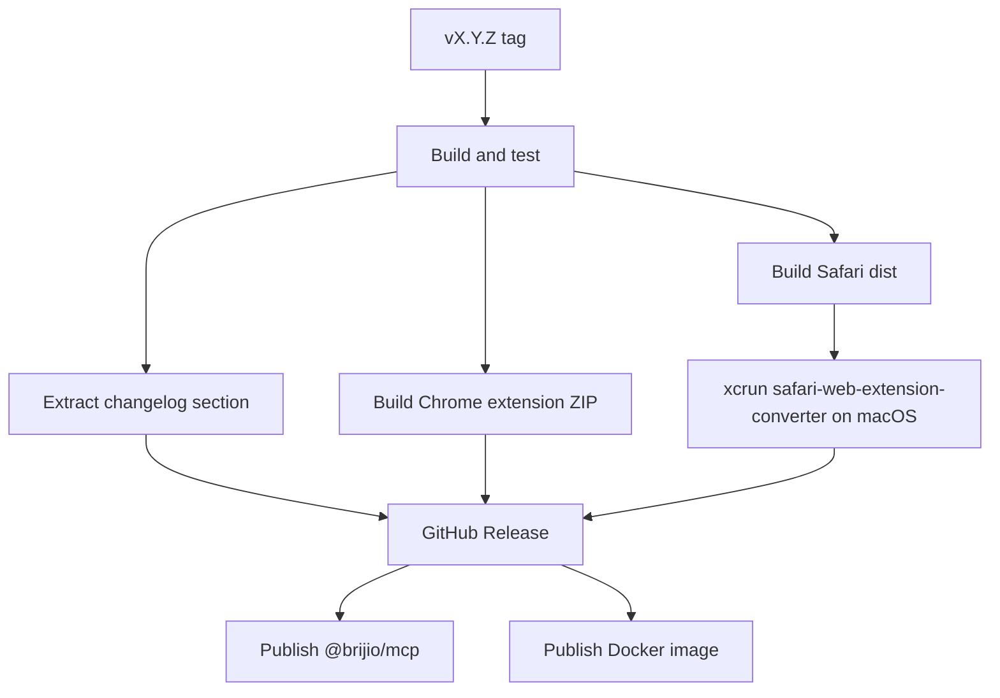

# ADR 0049: Unified Release Tag and Extension Assets

**Status:** Accepted | **Date:** 2026-06-18

## Context

Brijio currently has separate release tags for server packages and browser
extensions:

- `vX.Y.Z` for the main server/runtime release.
- `ext-chrome-vX.Y.Z` for Chrome extension release artifacts.
- `ext-safari-vX.Y.Z` for Safari extension release artifacts.

ADR 0036 chose independent extension versioning because store review cycles can
diverge from server releases. In practice, this creates extra release tags,
separate GitHub releases, duplicated release notes, and avoidable release
operator overhead.

For `0.2.0`, the desired model is a single release page with all user-facing
artifacts attached:

- npm package publish for `@brijio/mcp`.
- Docker image publish.
- Chrome extension ZIP asset.
- Safari extension asset where GitHub Actions can produce it.

The existing npm publish job failed with:

```text
npm error code E404
npm error 404 Not Found - PUT https://registry.npmjs.org/@brijio%2fmcp - Not found
```

`@brijio/mcp` exists on npm at `0.1.2`, so this is not a missing package-name
problem. The likely root cause is that the `NPM_TOKEN` used by GitHub Actions
does not have publish rights for the `@brijio/mcp` package or `@brijio` scope.

## Decision

Use only `vX.Y.Z` tags for release automation. Remove `ext-chrome-v*` and
`ext-safari-v*` release triggers.

The main `tag-and-release.yml` workflow will own all release outputs:

1. Build and test the repository.
2. Extract the matching `CHANGELOG.md` section.
3. Build the Chrome extension.
4. Validate Chrome `dist/manifest.json` version equals the tag version.
5. Zip Chrome `dist/` and attach it to the `vX.Y.Z` GitHub release.
6. Build the Safari extension web-extension bundle.
7. On a macOS runner, run `xcrun safari-web-extension-converter` against the
   Safari extension `dist/` output.
8. Zip the generated Safari Xcode project and attach it to the same GitHub
   release.
9. Publish npm package and Docker image after release validation.

If Safari conversion is unavailable on GitHub-hosted macOS runners, the workflow
should fail that asset job clearly rather than silently publishing an incomplete
release. Producing a signed App Store submission package is out of scope unless
Apple signing credentials are later added.



## npm Publish Handling

The workflow should keep `pnpm publish --access public --no-git-checks`, but add
clear preflight diagnostics before publishing:

- `npm whoami` with `NODE_AUTH_TOKEN`.
- `npm view @brijio/mcp version` to distinguish existing package checks from
  auth/publish failures.
- A failure message that tells maintainers to verify the npm automation token
  has publish access to `@brijio/mcp` and the `@brijio` scope.

The repository cannot fix missing npm permissions in code. The external release
requirement is:

- The GitHub `NPM_TOKEN` secret must be an npm automation token owned by an
  account or organization with publish rights for `@brijio/mcp`.

## Consequences

Positive:

- One Git tag creates one complete release page.
- Release notes live in one place and cover server plus extension artifacts.
- Chrome and Safari assets are easier to find for each version.
- The extension release workflow no longer duplicates GitHub releases.

Negative:

- Extension releases are now coupled to main version tags.
- Extension-only hotfixes require a normal `vX.Y.Z` patch release.
- Safari conversion requires a macOS runner and may not produce a signed
  distributable without future Apple signing credentials.

## Supersedes

This supersedes ADR 0036 for future releases. Historical extension tags remain
valid, but no new `ext-chrome-v*` or `ext-safari-v*` tags should be created.

## Testing

Implementation should verify:

- `vX.Y.Z` workflow creates or updates one GitHub release.
- Chrome ZIP is attached to the main release.
- Chrome manifest version must match `X.Y.Z`.
- Safari conversion job runs on `macos-latest` and attaches a Safari artifact.
- Changelog extraction fails if the release section is absent.
- npm publish preflight reports token identity and gives an actionable error
  when publish rights are missing.
