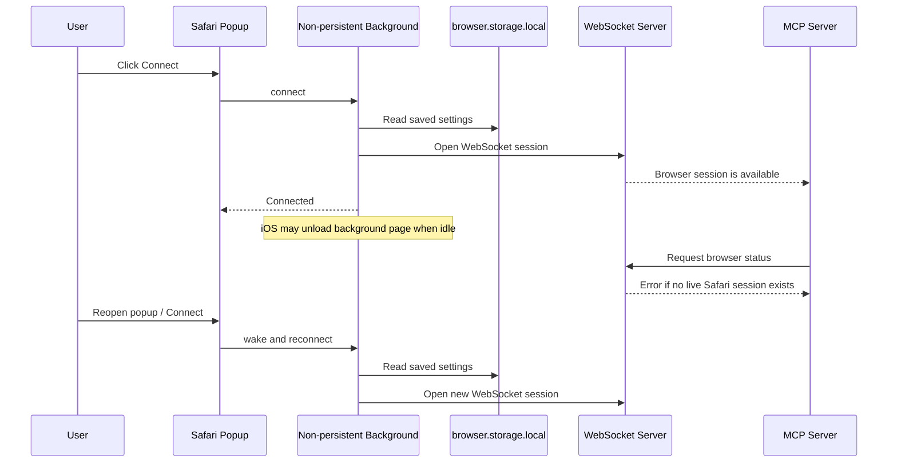

# ADR 0050: iOS Safari Non-Persistent Background Page

## Status

Accepted

## Date

2026-06-18

## Context

Brijio's Safari Web Extension currently uses a Manifest V2 background script:

```json
{
  "background": {
    "scripts": ["background.js"]
  }
}
```

In Manifest V2, omitting `persistent` makes the background page persistent by
default. Safari on iOS and iPadOS does not support persistent background pages.
The App Store validation warning is:

```text
Warning: Persistent background pages are not supported on iOS and iPadOS.
You will need to make changes to support a non-persistent background page.
```

This blocks publishing the Safari extension for iPhone and iPad. It also means
ADR 0019's Safari assumption is too broad: desktop Safari may tolerate the
current persistent-page design, but iOS and iPadOS require an event-page
lifecycle where the browser can unload and recreate the background context.

Brijio's product model already requires explicit user control. The user starts
the bridge manually, and browser state is only requested through explicit MCP
tool calls. iOS background suspension is compatible with that model, but the
runtime must stop assuming that in-memory background state and WebSocket
connections live indefinitely.

## Decision

Make the Safari Web Extension background page non-persistent so it can pass
iOS/iPadOS App Store validation and run on iPhone and iPad.

The Safari manifest will declare:

```json
{
  "background": {
    "scripts": ["background.js"],
    "persistent": false
  }
}
```

Safari runtime behavior will be designed as unload-tolerant:

- Register all WebExtension event listeners at top level.
- Keep durable configuration in `browser.storage.local`, including WebSocket
  URL, pairing token, profile name, browser label, and browser instance ID.
- Treat WebSocket objects, pending requests, timers, and controller instances as
  volatile background-page memory.
- Recreate volatile runtime state when Safari wakes the background page.
- Use the existing reconnect path for ordinary WebSocket closes or errors while
  the non-persistent background page remains loaded.
- Require explicit user action from the popup to start or restart a bridge
  session when iOS has unloaded the background page.
- Return clear unavailable/disconnected errors through the WebSocket/MCP path
  when no live Safari extension session exists.

The implementation should not try to simulate an always-running iOS background
process. iOS may suspend the extension background page, so Brijio should expose
that lifecycle clearly instead of hiding it behind unreliable keepalive loops.



## Consequences

Positive:

- Safari extension can satisfy iOS/iPadOS non-persistent background
  requirements.
- App Store submission is no longer blocked by the persistent background page
  warning.
- Safari runtime behavior better matches Brijio's user-controlled security
  model: availability depends on an active user-started bridge session.
- Documentation can clearly distinguish "connected now" from "configured for
  reconnect."

Negative:

- iPhone and iPad cannot provide the same always-live local WebSocket behavior
  as a persistent desktop background page.
- Existing keepalive behavior should be treated as best-effort only on Safari,
  not as a guarantee that iOS will keep the bridge alive.
- Users may need to reconnect from the Safari extension popup after iOS unloads
  the background page.
- Automatic reconnect is best-effort on Safari: it can recover normal socket
  closes while the event page is alive, but it cannot run after iOS unloads the
  background page until another extension event wakes it.
- MCP clients must handle unavailable Safari sessions as normal behavior.

## Supersedes

This ADR supersedes the Safari lifecycle assumption in ADR 0019 that Safari uses
a persistent Manifest V2 background page. ADR 0019 remains valid for the shared
extension package, adapter structure, broad Safari host permissions, and popup
configuration model.

## Out Of Scope

- Native iOS background networking outside Safari Web Extension capabilities.
- Silent background surveillance or continuous page streaming.
- App Store signing, notarization, provisioning profiles, or TestFlight setup.
- Splitting desktop Safari and iOS Safari into divergent feature sets unless
  later App Store packaging work proves it necessary.
- Migrating Safari to Manifest V3 service workers in this change.

## Testing

Implementation should verify:

- Safari `manifest.json` declares `"persistent": false`.
- Built Safari `dist/manifest.json` preserves `"persistent": false`.
- Safari build validation fails if the generated manifest regresses to a
  persistent background page.
- Safari unit tests cover storage-backed settings restoration after background
  controller creation.
- Safari unit tests cover disconnected/unavailable status when no live
  WebSocket exists.
- Existing Chrome extension tests continue to pass unchanged.
- Safari extension build still produces `background.js`, `content.js`,
  `popup.js`, `popup.html`, icons, and manifest output.
