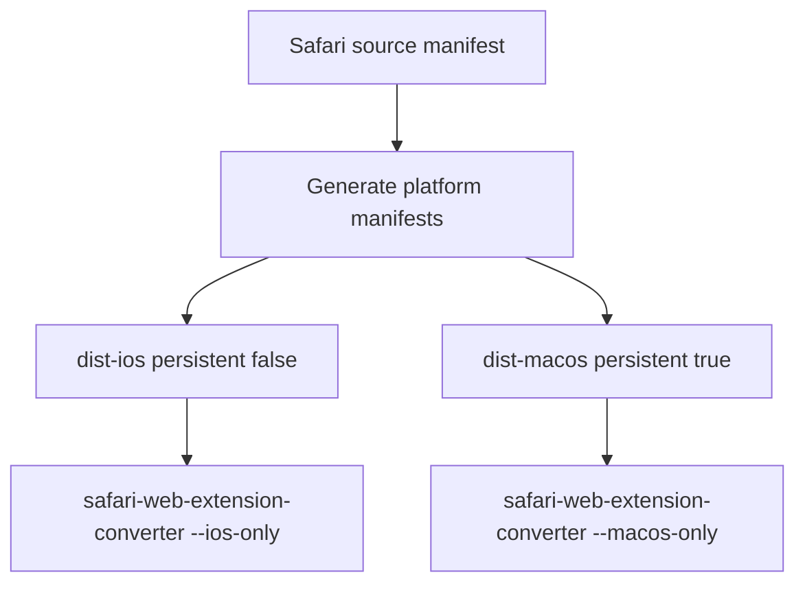

# ADR 0051: Safari Platform-Specific Builds

**Status:** Accepted | **Date:** 2026-06-18

## Context

ADR 0050 changed the Safari Web Extension background page to
`"persistent": false` so the extension can pass iOS and iPadOS App Store
validation. That made the source Safari manifest iOS-safe, but it also forced
desktop Safari to use a non-persistent background page.

For macOS, a persistent Safari background page gives Brijio a more stable local
WebSocket bridge. For iOS and iPadOS, persistent background pages are not
supported and block App Store validation.

The repo currently builds one Safari extension output from one source manifest.
That single output cannot be both iOS-safe and desktop-persistent.

The local `safari-web-extension-converter --help` output supports
platform-specific projects with `--ios-only` and `--macos-only`.

## Decision

Split Safari build output by platform.

- `clients/extensions/safari/dist-ios`
  - Uses a generated manifest with `"persistent": false`.
  - Intended for iOS and iPadOS validation and future iOS experimentation.

- `clients/extensions/safari/dist-macos`
  - Uses a generated manifest with `"persistent": true`.
  - Intended for desktop Safari shipping.

The checked-in source manifest remains iOS-safe by default. A build script
generates platform-specific manifests from that source manifest so there are no
hand-maintained duplicate manifests.

Makefile targets are explicit:

- `make safari-ios` builds `dist-ios` and runs
  `xcrun safari-web-extension-converter --ios-only`.
- `make safari-macos` builds `dist-macos` and runs
  `xcrun safari-web-extension-converter --macos-only`.
- `make safari` builds both platform projects.

## Consequences

Positive:

- macOS Safari can ship with the more stable persistent background behavior.
- iOS and iPadOS artifacts remain compatible with non-persistent background
  requirements.
- Platform behavior is explicit in artifact names, tests, build validation, and
  release assets.
- iOS can be evaluated separately before deciding whether the right product path
  is a Safari extension or a native app-backed bridge.

Negative:

- Safari build and release workflow becomes more complex.
- Desktop and iOS Safari now intentionally diverge in lifecycle behavior.
- Generated Xcode projects are platform-specific instead of one shared project.

## Deferred

Persisting a user-desired connection state for iOS auto-reconnect-on-wake is
deferred. That is still useful if the iOS extension path remains viable, but it
should be designed alongside the larger iOS question: whether Brijio on iOS
should be a Safari extension, a native app with extension messaging, or both.

## Testing

Implementation should verify:

- Source Safari manifest remains non-persistent.
- Generated iOS manifest is non-persistent.
- Generated macOS manifest is persistent.
- Safari build verification fails if either platform output has the wrong
  persistence setting.
- `pnpm --filter @brijio/safari-extension test` passes.
- `pnpm --filter @brijio/safari-extension build` produces `dist-ios` and
  `dist-macos`.

