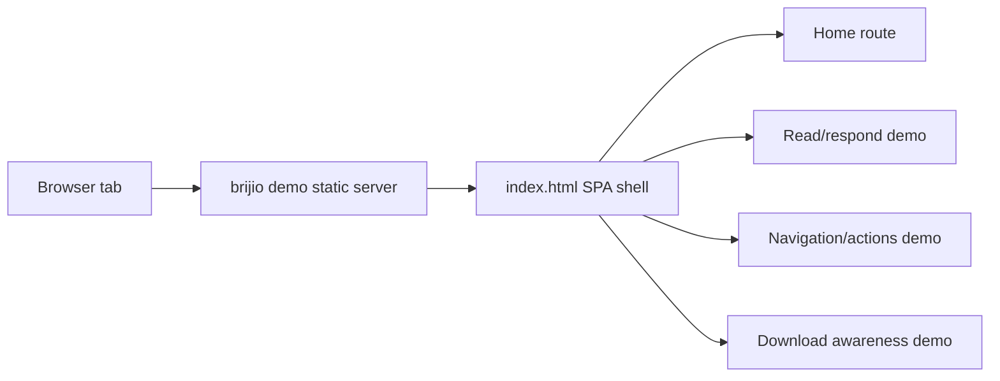
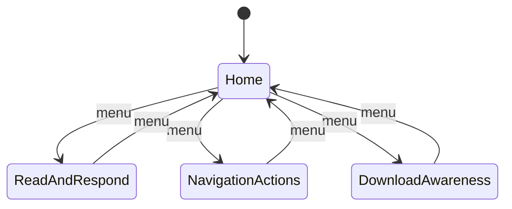

# ADR 0053: Demo Site SPA And Screenshot Polish

## Status

Accepted

## Date

2026-06-18

## Context

`brijio demo` serves static pages from `clients/test-page/`: the read/respond
form demo, the navigation/action demo, and the download awareness demo. These
pages are useful tool-validation fixtures, but they are separate documents with
inconsistent visual treatment. They also do not provide a polished Home screen
for screenshots, demos, or store listing assets.

The download awareness page also relies on several third-party URLs. Some public
endpoints are brittle, can rate-limit, can move, or can fail in ways that make
the demo look broken when the intended behavior is to test Brijio.

## Decision

Turn the demo site into a small static SPA shell while preserving the zero-build
static hosting model from ADR 0039.

The SPA will:

- Serve from `clients/test-page/index.html` as a single entry point.
- Provide a polished Home route with concise Brijio positioning,
  privacy/control language, architecture highlights, and screenshot-friendly
  composition.
- Provide top-level menu entries for the initial three demos: read/respond,
  navigation/actions, and downloads/fetching.
- Keep existing demo behavior available as static client-side views.
- Use hash-based client-side route state so the existing static file server,
  Docker, and nginx setup do not need server-side fallback behavior.
- Avoid external visual dependencies so the page works offline except for
  deliberate download/fetch edge-case URLs.

ADR 0054 extends this initial three-demo information architecture to four demo
routes by splitting structured parsing into its own route.

For download/fetch demos, prefer reliable same-origin fixture files served from
`clients/test-page/assets/` for normal happy paths. Keep external URLs only when
a scenario explicitly tests cross-origin, CORS, 404, timeout, or blocked
behavior.

## Consequences

Positive:

- Demo screenshots start from a polished Brijio-branded Home screen instead of a
  raw test fixture.
- The demo feels like one coherent product surface while retaining tool
  coverage.
- Download happy paths are deterministic because they use local static assets.
- Existing `brijio demo` Docker/static serving remains simple.

Negative:

- Large fixture pages need to be split into local static fragments or route
  modules over time.
- Hash/client-side routing means direct links use `/#route` style unless the
  static server later adds fallback routing.

## Testing

Implementation should verify:

- `brijio demo` serves the SPA Home page.
- Demo menu items switch views without a full page reload.
- The read/respond form still submits and renders validation results.
- Navigation/action controls still update DOM state and history as expected.
- The download page uses same-origin fixture URLs for happy paths.
- Any retained external URLs are documented as intentional cross-origin failure
  scenarios.
- Visual checks cover desktop and mobile screenshot dimensions.
