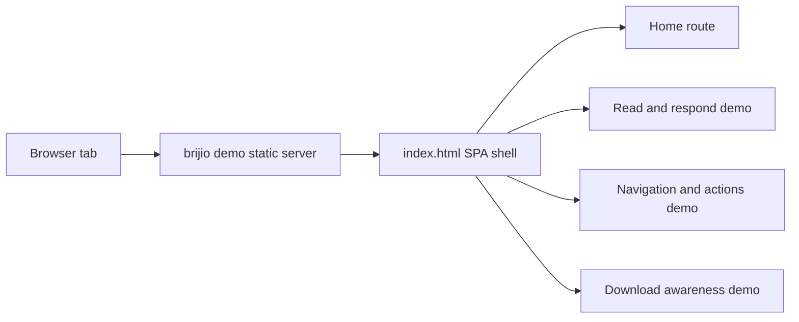
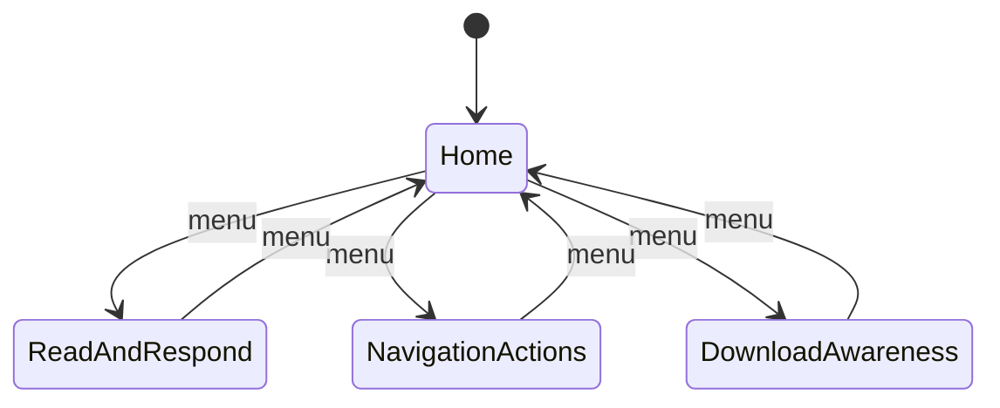

# ADR 0053: Demo Site SPA And Screenshot Polish

**Status:** Accepted | **Date:** 2026-06-18

## Context

`brijio demo` currently serves static pages from `clients/test-page/`: the read-and-respond form demo, the navigation/action demo, and the download awareness demo. These pages are useful for tool validation, but they are separate documents with inconsistent visual treatment. They also do not provide a polished home screen that explains Brijio for screenshots, demos, and store listing assets.

The download awareness page also relies on several third-party URLs. Some public endpoints are brittle, can rate-limit, can move, or intentionally fail in ways that make the demo look broken when the intended test is the Brijio behavior.

## Decision

Turn the demo site into a small static SPA shell while preserving the zero-build static hosting model from ADR 0039.

The SPA will:

- Serve from `clients/test-page/index.html` as the single entry point.
- Provide a polished home route with concise Brijio marketing copy, privacy/control positioning, architecture highlights, and screenshot-friendly composition.
- Provide a top-level menu for three demos: read and respond, navigation and actions, and downloads/fetching.
- Keep the existing demo behaviors available as static client-side views.
- Use hash-based or client-side route state so the existing static file server and Docker nginx setup do not need server-side fallback behavior.
- Avoid external visual dependencies so the page works offline except for deliberate download/fetch test URLs.

For download/fetch demos, prefer reliable same-origin fixture files served from `clients/test-page/assets/` for normal happy-path examples. Keep a small number of external URLs only when the scenario explicitly tests cross-origin, CORS, 404, timeout, or blocked behavior. Replace known brittle public links such as placeholder image services and unrelated GitHub README downloads with same-origin fixtures.

## Consequences

Positive:

- Demo screenshots can start from a polished Brijio-branded home screen instead of a raw test fixture.
- The demo feels like one coherent product surface while retaining tool coverage.
- Download happy paths become deterministic because they use local static assets.
- Existing `brijio demo` and Docker static serving remain simple.

Negative:

- The large read-and-respond fixture becomes embedded in a larger SPA file unless split into local static fragments or route modules.
- Hash/client-side routing means direct links use `/#route` style unless the static server later adds fallback routing.

## Testing

Implementation should verify:

- `brijio demo` serves the SPA home page.
- The three demo menu items switch views without a full page reload.
- The read-and-respond form still submits and renders validation results.
- The navigation/action controls still update DOM state and history as expected.
- The download page uses same-origin working fixture URLs for happy paths.
- Any retained external URLs are documented as intentional failure or cross-origin scenarios.
- Visual checks cover desktop and mobile screenshot dimensions.
