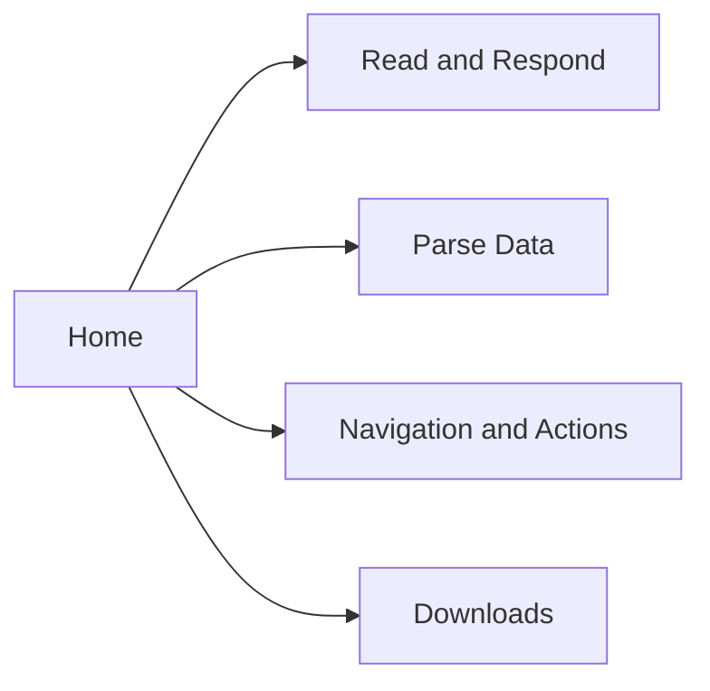

# ADR 0054: Demo Information Architecture And Icon Refresh

## Status

Accepted

## Date

2026-06-18

## Context

ADR 0053 introduced a screenshot-ready demo SPA. Follow-up review found several
issues:

- Demo route content should fully replace the Home route, not appear as an
  embedded preview.
- Demo headers should not show "Open standalone" links.
- Read and Respond mixes narrative form coverage with structured table parsing
  fixtures.
- Navigation and Actions CSS conflicts when loaded inside the SPA shell.
- The new Brijio mark should become the source for Chrome and Safari extension
  icons.
- The Home page needs a stronger hero visual based on the Brijio
  browser-to-agent bridge.

## Decision

Extend the demo SPA from three demos to four demos:

Read and Respond remains focused on narrative reading and response form
completion. Remove the table parsing fixtures from that page, add a table of
contents before the response form, and organize reading content around Sherlock
Holmes story sections while preserving deterministic form answers.

Create a separate Parse Data route for structured extraction fixtures. Move the
table fixtures out of Read and Respond into this route, and include static
same-origin tables plus compact record-style data sections.

Keep Navigation and Actions behavior, but reduce visual conflicts with the SPA
shell. Strip duplicated page-level navigation, scope fixture-specific overrides,
and prevent oversized controls from dominating the first viewport.

Remove the standalone-link pattern from demo headers. Route content should feel
like the primary page, not an embedded preview.

Generate Chrome and Safari PNG icons from the Brijio mark while keeping the
existing manifest paths:

- `icon-16.png`
- `icon-32.png`
- `icon-48.png`
- `icon-64.png`
- `icon-128.png`
- `icon-256.png`
- `icon-512.png`
- `icon-1024.png`

## Consequences

Positive:

- SPA navigation matches user expectations: route content replaces the Home page
  and carries no redundant standalone links.
- Read and Respond becomes a polished product demo rather than a mixed fixture
  page.
- Parse Data gives structured extraction its own clear demo surface.
- Extension packages and the demo shell share a coherent Brijio mark.

Negative:

- More static demo pages must be kept in sync between `clients/test-page/` and
  `servers/mcp/demo/`.
- Replacing extension icons touches packaged user-facing assets and requires
  visual checks at small sizes.

## Testing

Implementation should verify:

- SPA menu contains Home plus four demo routes.
- Each demo route replaces the Home view.
- No route uses iframes.
- Demo headers do not show "Open standalone".
- Read and Respond still loads and the response form works.
- Parse Data route loads and contains the moved table fixtures.
- Navigation and Actions no longer has oversized conflicting controls in the
  first viewport.
- Chrome and Safari icon directories contain regenerated PNGs for each required
  size.
- Relevant static HTML fixtures remain directly reachable.
